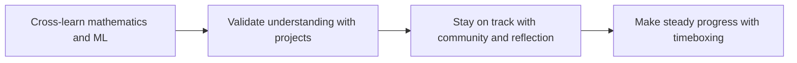

# Learning Strategy Recommendations

> The right method can make you twice as effective with half the effort. This page introduces three learning methods that have been proven in practice. **Strongly recommended reading before you begin formal study.**

---

## First, the big picture: use all three strategies together

| Strategy | What problem it solves | Minimum weekly action |
|---|---|---|
| Math + ML integration | Avoid spending a long time on math without seeing AI results | Learn one math intuition, run one small model example |
| Project-driven learning | Avoid only watching tutorials and having no proof of ability | Leave one runnable project at each stage |
| Community + reflection | Avoid getting stuck alone for too long | Share one question or one result each week |

## Strategy 1: Math + Machine Learning integrated learning

### Why not finish math first and then learn ML?

The traditional approach is: "Learn the math thoroughly first, then study machine learning." It sounds reasonable, but in practice there is a fatal problem:

> After studying math for two months without touching AI, your excitement fades, your motivation drops to zero, and you quit outright.

Our approach is: **learn one chapter of math, then immediately practice it with ML**. Learned vectors and matrices? Go implement linear regression right away and see how vector operations calculate house prices. Learned probability theory? Go look at the loss function in logistic regression and understand why cross-entropy is used.

### How exactly should you cross-learn?

| Step | Learn math first (the 4 minimum essential AI math foundations) | Then do ML (from beginner to practical) | What you’ll gain |
|:---:|---------|---------|----------|
| **Step 1** | Linear algebra: vectors, matrix operations | ML basics + linear regression | Understand regression using the matrix operations you just learned, and feel an immediate sense of accomplishment |
| **Step 2** | Probability and statistics | Logistic regression + decision trees | Understand classification with Bayes’ theorem and apply what you learn |
| **Step 3** | Calculus and optimization | Ensemble learning + complete ML project | After understanding gradient descent, focus on algorithms and hands-on practice |

After each math chapter, the course provides **🔀 integrated learning jump links** to tell you which ML section to jump to next.

### Three practical tips

**1. Don’t aim for 100% understanding of math**

What AI engineers need is "being able to use math tools to solve problems," not "being able to write mathematical proofs." If you’ve looked at a formula three times and still don’t fully get it, first remember its **intuitive meaning**, run it once in NumPy code to see the result, and then keep moving forward. After using it a few times in practice, it will become clear naturally.

**2. Having trouble with math? Watch these videos**

- **3Blue1Brown**’s linear algebra and calculus series (search "3b1b" on Bilibili for Chinese subtitles)
- This is the best math visualization tutorial in the world, no question
- You don’t need to watch everything; just follow the corresponding videos for the chapters you’re learning in the 4 minimum essential AI math foundations section

**3. Remember this sentence**

> "I don’t need to become a mathematician. I need to use math to solve AI problems."

The math sections of this course are all taught with code + visualization, not by deriving formulas on a blackboard.

---

## Strategy 2: Project-driven learning

### Why are projects more important than tutorials?

A harsh truth: 100 hours of watching tutorials is less effective than 10 hours of hands-on projects.

The reason is simple — when you watch tutorials, your brain is in "receiving mode" ("I get it, I get it"), but when you build a project, your brain is in "creating mode" ("Wait, what’s causing this bug? Why should this parameter be set this way?"). Only creating mode can truly turn knowledge into ability.

### Project arrangement for each stage

This course includes projects at every stage, and you should **carefully complete each one**:

| Stage | Project | What you’ll gain |
|------|------|------------|
| 1 Developer tools basics | Set up your development environment | This is your first achievement in itself |
| 2 Python programming basics | Command-line tools, web crawlers, Web API, AI API experience | Python programming ability + 4 completed works |
| 3 Data analysis and visualization | A complete EDA data analysis report | Data analysis ability |
| 4–5 AI math and machine learning | House price prediction, customer churn prediction, user segmentation | Full ML modeling workflow |
| 6 Deep learning and Transformer basics | Image classification, text sentiment analysis | PyTorch practical skills |
| 8 LLM application development and RAG | Enterprise knowledge base Q&A system (RAG) | LLM application development ability |
| 9 AI Agent and intelligent agent systems | Intelligent research assistant, data analysis Agent | Agent development ability |

### How to approach projects

Doing a project is not "copying the tutorial once." The correct approach is:

1. **Think for 10 minutes first:** After getting the requirements, think through the rough idea first. Don’t look at the answer immediately.
2. **Check hints only after you get stuck:** Each project has step-by-step hints. When you’re stuck, look at one step at a time, not all of them at once.
3. **Optimize after it runs:** First make the code run, even if it looks ugly, and then improve it.
4. **Write a README:** For every project, write a README explaining what you built, what technologies you used, and what the results were. This becomes material for your future job portfolio.
5. **Put it on GitHub:** Start building up your GitHub from the very first project.

### Self-check list after finishing a project

After completing a project, ask yourself:

- [ ] Can I explain what this project does in my own words without looking at the code?
- [ ] If the data changes, can I modify the code to adapt to the new data?
- [ ] If someone asks why I chose this model/method, can I explain the reason?
- [ ] Does my code have comments? Can others understand it?

---

## Strategy 3: Community learning

### Why is it easy to give up when learning alone?

The biggest enemy of self-study is not difficulty, but **loneliness**. When you hit a bug, there is no one to ask. When you reach a bottleneck, there is no encouragement. When you can’t see other people’s progress, you have no point of reference. Joining a learning community can solve these three problems.

### Recommended ways to participate

| Platform | How to participate | What you can gain |
|------|---------|------------|
| **GitHub** | Star related projects, open Issues, contribute code | Learn open-source collaboration, build a portfolio |
| **Kaggle** | Join beginner competitions, study excellent Notebooks | Hands-on real datasets, best practices |
| **Discord** | Join the HuggingFace and LangChain communities | Communicate with developers around the world |
| **Zhihu / Bilibili** | Follow AI topics, watch learning videos | Chinese-language resources, learning experiences |
| **WeChat groups** | Search for AI learning groups | Ask questions and share resources with others |
| **Reddit** | r/learnmachinelearning | International perspective, English resources |

### Suggested rhythm for community participation

You don’t need to spend too much time in communities. 2–3 hours per week is enough:

- **Every day:** Spend 5 minutes browsing discussions in the community and see whether there are any interesting topics
- **Every week:** Answer one other person’s question (teaching is the best way to learn)
- **Every month:** Share your learning progress or project results once

:::tip A proven effective method
**Feynman learning method:** After learning a concept, try explaining it in simple words to someone else (it can be someone in the community or even a rubber duck). If you can’t explain it clearly, that means you haven’t truly understood it yet.
:::

---

## Additional strategy: time management

### Pomodoro technique (recommended)

- Study for 25 minutes → rest for 5 minutes → study for 25 minutes → rest for 5 minutes
- After every 4 Pomodoros, take a 15–30 minute break
- AI learning involves many new concepts, and 25 minutes per unit is just right

### Avoid common pitfalls

| Pitfall | What it looks like | Solution |
|------|------|---------|
| **Tutorial hell** | You’ve watched 5 videos on one concept and still keep watching | Write code as soon as you finish one tutorial |
| **Perfectionism** | A bug has kept you stuck for 3 hours | If it takes more than 30 minutes, search or ask someone |
| **Saving but never reading** | You’ve saved 200 tutorials and haven’t watched a single one | Only watch what you need for the current stage |
| **Jumping around** | You want to run before you can walk | Follow the stages in order; don’t skip around |
| **Watching without practice** | Thinking "I understood it" means "I learned it" | Close the tutorial and write it from scratch yourself |

---
