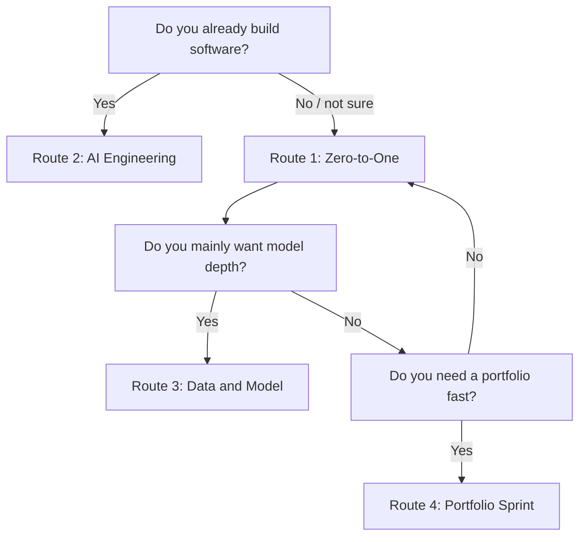

# Four Main Learning Routes

If you are not sure which route to choose, take **Route 1**. It is the default and the safest for most learners.

## Route Cards

| Route | Best for | Read deeply first | First visible output |
| --- | --- | --- | --- |
| 1. Zero-to-One Full-Stack | Beginners or learners who want the complete path | Chapters 1-3, then 7-9 | Learning assistant or course Q&A demo |
| 2. AI Engineering | People who already build software | Python project structure, APIs, RAG, Agent, deployment | Deployable LLM app or automation tool |
| 3. Data and Model Understanding | Learners aiming at data, ML, model evaluation, or research support | Data, math, ML, DL, evaluation | Experiment report with metrics and failure cases |
| 4. Portfolio Sprint | Job search, transition, or quick proof of ability | Project pages, README, evaluation, demos | 3-5 small projects plus one main project |

## How to Choose Quickly

Do not switch routes every day. Finish one stage, look at the project evidence, then adjust.

## Minimum Standard for Any Route

No matter which route you choose, each stage should leave:

| Evidence | Meaning |
| --- | --- |
| Run command | Someone else can reproduce it |
| Sample input/output | The result is visible |
| Failure case | You know where the system breaks |
| Evaluation or check | The project is not just a lucky demo |
| Next step | You know how to improve it |

The route is only the learning order. The project evidence is the real proof of progress.
