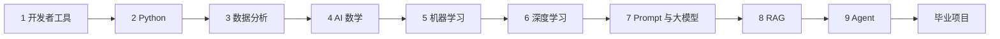
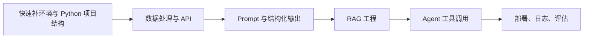
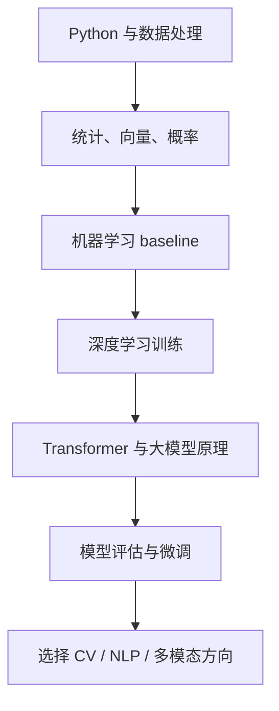
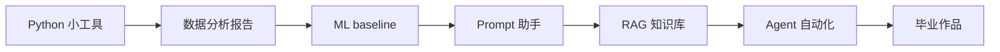

# 四条主线学习路线

这套课程可以完整顺序学习，也可以按目标选择主线。路线的作用不是删减课程，而是告诉你第一遍应该把哪些内容读深，哪些内容先知道位置，哪些内容等项目需要时再回来看。

如果你不确定选哪条，默认走“零基础全栈 AI 应用路线”。它覆盖最稳，最适合从工具、Python、数据一路走到 RAG、Agent 和毕业项目。

## 四条路线怎么选

| 路线 | 适合谁 | 第一目标 | 最终作品 |
|---|---|---|---|
| 零基础全栈 AI 应用路线 | 会一点电脑操作或刚开始编程 | 从环境、Python、数据到 AI 应用完整通关 | AI 学习助手或课程问答助手 |
| 已有开发经验的 AI 工程路线 | 已会写代码、接口或产品开发 | 快速补齐数据、Prompt、RAG、Agent 和工程化 | 可部署的 LLM 应用或 Agent 工具 |
| 数据与模型理解路线 | 想走数据分析、机器学习、模型评估 | 深入理解数据、指标、模型训练和误差分析 | 数据分析 + ML/DL 实验报告 |
| 作品集冲刺路线 | 准备求职、转行、展示能力 | 最快沉淀可运行、可解释、可评估项目 | 3～5 个项目组合 + 毕业作品 |

四条路线可以切换，但不要每天切换。更好的方式是先按一条路线完成一个阶段，再根据项目暴露出来的问题回流补课。

## 路线一：零基础全栈 AI 应用路线

这条路线适合大多数学习者。它按课程默认顺序推进，目标是建立完整能力链：会配置环境，会写 Python，会处理数据，理解模型基本逻辑，最后能做 RAG、Agent 和毕业项目。

第一遍学习时，每阶段只要求做到“能运行一个最小项目，能解释关键概念，能记录一个失败样本”。数学、深度学习和 Transformer 不需要一次学成专家，但要理解它们为什么支撑后面的 Embedding、检索、Prompt、模型评估和多模态。

| 阶段 | 第一遍重点 | 可以先不深挖 | 必交付 |
|---|---|---|---|
| 1～3 | 环境、Python、数据读取、清洗、图表 | 复杂工具链和高级 Pandas 技巧 | 可运行脚本、数据分析图表 |
| 4～6 | 向量、概率、baseline、训练曲线、过拟合 | 复杂数学推导和大型训练 | baseline、指标、失败样本 |
| 7～9 | Prompt、结构化输出、RAG、工具调用、Agent trace | 高级框架细节和复杂多 Agent | RAG 问答、Agent 执行轨迹 |
| 10～12 | 选择一个方向做毕业作品 | 三个方向全部做深 | 可演示毕业项目 |

通关标准是：你能从零创建一个 AI 应用项目，说明它的数据从哪里来，模型或 LLM 做了什么，结果如何评估，失败时如何复盘。

## 路线二：已有开发经验的 AI 工程路线

这条路线适合已经会写代码、做接口、做前端或做后端的人。你不需要在基础语法上停太久，但不能跳过数据、评估和工程边界，否则后面做 RAG 和 Agent 时会卡在输入输出、日志、权限和部署上。

| 学习段 | 精读内容 | 快速浏览 | 项目动作 |
|---|---|---|---|
| 基础补齐 | Python 文件、异常、API、数据处理 | 终端基础、语法入门 | 把已有开发习惯迁移到 Python 项目 |
| AI 应用 | Prompt、LLM API、结构化输出、RAG | 机器学习算法细节 | 做一个课程或业务知识库助手 |
| 系统工程 | 工具 schema、Agent trace、权限、安全、日志 | 复杂多 Agent 框架 | 做一个可控 Agent 或自动化工具 |
| 交付上线 | README、环境变量、部署、监控、成本估算 | 大规模训练 | 做可演示 Demo 和评估报告 |

这条路线最容易犯的错是“只会接 API，不会评估”。每个 LLM 功能都要留下固定测试样例、失败样本、日志字段和回归检查方法。

## 路线三：数据与模型理解路线

这条路线适合想走数据分析、机器学习、模型评估、模型工程或研究助理方向的人。它更重视数据质量、数学直觉、baseline、实验记录和误差分析。

| 学习段 | 关键问题 | 项目证据 |
|---|---|---|
| 数据分析 | 数据是否可信，结论是否有局限 | 数据字典、清洗日志、图表解释 |
| 数学与指标 | 相似度、概率、loss、指标分别解释什么 | 小实验、指标说明、手算样例 |
| 机器学习 | baseline 是什么，是否数据泄漏 | train/test 划分、指标表、错误样本 |
| 深度学习 | loss 为什么变化，模型哪里失败 | 训练曲线、混淆矩阵、失败图片或文本 |
| 大模型与评估 | Prompt、RAG、微调分别适合什么 | 对比实验、固定测试集、结论边界 |

这条路线不是只学理论。每个模型概念都要落到一个实验：输入是什么，输出是什么，指标是什么，失败样本是什么，下一轮如何改。

## 路线四：作品集冲刺路线

这条路线适合已经有时间压力，希望尽快形成作品集的人。它的重点不是把所有章节读到最深，而是用项目驱动学习，边做边补。

| 周期 | 学习重点 | 作品集交付 |
|---|---|---|
| 第 1 段 | 环境、Python、README、Git | 一个能运行的小工具 |
| 第 2 段 | 数据清洗、可视化、结论表达 | 一份数据分析报告 |
| 第 3 段 | baseline、指标、错误样本 | 一个 ML 或分类实验 |
| 第 4 段 | Prompt、结构化输出、LLM API | 一个 Prompt 助手 |
| 第 5 段 | 文档处理、检索、引用、评估 | 一个 RAG 问答项目 |
| 第 6 段 | 工具调用、trace、权限、失败恢复 | 一个 Agent 自动化项目 |
| 第 7 段 | 部署、演示、复盘、作品集包装 | 一个毕业作品 |

作品集冲刺路线必须避免“只做成功演示”。每个项目至少要有 README、运行命令、示例输入输出、评估方式、失败样本和下一步计划。准备求职时，项目能讲清楚比功能堆得多更重要。

## 路线切换和回流规则

学习过程中如果卡住，不要立刻否定整条路线。先判断卡点属于哪一层，再回到对应章节补最小能力。

| 当前路线 | 常见卡点 | 回流方式 |
|---|---|---|
| 零基础全栈路线 | 后半段内容太多，RAG 和 Agent 混在一起 | 先完成 RAG 问答，再做 Agent；不要同时追所有框架 |
| AI 工程路线 | API 能调通，但答案不稳定 | 回看数据、评估、Prompt schema 和 RAG 评估 |
| 数据模型路线 | 理论能懂，但项目展示弱 | 回看 README、项目交付标准和作品集清单 |
| 作品集冲刺路线 | 项目能演示，但讲不清原理 | 回看能力地图、数学最小基础和模型评估 |

如果一个阶段连续卡住三次，优先做最小实验，而不是继续读更多材料。能跑通、能复现、能记录，才说明可以进入下一阶段。

## 每条路线的最低毕业标准

无论你选择哪条路线，最后都应该能交付一个完整项目。完整项目不等于功能最多，而是有清晰问题定义、运行方式、输入输出、评估样例、失败分析和改进计划。

| 路线 | 最低毕业作品 | 必须证明 |
|---|---|---|
| 零基础全栈 AI 应用 | AI 学习助手或课程问答助手 | 从基础到 AI 应用的完整闭环 |
| AI 工程路线 | 可部署 LLM / RAG / Agent 应用 | 工程可运行、可观测、可回归 |
| 数据与模型路线 | 模型实验或评估报告 | 数据可信、指标清楚、结论有边界 |
| 作品集冲刺路线 | 3～5 个项目组合和一个主项目 | 能展示、能解释、能复盘 |

路线只是学习顺序，项目才是能力证据。每完成一段，都回到项目里补一条运行记录、一张结果截图或一个失败样本，学习会更稳。