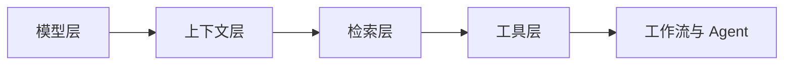
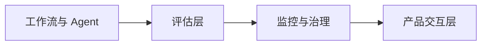
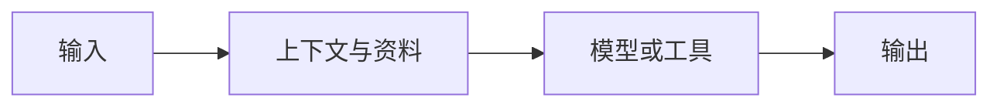
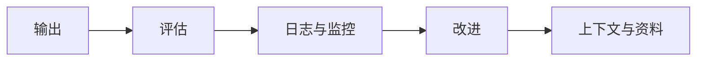

# 2025-2026 AI 应用技术地图

## 本节定位

这一页是整套课程后半段的“现代技术总览”。你会看到 2025～2026 年 AI 应用工程的主线已经从“会调用大模型”升级为“能构建可检索、可行动、可评估、可监控、可部署的 AI 系统”。

新人阅读这一页时，不需要记住所有新名词，只要先建立一张地图：RAG 解决知识接入，Agent 解决多步骤行动，多模态解决真实世界输入输出，模型工程解决成本和部署，LLMOps / RAGOps / AgentOps 解决长期运行和质量控制。

## 现代 AI 系统不只是一个模型

早期大模型应用常见形态是：用户输入问题，后端调用一个模型，模型返回答案。但真实产品很快会遇到问题：模型不知道私有资料，回答没有来源，工具调用不稳定，成本不可控，生成内容无法审核，线上失败无法复盘。

所以现代 AI 应用更像一个系统，而不是一个单点模型。

看懂这两段图，就能理解为什么课程后半段要从 Prompt 进入 RAG、Agent、多模态、部署和评估。真正的能力不是“调一次模型成功”，而是让系统在不同用户、不同资料、不同失败场景下仍然能被检查和改进。

## RAGOps：让知识库不是一次性 Demo

RAGOps 可以理解成“围绕 RAG 系统的运行、评估和维护方法”。普通 RAG 只关心能不能检索并回答；RAGOps 还关心文档是否更新、索引是否过期、召回是否稳定、引用是否可信、成本和延迟是否可接受。

现代 RAG 常见技术包括 Hybrid Search、Reranking、Query Rewrite、Multi-query Retrieval、GraphRAG、Agentic RAG 和 Multimodal RAG。它们解决的问题不同：Hybrid Search 避免纯向量检索漏掉关键词，Reranking 让召回结果重新排序，Query Rewrite 让含糊问题变得更适合检索，GraphRAG 适合跨文档实体关系，Agentic RAG 让系统能多轮判断还要不要继续查资料，多模态 RAG 则把图片、表格、PDF 和截图纳入知识来源。

这一部分会主要落在第 8 站：LLM 应用开发与 RAG。

## AgentOps：让智能体能被追踪和控制

AgentOps 可以理解成“围绕 Agent 的执行轨迹、工具调用、权限、安全、评估和部署的工程方法”。一个 Agent 不应该只是看起来会行动，还要知道它为什么行动、调用了什么工具、花了多少成本、失败时怎么恢复、什么时候需要人工确认。

现代 Agent 的重点不是完全放任模型自由发挥，而是把工作流、工具协议和安全边界结合起来。MCP 这类协议让模型和工具、文件、数据库、业务系统之间的连接更标准；Agentic Workflow 让开放任务和固定流程结合；Human-in-the-loop 让高风险步骤保留人工确认；Agent Observability 记录计划、工具调用、结果和错误。

这一部分会主要落在第 9 站：AI Agent 与智能体系统。

## 多模态 AI：从文字助手到真实世界助手

多模态 AI 的重点不是“生成图片很漂亮”，而是让 AI 能处理真实世界里的多种输入输出：截图、图表、PDF、文档页面、语音、视频、图片和文本。现代应用里，多模态能力经常和 RAG、Agent、内容生成、审核工作流结合。

例如，一个课程资料助手可以读取 Markdown，也可以理解课件截图和 PDF 表格；一个研究 Agent 可以看网页截图、提取图表信息、调用工具生成报告；一个 AIGC 工作台可以从主题生成文案、图片提示词、分镜脚本、语音稿和审核清单。

这一部分会主要落在第 12 站：AIGC 与多模态，也会和第 8 站的文档解析、多模态 RAG，以及第 9 站的多模态 Agent 产生连接。

## 模型工程：不是永远调用最强模型

真实项目不一定永远使用最强、最贵、最大的模型。很多场景需要在效果、延迟、成本、隐私和部署复杂度之间取平衡。

现代模型工程会考虑小模型、模型路由、量化、蒸馏、LoRA / QLoRA、本地部署、混合部署、缓存、批处理和推理优化。一个系统可能会用便宜模型处理简单任务，用强模型处理复杂推理，用视觉模型处理图片，用本地模型处理隐私数据。

这一部分会落在第 6 站的深度学习基础、第 7 站的大模型原理与微调、第 8 站的模型部署和工程化实践里。

## LLMOps：把大模型应用当成长期运行的软件

LLMOps 关注的是大模型应用的全生命周期：Prompt 版本管理、评估集、自动化测试、日志、Trace、Token 成本、延迟、模型版本变化、权限控制、内容安全和上线回滚。

如果没有 LLMOps，一个应用可能今天回答很好，明天因为文档更新、Prompt 改动、模型版本变化或用户问题变化而变差，却没人知道原因。课程里的工程化部分会逐步把这些能力加入项目：先记录日志，再设计评估集，再加入监控和成本统计，最后形成上线检查清单。

## 现代 AI 应用的最小闭环

无论你做 RAG、Agent 还是多模态应用，都可以用下面这条闭环检查系统是否可靠。

如果一个项目只有输入和输出，没有评估、日志和改进，它还只是 Demo。如果它能知道自己用了哪些资料、调用了哪些工具、为什么失败、怎么比较优化前后效果，它才开始接近真实 AI 工程。

## 学习建议

第一次读这一页时，只要记住四句话：RAG 负责把外部知识接进来，Agent 负责围绕目标执行多步骤任务，多模态负责处理真实世界输入输出，Ops 负责让系统长期稳定运行。

进入具体章节时，不要把新技术当成名词清单。每学一个技术，都要问：它解决什么失败？什么时候不该用？最小例子怎么做？如何评估？如何写进项目 README？这样你学到的就不是热点，而是可迁移的工程能力。
