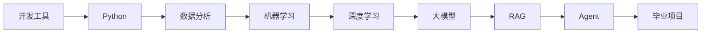

# 阶段过渡指南：从基础到 AI 应用

AI 全栈学习最容易卡住的地方，不一定是某个知识点本身，而是不知道为什么突然要学下一个主题。这个页面用一条主线解释各阶段之间的关系，帮助你在切换阶段时知道自己正在补哪块能力。

## 一图看懂阶段为什么这样排

每次切换阶段前只问一句：下一阶段需要我新增哪种能力？如果答案说不清，先读本页对应过渡段，再做一个最小练习。

## 从开发工具到 Python

开发工具阶段解决的是“你能不能稳定地写代码、运行代码、保存代码”。Python 阶段解决的是“你能不能用代码表达一个清晰流程”。如果开发环境、路径、依赖和 Git 没跑通，后面所有 AI 项目都会被环境问题打断。

进入 Python 前，你至少应该能打开项目目录、运行一个脚本、提交一次 Git 记录。否则学习 Python 时遇到的很多问题，其实不是语法问题，而是环境问题。

## 从 Python 到数据分析

Python 教你写流程，数据分析教你处理真实数据。AI 项目里的输入通常不是干净的单个变量，而是文件、表格、日志、文档和用户行为记录。数据分析阶段的价值是让你理解数据的形状、质量、分布和异常。

进入数据分析前，你应该能写函数、读写文件、使用列表和字典。进入机器学习前，你应该能用 Pandas 读取数据、清洗字段、做基础统计，并用图表解释现象。

## 从数据分析到机器学习

数据分析回答“发生了什么”，机器学习尝试回答“能不能根据已有数据预测或分类”。这个过渡的关键是把数据表变成特征，把业务问题变成建模问题，把直觉结论变成可评估的模型。

如果你在机器学习阶段卡住，常见原因不是算法太难，而是数据理解不够。比如目标变量是什么、特征是否泄漏、训练集和测试集是否合理、指标是否匹配问题，这些都来自数据分析能力。

## 从机器学习到深度学习

机器学习阶段主要训练你理解数据、特征、模型和评估。深度学习阶段进一步让模型自动学习表示，尤其适合图像、文本、语音和复杂序列。这个过渡的关键是从“手工特征 + 传统模型”转向“张量 + 神经网络 + 表示学习”。

进入深度学习前，你应该已经理解训练集/测试集、损失函数、过拟合、评估指标和 baseline。否则 PyTorch 代码即使跑起来，也很难判断模型到底学到了什么。

## 从深度学习到大模型

深度学习让你理解神经网络训练，Transformer 让你理解现代大模型的架构基础。大模型阶段不要求你从零训练一个模型，但要求你理解 token、embedding、上下文、预训练、微调和对齐这些概念的作用。

如果你只想做应用，可以快读底层推导，但不要完全跳过 Transformer 和 embedding。因为 RAG、Prompt、微调、Agent 的很多问题都和这些基础概念有关。

## 从大模型到 RAG

大模型本身有知识过期、幻觉、无法访问私有资料等限制。RAG 的作用是把外部知识库接入生成过程，让模型基于检索到的材料回答问题。这个过渡的关键是从“让模型凭记忆回答”转向“让模型基于来源回答”。

进入 RAG 前，你应该理解 API 调用、文本切分、embedding、向量相似度和基本提示词。学习 RAG 时，要始终把检索和生成分开调试。

## 从 RAG 到 Agent

RAG 主要解决知识获取问题，Agent 进一步解决任务执行问题。RAG 回答“相关资料是什么、答案是什么”，Agent 处理“为了完成目标，应该分几步、调用哪些工具、如何记录状态、失败后如何恢复”。

进入 Agent 前，你应该已经理解 RAG、函数调用、日志、评估和安全边界。否则 Agent 很容易变成一个不可控的自动化脚本，出了问题也无法追踪。

## 从 Agent 到毕业项目

毕业项目不是把所有技术都塞进去，而是选择一个真实问题，组合合适技术形成稳定闭环。你可以从 AI 学习助手、企业知识库、数据分析 Agent、垂直领域助手或多模态工作流中选择一个方向。

真正的通关标准是：项目能运行，流程能解释，效果能评估，失败能复盘，别人能按 README 复现。到这个阶段，学习重点从“学会某个知识点”转为“做出一个可信的系统”。
