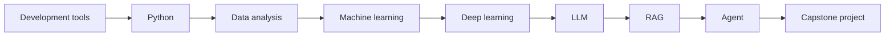

# Stage Transition Guide: From Basics to AI Applications

The place where AI full-stack learners most easily get stuck is not necessarily a specific concept itself, but not knowing why they suddenly need to learn the next topic. This page uses one main line to explain the relationship between each stage, helping you understand which capability you are filling in when you switch stages.

## See at a glance why the stages are arranged this way

Before switching to the next stage, ask just one question: what new capability does the next stage require me to add? If the answer is unclear, first read the corresponding transition section on this page, then do a minimum exercise.

## From development tools to Python

The development tools stage solves the question of whether you can write code, run code, and save code reliably. The Python stage solves the question of whether you can use code to express a clear workflow. If your development environment, paths, dependencies, and Git are not working properly, all later AI projects will be interrupted by environment issues.

Before moving into Python, you should at least be able to open a project directory, run a script, and make one Git commit. Otherwise, many problems you encounter while learning Python are not really syntax problems, but environment problems.

## From Python to data analysis

Python teaches you how to write workflows, while data analysis teaches you how to handle real-world data. The inputs in AI projects are usually not clean single variables, but files, tables, logs, documents, and user activity records. The value of the data analysis stage is helping you understand the shape, quality, distribution, and anomalies of data.

Before moving into data analysis, you should be able to write functions, read and write files, and use lists and dictionaries. Before moving into machine learning, you should be able to use Pandas to load data, clean fields, perform basic statistics, and explain patterns with charts.

## From data analysis to machine learning

Data analysis answers “what happened,” while machine learning tries to answer “can we predict or classify based on the existing data?” The key to this transition is turning data tables into features, business problems into modeling problems, and intuitive conclusions into measurable models.

If you get stuck in the machine learning stage, a common reason is not that the algorithms are too difficult, but that your understanding of the data is not enough. For example, what the target variable is, whether there is data leakage, whether the training set and test set are reasonable, and whether the metric matches the problem — all of these come from data analysis skills.

## From machine learning to deep learning

The machine learning stage mainly trains you to understand data, features, models, and evaluation. The deep learning stage further enables models to learn representations automatically, and is especially suitable for images, text, speech, and complex sequences. The key to this transition is moving from “manual features + traditional models” to “tensors + neural networks + representation learning.”

Before entering deep learning, you should already understand train/test splits, loss functions, overfitting, evaluation metrics, and baselines. Otherwise, even if PyTorch code runs, it will be hard to judge what the model has actually learned.

## From deep learning to LLM

Deep learning helps you understand neural network training, while Transformer helps you understand the architectural foundation of modern LLMs. The LLM stage does not require you to train a model from scratch, but it does require you to understand the roles of concepts such as token, embedding, context, pretraining, fine-tuning, and alignment.

If you only want to build applications, you can skim the underlying derivations, but do not skip Transformer and embedding entirely. Many issues in RAG, Prompt, fine-tuning, and Agent are related to these foundational concepts.

## From LLM to RAG

LLMs themselves have limitations such as outdated knowledge, hallucinations, and inability to access private data. The role of RAG is to connect an external knowledge base to the generation process, allowing the model to answer questions based on retrieved materials. The key to this transition is moving from “let the model answer from memory” to “let the model answer based on sources.”

Before entering RAG, you should understand API calls, text chunking, embeddings, vector similarity, and basic prompts. When learning RAG, always keep retrieval and generation separate for debugging.

## From RAG to Agent

RAG mainly solves the problem of knowledge retrieval, while Agent further solves the problem of task execution. RAG answers “what related materials are there, and what is the answer,” while Agent handles “to complete a goal, how many steps should be taken, which tools should be called, how state should be recorded, and how to recover after failure.”

Before entering Agent, you should already understand RAG, function calling, logging, evaluation, and safety boundaries. Otherwise, Agent can easily become an uncontrollable automation script, and when something goes wrong, there is no way to trace it.

## From Agent to the capstone project

A capstone project is not about cramming in every technology, but about choosing a real problem and combining the right technologies to form a stable closed loop. You can choose one direction from AI learning assistants, enterprise knowledge bases, data analysis agents, vertical-domain assistants, or multimodal workflows.

The real pass standard is: the project can run, the workflow can be explained, the results can be evaluated, failures can be reviewed, and others can reproduce it according to the README. At this stage, the focus shifts from “learning a concept” to “building a trustworthy system.”
