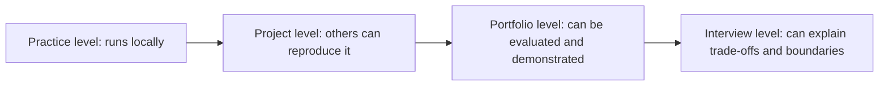

# Portfolio Acceptance Checklist

This checklist is used to check whether your phase project or capstone project has been upgraded from “practice code” to “a project you can showcase.” A portfolio project does not need a lot of features, but it must be runnable, explainable, evaluable, and reviewable.

## Portfolio Acceptance Levels at a Glance

| Level | Key evidence |
|---|---|
| Practice level | Code and basic output |
| Project level | README, run commands, sample inputs/outputs |
| Portfolio level | Evaluation, logs, failure cases, screenshots or demos |
| Interview level | Architecture, metrics, limitations, cost, security, and alternatives |

## One-Minute Quick Check

If you are short on time, first check these 8 items: does the project have a README, does the README include run commands, can others run it following the commands, are there sample inputs/outputs, are there screenshots or a demo, is there an evaluation method, are there failure cases, and is there a next-step plan.

If 3 or more of these 8 items are missing, the project is usually not ready for a portfolio yet. It may be a useful exercise, but it has not yet become a showcaseable result.

## README Check

| Check item | Passing standard |
| --- | --- |
| Project background | Can explain who the user is, what the problem is, and why AI is needed |
| Feature list | Can list the features that are already done, instead of only writing a plan |
| How to run | Has clear commands, dependency installation steps, and environment notes |
| Sample inputs/outputs | Provides at least 1 to 3 real examples |
| Project structure | Can explain the purpose of the main folders and files |
| Technology choices | Can explain why the current model, framework, database, or tool was chosen |
| Known limitations | Proactively states what the system is not good at and which scenarios are not yet covered |
| Next-step plan | Has specific iteration directions instead of vaguely saying “keep optimizing” |

The goal of the README is not to be very long, but to let others understand the project without asking you. In particular, the run instructions and sample inputs/outputs must be specific enough to reproduce.

## Reproducibility Check

| Check item | Passing standard |
| --- | --- |
| Dependency records | Python projects have requirements or pyproject, frontend projects have package.json |
| Configuration notes | API Key, model name, path, port, and other configurations are documented |
| Data notes | The source, format, and field meanings of sample data are clear |
| Minimum run command | There is one command that can run the smallest end-to-end flow |
| Error handling | Common errors such as missing dependencies, missing keys, and missing files have prompts |
| Environment isolation | Does not depend on hidden paths or temporary files on a personal computer |

If the project can only run on your own computer, it is not yet a portfolio project. A portfolio project should at least allow others to reproduce the minimal version from the README.

## AI Capability Check

| Project type | What to check |
| --- | --- |
| Machine learning project | Whether there is a baseline, train/test split, metrics, and error analysis |
| Deep learning project | Whether there are training logs, validation metrics, training curves, and overfitting analysis |
| Prompt project | Whether Prompt versions, input/output examples, failure cases, and improvement process are recorded |
| RAG project | Whether there are document sources, chunking strategy, retrieval results, citation checks, and an evaluation question set |
| Agent project | Whether there are tool definitions, execution traces, stopping conditions, permission boundaries, and failure recovery |
| Multimodal project | Whether the input format, generation/understanding flow, human review, and quality standards are explained |

Acceptance priorities differ by project type. Do not use the same standard to evaluate every project. The core of a RAG project is not a pretty interface, but reliable retrieval and citations; the core of an Agent project is not having many steps, but traceable execution and controllable permissions.

## Engineering Check

| Check item | Passing standard |
| --- | --- |
| Logs | Can see key requests, model outputs, tool calls, or error messages |
| Parameter configuration | Key parameters such as model, path, threshold, and retrieval count are configurable |
| Modular structure | Data processing, model calls, business logic, and evaluation code should not all be mixed together |
| Test cases | There is at least one fixed sample for regression checks |
| Cost awareness | There is basic tracking of tokens, latency, call count, or resource usage |
| Security boundaries | High-risk tool calls, file writes, external requests, and similar actions are controlled |

Engineering does not mean making the project complicated. It means making it more stable, easier to debug, and easier to continue iterating. A small project with a clear structure is better suited for a portfolio than a large project that is hard to reproduce.

## Evaluation and Retrospective Check

| Check item | Passing standard |
| --- | --- |
| Test set | There is a fixed list of questions, samples, or tasks |
| Metrics | There is at least one way to measure performance |
| Success cases | Shows where the system performs well |
| Failure cases | Shows where the system fails and explains why |
| Boundary cases | Shows how the system behaves with ambiguous, long, missing-information, or abnormal inputs |
| Improvement plan | Specific next steps are proposed based on the failure reasons |

Do not be afraid to write failure cases. In a portfolio project, failure cases and retrospectives are often more valuable than successful screenshots, because they prove that you truly understand the system boundaries.

## Three-Minute Demo Check

When preparing to present the project, you can explain it in this order: what problem the project solves, how users use it, how the system processes input, where AI plays a role, how the results are validated, what failed before, and how to improve it next.

If you cannot explain these points clearly within 3 minutes, the project presentation still needs organization. You can go back to the README first and compress the background, architecture, examples, and evaluation into one clear storyline.

## Final Pass Standard

| Level | Standard |
| --- | --- |
| Practice level | Can run locally, with basic code and simple output |
| Project level | Has a README, run commands, sample inputs/outputs, and basic error handling |
| Portfolio level | Has evaluation, logs, failure cases, screenshots or a demo, and clear technical trade-offs |
| Interview level | Can explain architecture, metrics, limitations, cost, security, and alternatives |

Each phase project in the course should at least reach “project level.” Capstone projects are recommended to reach “portfolio level.” If you plan to use it in interviews, try your best to reach “interview level.”
