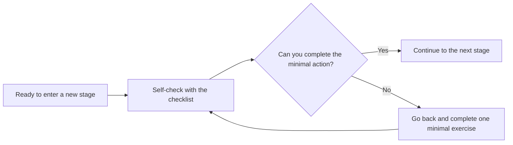

# Prerequisite Checklist

This checklist is used to quickly judge whether you are ready before entering a key stage. If you are not familiar with one item, it does not mean you cannot keep learning, but it is recommended that you first go back to the corresponding section and complete a minimal exercise. In AI full-stack learning, the biggest pitfall is prerequisite knowledge gaps piling up, until you feel like “I understand a little bit of every chapter, but I still can’t build the project.”

## One-glance usage guide

| Self-check result | Next step |
|---|---|
| Most items are doable | Keep learning, and write unfamiliar points into your review notes |
| Only 1–2 items are unfamiliar | Complete one minimal exercise; do not relearn the whole chapter |
| Most items are still unclear | Go back to the task list from the previous stage and complete the minimal project first |

## Before entering Python

You should be able to do these things: open the terminal, enter the project directory, create a file, run a command, understand the current working directory, and know which command produced an error message. If these are still unfamiliar, go back to the developer tools basics stage first.

## Before entering data analysis

You should be able to write functions, use lists and dictionaries, read and write files, install third-party libraries, and understand the input and output of a script. Before entering Pandas, it is best if you can use pure Python to read a text file and count its contents.

## Before entering machine learning

You should be able to read tabular data, view rows and columns, handle missing values, understand the difference between training data and target variables, and use charts to describe data distributions. Machine learning does not start with algorithms; it starts with the question, “Can this problem be expressed with data?”

## Before entering deep learning

You should understand training sets, validation sets, test sets, features, labels, loss functions, overfitting, and evaluation metrics. You should also have a basic intuition for matrices, vectors, and array shapes. Otherwise, PyTorch tensor errors will be very hard to debug.

## Before entering large models and Prompt

You should understand what model inputs and outputs are, what an API is, what JSON is, what context is, and why model responses may be unstable. A Prompt is not a magic sentence, but a clear way to give the model the task, constraints, inputs, and output format.

## Before entering RAG

You should be able to complete one LLM API call, understand text chunking, know that embedding turns text into vectors, understand similarity retrieval, and distinguish between “retrieved results” and “generated answers.” If you cannot inspect the retrieved original text snippets, debugging RAG will be very difficult.

## Before entering Agent

You should understand function calling, tool parameters, error handling, logs, state, and permissions. An Agent is not simply about making the model think more; it is about letting the model call tools within controlled boundaries to complete tasks. Before entering Agent, it is best if you can first write a normal function-calling workflow.

## Before entering deployment

You should be able to explain project dependencies, run commands, configuration items, environment variables, log locations, and how to troubleshoot errors. Deployment is not something to think about only at the very end; it is an important step for verifying whether a project is reproducible.

## How to use this checklist

Before entering each new stage, spend 10 minutes checking the corresponding items. For things you do not understand, do not stay stuck on theoretical explanations for too long; prioritize completing one minimal exercise. For example, if you are not familiar with JSON, write a script to read and write JSON; if you are not familiar with an API, call a public endpoint once; if you are not familiar with logs, add one runtime log message to your small program.
