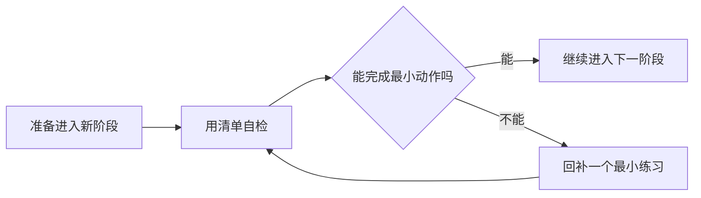

# 前置知识检查清单

这份清单用于在进入关键阶段前快速判断自己是否准备好了。如果某一项不熟，不代表不能继续学，但建议先回到对应章节补一个最小练习。AI 全栈学习最怕的是前置知识缺口不断累积，最后感觉“每一章都看得懂一点，但项目做不出来”。

## 使用方法一图看懂

| 自检结果 | 下一步 |
|---|---|
| 大部分能做 | 继续学习，把不熟的点写进复盘 |
| 只有 1～2 项不熟 | 补一个最小练习，不要重学整章 |
| 多数都不会 | 回到上一阶段任务单，先完成最小项目 |

## 进入 Python 前

你应该能完成这些动作：打开终端，进入项目目录，创建文件，运行一个命令，理解当前工作目录，知道错误信息来自哪条命令。如果这些还不熟，先回到开发者工具基础阶段。

## 进入数据分析前

你应该能写函数、使用列表和字典、读写文件、安装第三方库，并理解脚本的输入和输出。进入 Pandas 前，最好能用纯 Python 读取一个文本文件并统计内容。

## 进入机器学习前

你应该能读取表格数据，查看行列，处理缺失值，理解训练数据和目标变量的区别，能用图表描述数据分布。机器学习不是从算法开始，而是从“这个问题能不能被数据表达”开始。

## 进入深度学习前

你应该理解训练集、验证集、测试集、特征、标签、损失函数、过拟合和评估指标。还应该对矩阵、向量和数组 shape 有基本直觉。否则 PyTorch 的张量错误会非常难排查。

## 进入大模型与 Prompt 前

你应该理解什么是模型输入输出、什么是 API、什么是 JSON、什么是上下文，以及为什么模型回答可能不稳定。Prompt 不是魔法句子，而是把任务、约束、输入和输出格式清楚交给模型。

## 进入 RAG 前

你应该能完成一次 LLM API 调用，理解文本切分，知道 embedding 是把文本变成向量，理解相似度检索，能区分“检索结果”和“生成答案”。如果你无法查看检索到的原文片段，RAG 调试会很困难。

## 进入 Agent 前

你应该理解函数调用、工具参数、错误处理、日志、状态和权限。Agent 不是简单地让模型多思考，而是让模型在受控边界内调用工具完成任务。进入 Agent 前，最好先能写一个普通函数调用工作流。

## 进入部署前

你应该能说明项目依赖、运行命令、配置项、环境变量、日志位置和错误排查方式。部署不是最后一步才考虑的事情，而是检验项目是否可复现的重要环节。

## 如何使用这份清单

每进入一个新阶段前，用 10 分钟检查对应条目。不会的地方不要长时间停留在理论解释上，优先补一个最小练习。例如不熟 JSON，就写一个读写 JSON 的脚本；不熟 API，就调用一次公开接口；不熟日志，就给自己的小程序加一条运行日志。
