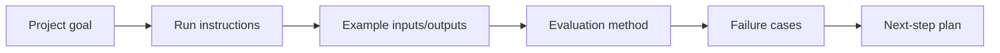

# Project Delivery Standard

Project pages in this course should not only tell learners “what features to build,” but also “what evidence to deliver.” If a project does not include run instructions, example inputs/outputs, evaluation methods, or failure cases, it is hard to turn it from an exercise into a portfolio piece.

## One-Chart Overview: The Project Delivery Loop

| If you can only add 3 things first | Reason |
|---|---|
| Run instructions | So others can reproduce it |
| Example inputs/outputs | So others can see the actual result |
| Failure cases | To prove you understand the system limits |

## Recommended Project Page Structure

| Module | Question it should answer | Minimum requirement |
|---|---|---|
| Project goal | What problem does this project solve? | Explain user input, system output, and usage scenario |
| Run instructions | How can others reproduce it? | Provide dependency installation, run commands, and environment variable notes |
| Example inputs/outputs | What does the project actually look like? | Show at least one real input and the corresponding output |
| Project structure | How are files organized? | List core source code, data, logs, and report directories |
| Method explanation | Why was it done this way? | Explain the choice of data, model, Prompt, RAG, Agent, or tools |
| Evaluation method | How do we judge the result? | Clearly state metrics, baseline, test set, or manual review criteria |
| Failure cases | Where is it still unstable? | Record at least 1–3 failure cases and possible causes |
| Next-step plan | How will it be iterated? | State what will be changed in the next version and why |

The closer a project is to the second half of the course, the more it should emphasize an engineering loop. RAG projects should include retrieval logs and citation checks, Agent projects should include traces and permission boundaries, and multimodal projects should include material sources and a review checklist.

## Minimum README Acceptance Criteria

For each stage of a project, the README should at least allow another person to answer: what this project does, how to run it, what the inputs and outputs are, how well it currently works, where it fails, and what will be changed next.

~~~md
# Project Name

## Project Goal

## Run Instructions

## Example Inputs/Outputs

## Project Structure

## Method Explanation

## Evaluation Method

## Failure Cases

## Next-Step Plan
~~~

If the project involves LLM, RAG, or Agent, it should also explain the Prompt version, model call configuration, retrieval configuration, tool schema, log fields, and safety boundaries.

## Additional Requirements for Different Project Types

| Project type | Extra evidence | Common signs of failure |
|---|---|---|
| Python utility | Command-line arguments, file read/write examples, exception handling | Only runs on the author's computer, no example input |
| Data analysis project | Data dictionary, cleaning records, chart conclusions, limitations | Only charts, no explanation or data quality notes |
| Machine learning project | baseline, metrics, data split, error analysis | Only reports the highest score, no explanation of evaluation method |
| Deep learning project | training curves, configuration, checkpoint, failure cases | Loss screenshots exist, but experiments cannot be reproduced |
| Prompt project | Prompt version, fixed test samples, structured validation | Only shows one successful output |
| RAG project | chunks, retrieval logs, eval questions, citation check | Answers look correct, but the citations do not support them |
| Agent project | tools schema, agent traces, max_steps, human confirmation | Impossible to replay what the Agent did |
| Multimodal project | material sources, Prompt version, review checklist, exported results | Only generated images are shown, with no source or usage boundary explained |

## Project Completion Checklist

Before submitting a stage project, it is recommended to check item by item: can the README be read independently, are the run commands copyable, are the example inputs/outputs real, is the evaluation method clear, are failure cases recorded, are project limitations explained, and is the next-step plan specific?

If a project is still incomplete for now, it can still be submitted using a “minimum closed loop” approach. The important thing is to leave evidence in each iteration: what was added this time, what was verified, where it failed, and why the next change should be made that way.
