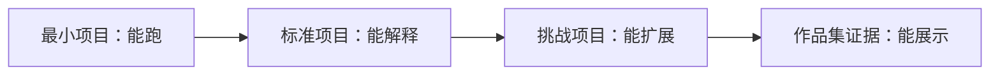

# 全课程项目矩阵

这张表帮助你把课程从“章节列表”变成“作品路线”。每个阶段都至少保留一个可运行成果，最后你会得到一组能展示成长过程的项目证据。

## 先看图：每个项目分三档



第一遍只做“最小项目”也可以继续往后走。准备作品集时，再把关键项目升级到“标准项目”或“挑战项目”。

| 学习站 | 最小项目 | 标准项目 | 挑战项目 | 作品集证据 |
|---|---|---|---|---|
| 1 开发者工具基础 | 建仓库并跑通 Python | 配好 Git、VS Code、Jupyter | 写环境搭建脚本 | README、截图、提交记录 |
| 2 Python 编程基础 | 命令行任务管理器 | 支持 JSON 保存和模块拆分 | 加 Web API 或 AI API 调用 | 运行命令、示例输入输出 |
| 3 数据分析与可视化 | 单 CSV EDA | 多数据源分析报告 | 加数据库和交互图表 | 图表、结论、数据清洗记录 |
| 4 AI 数学基础 | 用向量和概率解释数据 | 梯度下降可视化小实验 | 反向传播直觉演示 | 公式解释、图示、实验记录 |
| 5 机器学习 | 房价或分类 baseline | 完整 sklearn pipeline | 特征工程和模型对比 | 指标、baseline、错误分析 |
| 6 深度学习与 Transformer | PyTorch 训练循环 | 图像或文本分类项目 | 训练诊断与迁移学习 | 曲线、混淆矩阵、失败样本 |
| 7 大模型原理与 Prompt | Prompt 模板集 | 学习计划/复盘卡生成器 | 行为对比评估表 | Prompt 版本、输出对比 |
| 8 LLM 应用与 RAG | Markdown 检索问答 | 课程知识库助手 | Rerank、评估集、引用检查 | 问题集、来源引用、评估结果 |
| 9 AI Agent | 工具调用小 Agent | 学习规划 Agent | 加记忆、MCP、trace 和安全边界 | 执行轨迹、工具日志、回放样本 |
| 10 计算机视觉 | 图像分类或 OCR 实验 | 目标检测/视觉理解项目 | 行业视觉检测 Demo | 标注样例、指标、可视化结果 |
| 11 自然语言处理 | 文本分类或关键词抽取 | 评论理解/信息抽取项目 | 领域文本分析系统 | 标签体系、指标、错误样本 |
| 12 AIGC 与多模态 | 图片/语音/视频小实验 | 多模态内容工作流 | 可审核的创意平台 Demo | 素材、生成记录、人工审核标准 |

## 怎么使用这张矩阵

如果你时间有限，每个阶段只完成最小项目也可以继续往后走。如果你想做作品集，建议至少在机器学习、RAG、Agent、多模态阶段完成标准项目，并把 README 写完整。

不要把挑战项目当成必做项。它们更适合在你已经跑通主线后，用来把作品从“学习练习”升级成“可展示项目”。

## 项目证据分层

同一个项目可以分三次交付，不需要一开始就做到完整产品。第一次先交最小闭环，证明它能运行；第二次补工程证据，证明它能复现和排查；第三次补展示材料，证明它能放进作品集或面试。

| 证据层 | 要回答的问题 | 常见文件 |
|---|---|---|
| 最小闭环 | 这个项目能不能跑起来 | `README.md`、运行命令、示例输入输出 |
| 工程闭环 | 出错时能不能定位和复现 | 配置文件、日志、测试样例、失败样本 |
| 作品闭环 | 别人能不能看懂价值和取舍 | 架构图、评估报告、截图/GIF、复盘记录 |

越到课程后半段，项目证据越应该从“能跑”转向“能解释、能评估、能复盘”。RAG 和 Agent 项目尤其要保留中间过程，而不是只保留最终答案。

## 推荐仓库组织方式

如果你想把整套课程整理成一个长期作品集，可以把每个阶段项目放在同一个总仓库里，也可以每个成熟项目单独建仓。无论哪种方式，建议保持统一结构。

```text
ai-fullstack-portfolio/
├── ch01-tools1-python-cli/
├── ch01-tools2-data-analysis/
├── ch01-tools5-ml-baseline/
├── ch01-tools8-rag-assistant/
├── ch01-tools9-agent-planner/
└── final-ai-app/
```

每个项目目录至少包含 README、源码、示例数据或输入、结果截图或输出、失败样本和下一步计划。这样做的好处是，学完整门课后你不是只有一堆练习文件，而是有一条清晰的成长证据链。
