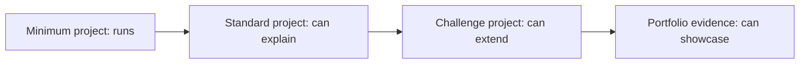

# Full-Course Project Matrix

This table helps you turn the course from a “list of chapters” into a “project roadmap.” At each stage, keep at least one runnable result, and by the end you will have a set of project artifacts that show your growth.

## First, look at the diagram: each project has three tiers



It is fine to start by doing only the “minimum project” in the first pass. When you prepare your portfolio, upgrade key projects to the “standard project” or “challenge project” tier.

| Learning stage | Minimum project | Standard project | Challenge project | Portfolio evidence |
|---|---|---|---|---|
| 1 Developer Tools Basics | Create a repo and get Python running | Set up Git, VS Code, and Jupyter properly | Write an environment setup script | README, screenshots, commit history |
| 2 Python Programming Basics | Command-line task manager | Support JSON saving and module splitting | Add a Web API or AI API call | Run commands, sample input/output |
| 3 Data Analysis and Visualization | EDA on a single CSV | Analysis report from multiple data sources | Add a database and interactive charts | Charts, conclusions, data cleaning notes |
| 4 AI Math Basics | Explain data with vectors and probability | Small gradient descent visualization experiment | Intuitive backpropagation demo | Formula explanations, diagrams, experiment logs |
| 5 Machine Learning | House price or classification baseline | Complete sklearn pipeline | Feature engineering and model comparison | Metrics, baseline, error analysis |
| 6 Deep Learning and Transformer | PyTorch training loop | Image or text classification project | Training diagnostics and transfer learning | Curves, confusion matrix, failed samples |
| 7 LLM Principles and Prompt | Prompt template set | Study plan / review card generator | Behavior comparison evaluation table | Prompt versions, output comparison |
| 8 LLM Applications and RAG | Markdown retrieval QA | Course knowledge base assistant | Rerank, evaluation set, citation checks | Question set, source citations, evaluation results |
| 9 AI Agent | Small tool-calling Agent | Study planning Agent | Add memory, MCP, trace, and safety boundaries | Execution trace, tool logs, replay samples |
| 10 Computer Vision | Image classification or OCR experiment | Object detection / visual understanding project | Industry visual inspection demo | Annotation samples, metrics, visualization results |
| 11 Natural Language Processing | Text classification or keyword extraction | Comment understanding / information extraction project | Domain text analysis system | Label system, metrics, error samples |
| 12 AIGC and Multimodal | Small image / audio / video experiment | Multimodal content workflow | Reviewable creative platform demo | Assets, generation logs, human review criteria |

## How to use this matrix

If you are short on time, finishing only the minimum project for each stage is enough to keep moving forward. If you want to build a portfolio, it is recommended to complete at least the standard project in the machine learning, RAG, Agent, and multimodal stages, and to write a complete README.

Do not treat the challenge projects as required tasks. They are better suited for after you have already finished the main path, and can be used to upgrade your work from “learning exercise” to “showcase project.”

## Project evidence tiers

The same project can be delivered in three rounds. You do not need to build a complete product from the start. In the first round, submit the minimum closed loop to prove it runs; in the second round, add engineering evidence to prove it can be reproduced and debugged; in the third round, add presentation materials to prove it can go into a portfolio or interview.

| Evidence tier | Question to answer | Common files |
|---|---|---|
| Minimum closed loop | Can this project run? | `README.md`, run commands, sample input/output |
| Engineering closed loop | Can errors be located and reproduced? | Config files, logs, test samples, failed samples |
| Portfolio closed loop | Can others understand the value and trade-offs? | Architecture diagram, evaluation report, screenshots/GIFs, retrospective notes |

As you move into the second half of the course, project evidence should shift from “it runs” to “it can be explained, evaluated, and reviewed.” RAG and Agent projects especially should keep intermediate process artifacts, not just the final answer.

## Recommended repository organization

If you want to organize the entire course into a long-term portfolio, you can place each stage project in the same monorepo, or create a separate repo for each mature project. Either way, it is recommended to keep a consistent structure.

```text
ai-fullstack-portfolio/
├── ch01-tools1-python-cli/
├── ch01-tools2-data-analysis/
├── ch01-tools5-ml-baseline/
├── ch01-tools8-rag-assistant/
├── ch01-tools9-agent-planner/
└── final-ai-app/
```

Each project folder should include at least a README, source code, sample data or inputs, result screenshots or outputs, failed samples, and a next-step plan. The benefit is that after finishing the course, you will not just have a pile of exercise files—you will have a clear chain of evidence showing your growth.
