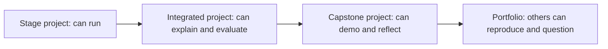
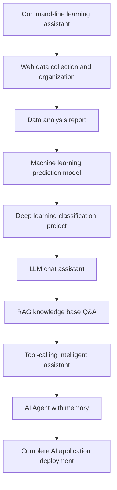

# Project Roadmap and Portfolio


The most effective way to learn AI is not to keep watching tutorials, but to keep building small projects that can run, be explained, and be shown to others. Projects force you to face real problems: where the data comes from, what the inputs and outputs are, how the model is integrated, how the results are evaluated, and how to troubleshoot when things fail.

This course breaks projects into three levels: stage projects, integrated projects, and capstone projects.

## First, look at the diagram: how projects grow from exercises into portfolio pieces



| Level | What to achieve first | What not to chase at the beginning |
|---|---|---|
| Stage project | Input, output, and a run command | Lots of features and a beautiful UI |
| Integrated project | Metrics, logs, and failure cases | Only a single success screenshot |
| Capstone project | A complete README, evaluation, and demo | Stuffing every technology into it |

## Project growth roadmap



## First group of projects: programming and data fundamentals

The goal of the first group of projects is to help you become familiar with the development workflow, rather than chasing complex algorithms.

You can start with a command-line to-do tool or learning assistant to practice Python input/output, file reading and writing, argument parsing, and module separation. Then build a web data collection project to practice requests, parsing, cleaning, and saving. After that, create a data analysis report to practice Pandas, visualization, and communicating conclusions.

After completing this group of projects, you should be able to independently finish a “small but complete” Python project and organize the results into documentation or a Notebook.

## Second group of projects: model training and evaluation

The goal of the second group of projects is to understand how models learn patterns from data.

You can build projects such as house price prediction, customer churn prediction, user segmentation, and anomaly detection. Each project should include data understanding, feature processing, train/test split, model training, metric evaluation, error analysis, and improvement suggestions.

After completing this group of projects, you should be able to explain the full loop of a machine learning project, rather than only knowing how to call `fit()` and `predict()`.

## Third group of projects: LLM applications

The goal of the third group of projects is to integrate LLMs into real tasks.

You can start with an LLM chat assistant to practice API calls, Prompt templates, conversation context, and structured output. Then build a document Q&A system to practice document parsing, chunking, Embedding, vector retrieval, and RAG. After that, you can build a course Q&A assistant, a resume optimization assistant, a knowledge organization assistant, or an enterprise knowledge base demo.

After completing this group of projects, you should be able to clearly explain: what the LLM is responsible for, what the retrieval system is responsible for, what the backend service is responsible for, and how the evaluation data is designed.

## Fourth group of projects: AI Agents

The goal of the fourth group of projects is to upgrade AI from “answering questions” to “executing tasks.”

You can build a research assistant that breaks down questions by topic, retrieves materials, and organizes summaries. You can also build a data analysis Agent that reads data, generates an analysis plan, calls Python tools, and outputs charts and conclusions. Going further, you can build a multi-Agent development team demo where different roles collaborate to complete requirement analysis, coding, testing, and documentation.

After completing this group of projects, you should be able to understand the core challenges of Agents: task planning, tool selection, context management, error recovery, permission boundaries, cost control, and result evaluation.

## Capstone project suggestions

A capstone project does not have to be very large, but it must be complete. A good capstone project should include a frontend or interaction entry point, backend API, model calls, data or a knowledge base, logging, basic evaluation, and deployment instructions.

Optional directions include: personal knowledge base assistant, course learning assistant, resume analysis assistant, industry report generation assistant, customer service knowledge base, data analysis Agent, office automation assistant, and multimodal content creation tools.

## Portfolio README template

Every time you finish a stage project, it is recommended that you add a README for the project. The README does not need to be long, but it should help others quickly understand what problem the project solves, how to run it, how to judge the results, and what improvements can be made next.

````md
# Project Name

## Project Goal

What problem does this project solve? Who is the target user? Why is it worth building?

## Input and Output

Input: What data, text, images, documents, or questions does the user need to provide?
Output: What results, charts, files, answers, or reports will the system return?

## Technical Approach

Describe the core flow in 3 to 6 steps, for example: read data → clean → model → evaluate → output report.

## How to Run

```bash
# Install dependencies
pip install -r requirements.txt

# Run the project
python main.py
```

## Results Display

Include key screenshots, sample outputs, metric tables, or a short run log. Do not just write “ran successfully”; let others see what success looks like.

## Evaluation Method

Explain how you determine whether the project is good or not. This can be accuracy, F1, MAE, recall, a manual checklist, a fixed test question set, or failure-case analysis.

## Problems Encountered

Record 2 to 3 real problems: environment errors, data issues, poor model performance, API failures, RAG retrieval misses, Agent tool-calling failures, etc., and explain how you diagnosed them.

## Next Improvements

Clearly write down what you would improve first if you continued, such as adding more data, changing metrics, adding logs, optimizing the Prompt, adding deployment, or improving the UI.
````

## How to turn stage projects into portfolio assets

Beginners can first make sure every project has “can run + has instructions + has result screenshots.” More experienced learners can continue to add “experiment logs + error analysis + metric comparisons + deployment instructions.” If you organize the README for each step using the same template, by the time you finish the course you will naturally have a complete AI full-stack portfolio.
