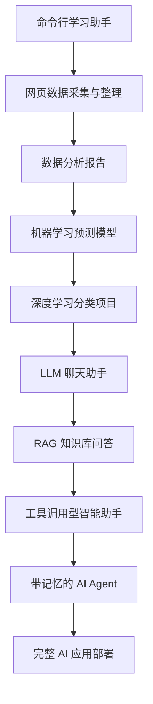

# 项目路线与作品集

学习 AI 最有效的方式不是一直看教程，而是不断完成可运行、可解释、可展示的小项目。项目会逼你面对真实问题：数据从哪里来，输入输出是什么，模型怎么接入，效果怎么评估，失败时怎么排查。

这套课程会把项目分成三个层次：阶段小项目、综合项目、毕业项目。

## 项目成长路线

## 第一组项目：编程与数据基础

第一组项目的目标是让你熟悉开发流程，而不是追求复杂算法。

你可以先做一个命令行待办工具或学习助手，练习 Python 输入输出、文件读写、参数解析和模块拆分。随后做一个网页数据采集项目，练习请求、解析、清洗和保存。再做一个数据分析报告，练习 Pandas、可视化和结论表达。

这一组项目完成后，你应该能独立完成一个“小而完整”的 Python 项目，并能把结果整理成文档或 Notebook。

## 第二组项目：模型训练与评估

第二组项目的目标是理解模型如何从数据中学习规律。

你可以做房价预测、客户流失预测、用户分群、异常检测等项目。每个项目都要包含数据理解、特征处理、训练集和测试集划分、模型训练、指标评估、误差分析和改进建议。

这一组项目完成后，你应该能解释一个机器学习项目的完整闭环，而不是只会调用 `fit()` 和 `predict()`。

## 第三组项目：大模型应用

第三组项目的目标是把大模型接入真实任务。

你可以先做一个 LLM 聊天助手，练习 API 调用、Prompt 模板、对话上下文和结构化输出。然后做一个文档问答系统，练习文档解析、切分、Embedding、向量检索和 RAG。之后可以做一个课程问答助手、简历优化助手、资料整理助手或企业知识库 Demo。

这一组项目完成后，你应该能说清楚：大模型负责什么，检索系统负责什么，后端服务负责什么，评估数据如何设计。

## 第四组项目：AI Agent

第四组项目的目标是让 AI 从“回答问题”升级为“执行任务”。

你可以做一个研究助手，让它根据主题拆解问题、检索资料、整理摘要。也可以做一个数据分析 Agent，让它读取数据、生成分析计划、调用 Python 工具、输出图表和结论。更进一步，可以做一个多 Agent 开发小组 Demo，让不同角色协作完成需求分析、编码、测试和文档。

这一组项目完成后，你应该能理解 Agent 的核心难点：任务规划、工具选择、上下文管理、错误恢复、权限边界、成本控制和结果评估。

## 毕业项目建议

毕业项目不一定要很大，但必须完整。一个好的毕业项目应该包含前端或交互入口、后端 API、模型调用、数据或知识库、日志记录、基础评估和部署说明。

可选方向包括：个人知识库助手、课程学习助手、招聘简历分析助手、行业报告生成助手、客服知识库、数据分析 Agent、自动化办公助手、多模态内容创作工具。

## 项目验收标准

每个项目完成后，建议用以下问题检查自己：这个项目解决的问题是否清楚，用户输入输出是否明确，核心流程是否能画成图，代码是否能重新运行，失败案例是否记录，效果是否有评估方式，是否能用三分钟讲清楚项目价值。

如果一个项目只能在你电脑上偶然跑通，但没有说明、没有评估、没有边界描述，它还不能算作品集项目。真正有价值的项目，应该让别人能理解、能运行、能看到你的设计思路。