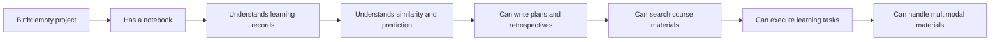

# AI Learning Assistant Story Quest Line

You can think of this course as a growth story: you are not mechanically grinding through chapters, but training an AI learning assistant. At the beginning, it knows nothing and is just an empty project; as you learn tools, Python, data, models, Prompt, RAG, and Agent, it gradually grows into an AI teammate that can read materials, make plans, look up questions, record failures, and help you review.

This story line does not replace the main course path. Instead, it gives each stage a lighter, more approachable goal. When you finish one stop, you unlock a new ability for the assistant.

## First, look at the four acts of the story

| Act | What changes in the assistant | Corresponding learning focus |
|---|---|---|
| Act 1 | Goes from an empty project to a tool that can take notes | Development environment, Python, data analysis |
| Act 2 | Starts to gain judgment | Math, machine learning, deep learning |
| Act 3 | Can communicate, search for information, and complete tasks | Prompt, RAG, Agent |
| Act 4 | Becomes a demo-ready product | CV, NLP, multimodal, capstone project |

## Main story: from a blank assistant to an AI teammate



The rules of the story quests are very simple: in each stage, do only one minimum task and leave one visible piece of evidence. If the task fails, keep the failure sample too, because that is part of AI engineering skills.

## Act 1: Wake up the assistant

| Stage | Story quest | Skills learned | Task evidence |
|---|---|---|---|
| 1 Development tools basics | Set up a workstation for the assistant | Terminal, directories, Git, environments | Project folder, first commit, run screenshot |
| 2 Python programming basics | Give the assistant a notebook | Variables, functions, files, exceptions, JSON | `tasks.json`, command output, error-handling example |
| 3 Data analysis and visualization | Help the assistant understand your learning records | Pandas, cleaning, statistics, charts | Study-time chart, completion-rate chart, data quality check |

The goal of this act is to help beginners quickly feel, “I really made something.” Don’t pursue complex features. As long as the assistant runs stably, saves data, and outputs results, you pass.

## Act 2: Give the assistant judgment

| Stage | Story quest | Skills learned | Task evidence |
|---|---|---|---|
| 4 AI math basics | Teach the assistant to understand similarity, probability, and change | Vectors, probability, gradients, metrics | Small experiments, metric explanations, hand-calculation examples |
| 5 Machine learning | Let the assistant predict learning risk | baseline, train/test split, classification, evaluation | Metric table, error samples, improvement log |
| 6 Deep learning and Transformer | Let the assistant recognize training failures | training loop, loss, overfitting, Transformer intuition | loss curve, config, failure samples |

The focus of this act is not to make the model very powerful, but to help learners understand where model judgments come from, why they can be wrong, and how to prove improvements are effective.

## Act 3: Teach the assistant to communicate and search for information

| Stage | Story quest | Skills learned | Task evidence |
|---|---|---|---|
| 7 Large models and Prompt | Let the assistant write study plans and review cards | Prompt, structured output, schema, evaluation | Prompt versions, fixed input/output, failure samples |
| 8 LLM applications and RAG | Let the assistant read course materials and answer questions | document chunking, retrieval, citation, RAGOps | eval questions, retrieval logs, citation check |
| 9 AI Agent | Let the assistant break down and execute learning tasks | tool calling, trace, permissions, stop conditions | agent trace, tool calls, safety boundary notes |

This act turns the assistant from “someone who can chat” into “someone who can work based on materials.” Beginners often confuse Prompt, RAG, and Agent. A story-based way to remember it is: Prompt means it can talk, RAG means it can look things up, and Agent means it can do things step by step.

## Act 4: Graduation project

| Stage | Story quest | Skills learned | Task evidence |
|---|---|---|---|
| 10 Computer vision | Let the assistant understand screenshots or images | image loading, classification, OCR, visualization | input image, prediction result, failed images |
| 11 Natural language processing | Let the assistant understand text tasks | classification, extraction, summarization, label systems | labeled examples, metrics, error texts |
| 12 AIGC and multimodal | Let the assistant generate content that can be reviewed | image, audio, video, multimodal workflows | source materials, generation records, human review |
| Graduation project | Let the assistant become a demo-ready product | integrated design, deployment, evaluation, retrospection | Demo, README, evaluation report, presentation script |

You do not need to go deep in every direction. Based on your graduation project, you can choose one direction and integrate it into the AI learning assistant, instead of trying to build all visual, NLP, and multimodal capabilities at the same time.

## Fixed format for each story quest

It is recommended that after completing each story quest, you write a short note in the README or `reports/improvement_record.md`.

```md
## Story Quest: Give the assistant a notebook

### Ability unlocked this time
The assistant can add, view, and complete learning tasks, and save them to a JSON file.

### What I learned
Python functions, lists, dictionaries, file reading and writing, and exception handling.

### How to run
python main.py add "Learn Python file reading and writing"

### Success evidence
`tasks.json` was generated, and it can be read again.

### Failure sample
When `tasks.json` is manually corrupted, the program crashes at first.

### Fix record
Add `JSONDecodeError` handling and prompt the user to back up or rebuild the file.
```

This format makes the learning process feel more like a game save. Each save includes abilities, evidence, failures, and fixes, and naturally builds into a portfolio.

## NPC hints in the story

While learning, you can imagine common roles as NPCs. They will keep reminding you to think about the problem from different angles.

| NPC | What it asks you | Corresponding skill |
|---|---|---|
| Product manager | Who exactly does this assistant help, and what problem does it solve | Problem definition, user scenarios |
| Tester | What happens if the input is empty, wrong, or broken | Exception handling, test cases |
| Data detective | Where does the data come from, and can it be trusted | Data cleaning, quality checks |
| Model coach | What is the baseline, and are the metrics trustworthy | Evaluation, error analysis |
| Safety officer | Can the Agent perform dangerous actions | Permissions, human confirmation, safety boundaries |
| Interviewer | How can you prove the project really works | README, demo, failure retrospection |

When you do not know what to do next, let one of these NPCs ask a question. If you can answer these questions, it means the project is becoming more mature.

## Beginner-friendly way to play

Do not aim for a perfect first run. For each story quest, you only need to complete the basic version: it runs, you can take a screenshot, and you record one failure. After the main path works end to end, come back and upgrade some tasks to a standard version or a portfolio version.

If you are struggling a lot at one stop, narrow the goal down to “unlock one minimum ability for the assistant.” For example, in the RAG stage, do not start by building an enterprise knowledge base. As long as the assistant can read 3 Markdown files and answer 5 questions, that is already meaningful progress.

The sense of achievement in learning comes from visible progress. Every time you complete a story quest, add one version note to the README so you can clearly see how the assistant grew step by step from an empty project.
