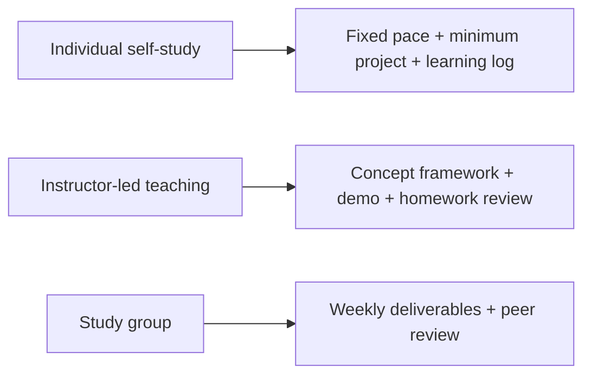

# Teaching and Self-Study Guide

This course can be used both as an individual self-study path and as the course backbone for bootcamps, community-based learning groups, or internal corporate training. The key differences between these usage styles are not the content order, but the pace, homework intensity, discussion format, and project acceptance criteria.

If you are a self-learner, the key is to build a steady rhythm and avoid being intimidated by the number of chapters. If you are an instructor, the key is to compress each stage into learning units that can be taught, practiced, and assessed. If you are organizing a study group, the key is to keep members producing project evidence continuously, rather than just checking off reading progress.

## First, choose how you will use it

| User | Most important action |
|---|---|
| Self-learner | Leave one runnable result and one reflection each week |
| Instructor | Compress each chapter into a unit that can be taught, practiced, and assessed |
| Study group | Sync not only reading progress, but also project evidence |

## How self-learners should use it

When studying on your own, it is recommended to first read the “5 must-read articles” guide, then choose one main path. If you want to build LLM applications quickly, you can first complete the development tools, Python, and data analysis basics, then move into LLM applications, RAG, and Agent. If you want a stronger understanding of models, you can proceed in the order of mathematics, machine learning, deep learning, and Transformer. If you want to build a portfolio, you should keep a small project at each stage instead of waiting until the end to start.

When studying on your own, do not aim to understand every chapter in one pass. A better rhythm is: read through the chapter quickly first, run the minimum code, record one question, then return to the project and use that knowledge to solve a concrete task. Every knowledge point in the course should, as much as possible, be turned into an output artifact, such as a script, a chart, an experiment log, a README, or a demoable feature.

## How instructors should use it

Instructors do not need to teach every page word for word. The course content is better suited as the foundation for lectures; classroom time should be used first and foremost for concept frameworks, key misconceptions, code demos, and homework review. Each stage can be designed with the structure of “opening question, core concepts, minimal demo, in-class exercise, after-class project, and reflection review.”

For beginner classes, it is recommended to reduce the proportion of mathematics and model derivation, and emphasize Python, data processing, API calls, RAG, and project delivery. For advanced classes, you can add model evaluation, engineering practices, Agent safety, deployment, and cost optimization. For internal corporate training, you should replace generic projects with the company’s internal documents, business processes, or data samples, while still preserving evaluation, logging, and security boundary requirements.

## How study groups should use it

The easiest way for a study group to fail is to synchronize only reading progress, not output quality. It is recommended to set a fixed small deliverable each week, such as an experiment log, a Notebook, a runnable script, a project screenshot, or an analysis of a failed sample. Members can review each other’s README files, commands, and sample outputs, rather than only discussing whether they “finished reading.”

In a co-learning group, you can assign three roles: the explainer, who paraphrases this week’s core concepts; the practitioner, who demonstrates code or a project; and the question collector, who gathers blockers and counterexamples. Rotate the roles every week so that everyone experiences the four learning actions: understanding, explaining, implementing, and questioning.

## Recommended course pace

| Pace | Suitable for | Suggested duration | How to use it |
| --- | --- | --- | --- |
| Quick start | Learners with programming basics who want a fast introduction to AI applications | 2-4 weeks | Skip detailed derivations and focus on small API, RAG, and Agent projects |
| Standard self-study | Learners with some time for systematic study | 3-6 months | Follow the main path and complete one project and one reflection at each stage |
| Bootcamp | Learners with an instructor and homework feedback | 8-12 weeks | Teach the core concepts each week, with homework centered on project loops |
| Deep advanced study | Learners who want to strengthen model principles and engineering skills | 6-12 months | Read the chapters on models, evaluation, deployment, security, and multimodality in depth |

No matter which pace you choose, it is recommended to keep a “learning log.” The learning log does not need to be long, but it should record what you learned this week, what you built, what problems you encountered, and what you plan to improve next. Over time, the learning log will reflect real growth better than simple reading progress.

## Homework design suggestions

Good homework should be runnable, checkable, and reviewable. Do not assign only “read chapter X” or “understand concept Y.” Better homework formats include: implementing a small calculation with NumPy, cleaning a dataset with Pandas, training a baseline with sklearn, completing a training loop with PyTorch, answering course questions with RAG, or using an Agent to call tools and generate a study plan.

Each assignment should ideally include basic requirements and challenge requirements. The basic requirements ensure that everyone can complete the full loop; the challenge requirements give advanced learners room to go deeper. When grading or reviewing, prioritize reproducibility, example inputs and outputs, error records, and explanations of technical choices, rather than only whether the final result looks polished.

## Project acceptance suggestions

Project acceptance can be judged from four angles: whether the function is complete, whether the engineering is reproducible, whether the results are evaluated, and whether the reflection is specific. Functional completeness means the system can produce a usable output after user input. Engineering reproducibility means others can run it by following the README. Result evaluation means there are test samples, metrics, or human review criteria. Specific reflection means the learner can clearly explain failure cases, causes, and next steps.

If used for teaching, you can require each stage project to submit three files: the README, the experiment log, and the failed-sample analysis. The README explains how to run it, the experiment log explains what was tried, and the failed-sample analysis explains what the system still does not handle well. This helps prevent students from only turning in final code without being able to explain their project.

## Suggested teaching sequence

For learners with no background or a weak foundation, it is recommended to first build an overall understanding that “AI applications are a system,” and only then move into code details. You can first show the input and output of a complete AI assistant, then break it down into the underlying Python, data, models, retrieval, prompts, tools, logs, and deployment. This way, learners will better understand why they need to learn the foundational content first.

For learners with development experience, you can go the other way around: start from project requirements and build while filling in the fundamentals. For example, first build a minimal RAG Q&A system, then go back and explain text chunking, embedding, vector databases, evaluation metrics, and engineering deployment. This helps reduce the feeling of “I learned a lot, but I don’t know where to use it.”

## Course maintenance suggestions

This course should be updated continuously, but it is not recommended to chase every new model or framework too frequently. A more stable maintenance approach is to prioritize updates to the capability map, project roadmap, evaluation standards, tool ecosystem, and common mistakes. Specific models and frameworks can appear as examples, but the main line of the course should remain focused on problem decomposition, system design, engineering delivery, and evaluation reflection.

When adding a new chapter, it is best to also add three things: how it relates to the previous and next chapters, which project capability it supports, and what the passing criteria are. This way, the course will not become a pile of isolated knowledge points; it will continue to maintain a clear AI full-stack growth path.
