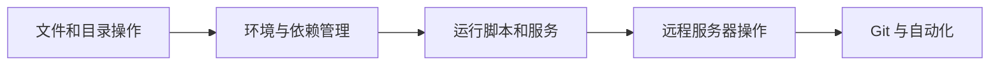

# 为什么要学命令行

## 学习目标

- 理解命令行和图形界面的本质区别
- 了解 AI 开发中哪些操作必须用命令行
- 克服对"黑底白字"的恐惧感

---

## 零、先建立一张地图

命令行这一节最适合新人的理解顺序不是“先背命令”，而是先看清它在开发工作流里的位置：



所以这节真正想解决的是：

- 为什么开发者最终都会回到命令行
- 为什么它不是“另一个界面”，而是一种更适合开发的操作方式

## 先看一个场景

假设你刚训练完一个 AI 模型，需要做以下操作：

1. 把训练好的模型文件从服务器下载到本地
2. 在 3 个不同的测试数据集上评估模型效果
3. 把结果整理成表格
4. 推送代码到 GitHub

如果用图形界面，你需要：打开文件管理器 → 找到文件 → 拖拽下载 → 打开 3 个 Jupyter Notebook → 手动运行 → 手动复制结果 → 打开 GitHub Desktop → 点击提交……

如果用命令行，你可以这样做：

```bash
# 从服务器下载模型
scp server:/models/best_model.pt ./models/

# 在 3 个数据集上评估（一条命令搞定）
for dataset in test_a test_b test_c; do
    python evaluate.py --model models/best_model.pt --data data/$dataset
done

# 推送到 GitHub
git add . && git commit -m "添加模型评估结果" && git push
```

6 行命令，30 秒搞定。而且下次再做同样的事，直接复制这 6 行就行。

这就是命令行的核心优势：**高效、可重复、可自动化**。

### 这段例子最值得先看什么？

第一次看命令行，不必先纠结每条命令具体参数。  
更值得先抓住的是：

1. 命令行很适合把一串操作串起来
2. 串起来以后就更容易重复执行
3. 这和后面脚本化、自动化是同一条主线

---

## 命令行 vs 图形界面

| 对比维度 | 图形界面（GUI） | 命令行（CLI） |
|---------|---------------|-------------|
| **上手难度** | 简单直观，看到什么点什么 | 需要记命令，初期有学习成本 |
| **操作效率** | 单个操作方便，批量操作痛苦 | 单个操作稍慢，批量操作极快 |
| **可重复性** | 每次都要手动操作 | 写好命令可以反复使用 |
| **自动化** | 几乎不可能自动化 | 天然支持脚本和自动化 |
| **远程操作** | 需要远程桌面（慢、卡） | SSH 连接，流畅无比 |
| **精确控制** | 被界面设计限制 | 想做什么做什么 |

一句话总结：**图形界面是给用户用的，命令行是给开发者用的。**

你现在要从"用户"变成"开发者"，命令行是第一课。

---

## AI 开发中，哪些事必须用命令行？

你可能觉得"我用鼠标点点也行吧"。在 AI 开发中，很多操作只有命令行能做，或者用命令行做效率高一个数量级：

### 1. 管理 Python 环境

```bash
# 创建一个专门用于深度学习的环境
conda create -n dl python=3.11

# 激活环境
conda activate dl

# 安装 PyTorch
pip install torch torchvision
```

这些操作没有图形界面可以替代。

### 2. 使用 Git 管理代码

```bash
git add .
git commit -m "修复了数据加载的 bug"
git push origin main
```

所有团队协作都基于 Git 命令行（或其图形封装，但底层是命令行）。

### 3. 在云服务器上训练模型

训练大模型通常不在你的电脑上，而是在云服务器（如 AutoDL、AWS）上。连接方式：

```bash
# 通过 SSH 连接到云服务器
ssh root@123.456.789.0

# 在服务器上启动训练
python train.py --epochs 100 --batch_size 32
```

云服务器通常**没有图形界面**，你唯一的操作方式就是命令行。

### 4. 安装各种工具和库

```bash
pip install transformers langchain chromadb
```

### 5. 运行脚本和项目

```bash
# 启动一个 FastAPI 服务
uvicorn main:app --reload

# 运行测试
pytest tests/

# 构建 Docker 镜像
docker build -t my-ai-app .
```

### 一个更适合新人的理解方式

你可以先把命令行理解成：

- 开发者和系统之间的直接对话层

图形界面更像：

- 帮你把常见操作做成按钮

而命令行则是：

- 让你自己把这些操作精确组织起来

这也是为什么越往后学：

- 环境
- 训练
- 部署
- 自动化

越离不开命令行。

---

## "我怕命令行"——如何克服？

如果你从来没用过命令行，看到那个黑色窗口可能会紧张。这完全正常。几点建议：

**1. 它不会炸掉你的电脑**

命令行里的大部分命令都是安全的（查看文件、创建文件夹、切换目录）。少数危险命令（比如 `rm -rf /`）你现在根本不会碰到。

**2. 记不住命令很正常**

没有人记得住所有命令。90% 的时间你只会用 10 个左右的核心命令（下一节会教你）。其他的用到了再查就行。

**3. Tab 键是你的好朋友**

在命令行里输入文件名或命令的前几个字母，按 `Tab` 键，它会自动帮你补全。这个功能能帮你省掉一半的打字量。

**4. 上下箭头可以翻历史**

按 `↑` 键可以调出上一条执行过的命令，不需要重新打字。

### 5. 第一次上手时，先只学最常用的 8~10 个命令

更稳的节奏通常是：

1. `pwd`
2. `ls`
3. `cd`
4. `mkdir`
5. `cp`
6. `mv`
7. `rm`
8. `python`
9. `git`
10. `pip` / `conda`

只要这批命令会了，你后面很多课程就已经能顺利跟上。

### 一个很适合新人的练习方式

第一次练命令行时，不要只盯着命令本身背。  
更稳的做法是每天练 3 类动作：

1. 进目录、看文件、切目录
2. 创建、复制、移动和删除文件
3. 运行一个 Python 脚本或 Git 命令

只要你把“命令和动作”建立起对应关系，  
命令行就不会再只是黑底白字。

---

## 小结

| 要点 | 说明 |
|------|------|
| 命令行是 AI 开发的基础工具 | 环境管理、Git、服务器操作都离不开 |
| 核心优势是效率和自动化 | 批量操作、可重复、可脚本化 |
| 初期有学习成本 | 但只需要掌握 ~10 个核心命令 |
| 不需要背命令 | 用多了自然就记住了，忘了就查 |

## 这节最该带走什么

- 命令行不是为了显得专业，而是为了更高效地组织开发动作
- 它最大的优势不是“酷”，而是“可重复、可自动化、可远程”
- 只要把最常用的几个命令练熟，后面很多开发体验都会一下顺起来

## 如果继续往上做，这节最值得补什么

更值得继续补的通常是：

1. 一个“10 个最常用命令”随手表
2. 一个“第一次 SSH 上服务器”练习
3. 一个“命令行 + Git + Python 脚本”三步小项目

:::tip 心态调整
把命令行想象成一个只听文字指令的助手。图形界面是你用手指指指点点告诉它干什么，命令行是你用文字精确地告诉它干什么。文字比手指更精确、更快、更容易复制。
:::
