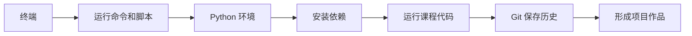

# 1 开发者工具基础

这一阶段解决的是“能不能稳定地写代码、运行代码、保存代码”。很多新人后面学 AI 卡住，并不是因为模型太难，而是因为命令行不会用、环境混乱、依赖装错、代码没有版本管理。

## 故事化导入：先打造你的 AI 工作台

在开始写模型和应用之前，先把工作台搭稳。终端像控制台，Git 像存档系统，Python 环境像实验室，VS Code 和 Jupyter 像两种不同的操作台。工具阶段的目标不是学很多命令，而是让你以后遇到项目时能自己创建、运行、保存和恢复。

## 学习闯关地图

## 互动练习：每天留下一个可复现记录

每完成一个工具操作，都在学习仓库里记下一条“我做了什么、用了什么命令、遇到什么报错、最后怎么解决”。这些记录会成为你自己的开发说明书。后面环境出问题时，你不是从零开始猜，而是能回到历史记录里找线索。

## 项目彩蛋

本阶段的彩蛋作品是一个 `ai-learning-lab` 仓库。它看起来只是一个简单文件夹，但以后会逐步装进 Python 脚本、数据分析 Notebook、模型实验、RAG 项目和 Agent Demo。也就是说，这个仓库会从第一天的小工具箱，成长为你的 AI 全栈作品集。

## 阶段定位

| 信息 | 说明 |
|---|---|
| 适合对象 | 刚开始系统学习 AI 全栈，或开发工具链不稳定的学习者 |
| 预估学时 | 8～12 小时 |
| 前置要求 | 无 |
| 阶段产出 | 一个可复现的 Python 开发环境，一个能用 Git 管理的学习仓库 |

## 新手最小通关路线

新手先把终端基础、Git 基本操作和 Python 环境配置跑通，不需要一开始掌握复杂分支模型或所有命令参数。只要你能创建项目、运行 Python 文件、安装依赖、提交一次 Git 记录，就算完成本阶段最小通关。

## 进阶深入路线

如果你已经有开发经验，可以重点补齐环境隔离、Git 分支协作、远程仓库同步和可复现项目说明。进一步尝试把 `ai-learning-lab` 写成一个标准项目仓库，包含环境说明、运行命令、目录结构和常见问题记录。

## 新人先做什么，进阶再做什么

新人第一次学这一阶段时，先把目标压到最低：能打开终端、进入项目目录、运行一个 Python 文件、安装一个依赖、完成一次 Git 提交。不要被命令参数吓到，先形成“遇到问题会看路径、看报错、看当前环境”的习惯。

有经验的学习者可以把重点放在可复现性上：不同项目如何隔离环境，README 怎样写运行步骤，依赖版本怎样记录，Git 历史怎样帮助回滚。你的目标不是“会用工具”，而是让后面的每个 AI 项目都能被别人重新跑起来。

## 为什么先学工具

AI 学习不是只在网页上看概念。你后面会不断安装库、运行脚本、打开 Notebook、下载数据、调用 API、训练模型、启动服务、排查报错。工具链越早稳定，后面越少在无关问题上消耗精力。

## 本阶段学习路径

第一章先学终端与命令行。你需要能进入目录、查看文件、运行命令、理解路径和常见报错。

第二章再学 Git 与版本管理。你需要养成边写边提交的习惯，知道如何查看历史、回滚改动、管理分支和同步远程仓库。

第三章最后学开发环境配置。你会搭建 Python 环境、配置 VS Code、使用 Jupyter，并理解为什么要用虚拟环境隔离依赖。

## 学完后你应该能做到

- 能在终端中完成基本文件和项目操作
- 能创建、激活和管理 Python 环境
- 能使用 VS Code 编写、运行和调试 Python 文件
- 能用 Git 保存学习过程，并把项目推送到 GitHub
- 遇到环境问题时，能先判断是路径、解释器、依赖还是权限问题

## 常见误区

很多新人会觉得“命令行和 Git 以后再补也行”。但 AI 项目里，环境、依赖、数据路径、模型文件和部署命令几乎每天都会出现。如果工具基础不稳，后面的每个阶段都会反复被打断。

另一个常见误区是把所有 Python 包都装进同一个环境。短期看方便，长期会出现版本冲突。你应该从一开始就理解虚拟环境的意义。

## 工具错误剧场：环境问题先看哪里

如果终端提示找不到命令，先检查命令是否安装、当前 shell 是否刷新、路径是否写错；如果 Python 能运行但包导入失败，先确认当前解释器和安装依赖的环境是不是同一个；如果 Git 提交失败，先看是否初始化仓库、是否配置用户名邮箱、是否真的把文件加入暂存区。

## 阶段项目

基础版是创建一个 `ai-learning-lab` 学习仓库，包含一个能运行的 `hello_ai.py`、一次 Git 提交和一份命令记录。标准版需要补充 Python 环境说明、依赖安装方式、VS Code 或 Jupyter 使用记录，并把仓库推送到远程平台。挑战版可以把它整理成后续 12 个学习站的作品集根目录，提前设计 `scripts/`、`notebooks/`、`projects/`、`notes/` 等目录，让整个课程的成果都能持续沉淀。