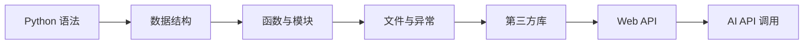

# 01 Python 编程基础

这一阶段解决的是“能不能用代码描述问题、处理数据、调用服务”。后面的数据分析、机器学习、RAG、Agent 都会反复依赖 Python，所以这里的目标不是背语法，而是建立编程思维和调试习惯。

## 阶段定位

| 信息 | 说明 |
|---|---|
| 适合对象 | 会一点编程但 Python 不系统，或希望用 Python 进入 AI 的学习者 |
| 预估学时 | 90～130 小时 |
| 前置要求 | 完成开发者工具基础，能使用终端和编辑器 |
| 阶段产出 | 命令行工具、网页数据采集脚本、简单 Web API、AI API 体验项目 |

## 为什么 Python 是 AI 主线语言

Python 不是因为语法最强大才成为 AI 主流，而是因为它同时连接了数据处理、机器学习、深度学习、Web API、自动化脚本和大模型生态。你后面会用它读数据、训练模型、调用 LLM、构建 RAG、封装工具和写 Agent。

## 本阶段学习路径

第一章学习 Python 语言基础，包括变量、类型、运算符、输入输出、流程控制、数据结构、函数和模块。你要重点理解“输入、处理、输出”这条主线。

第二章学习 Python 进阶，包括面向对象、异常处理、文件读写、函数式编程、迭代器生成器、类型注解和代码质量。你不需要一次记住所有高级语法，但要知道它们解决什么问题。

第三章进入实战项目。你会把前面的知识组合起来，完成命令行任务管理器、网页爬虫、Web API 和 AI API 快速体验。

## 学完后你应该能做到

- 能把一个小需求拆成函数、模块和文件
- 能读写 JSON、CSV、文本等常见文件
- 能安装并使用第三方库
- 能看懂基础报错，并通过打印、断点或日志定位问题
- 能调用外部 API，并处理请求参数、返回结果和异常情况
- 能完成一个结构清晰的小型 Python 项目

## 常见误区

不要试图把所有语法点一次性背熟。真正重要的是能在项目中反复使用它们。列表、字典、函数、文件操作、异常处理、第三方库调用，这些会比冷门语法更常用。

也不要太早陷入“写得优雅”。第一遍更重要的是写出能运行、能解释、能改动的代码。等你做完几个项目，再逐步关注类型注解、模块拆分和代码风格。

## 阶段项目

本阶段项目按复杂度递进：先做命令行任务管理器，练习数据结构、函数和文件保存；再做网页数据采集，练习请求、解析和存储；然后做 Web API，理解前后端和服务接口；最后做 AI API 快速体验，第一次把大模型能力接入自己的程序。

如果你想先看更细的学习顺序，可以阅读 [学习指南：Python 编程基础怎么学最不容易学乱](./study-guide.md)。