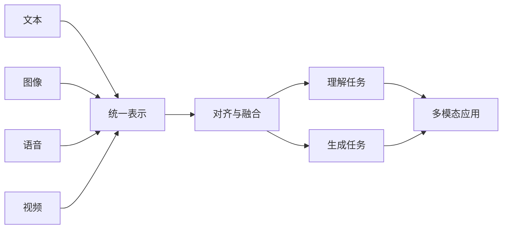
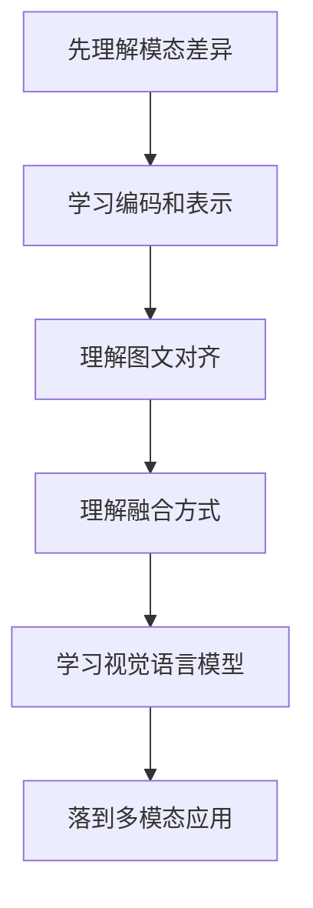
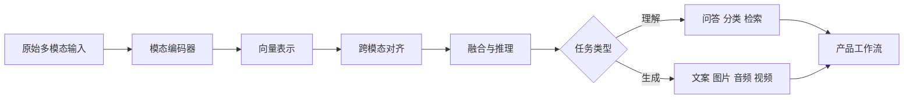

# 学前导读：多模态基础这一章到底在学什么

这一章解决的是：真实世界不是单模态的，AI 系统怎样把文本、图像、语音和视频放进同一套理解链路里。

前面的大模型主线大多围绕文本展开。到多模态阶段，课程开始把“语言模型应用”扩展到更接近真实世界的输入输出：一张图、一段音频、一段视频、一个截图、一个文档页面，都可能成为模型理解和生成的对象。

## 这一章在整个课程里的位置

你已经学过计算机视觉、NLP、大模型应用和 Agent。多模态基础章会把这些方向重新连接起来：视觉提供图像理解能力，NLP 提供文本理解和生成能力，大模型提供统一交互入口，Agent 和应用开发负责把多模态能力接入工作流。

多模态不是“图片加文字”这么简单。它的核心问题是：不同模态如何被编码成表示，如何互相对齐，如何融合到同一个任务里，最后如何服务问答、检索、创作、审核和自动化流程。

## 这一章真正要解决的问题

这一章要回答五个问题：什么是模态，为什么文本、图像、音频、视频不能简单拼接；表示学习如何把不同模态变成模型可处理的向量；图文对齐为什么是视觉语言模型的关键；融合方式如何影响任务效果；多模态能力如何落到图文问答、图片检索、截图理解、文档理解和创意生成场景。

新人最容易误解的是：多模态就是把图片传给模型，让模型说几句话。真正的多模态系统还要考虑输入质量、模态对齐、引用定位、编辑控制、审核风险和产品工作流。

## 新人推荐学习顺序

建议先学模态和表示，理解文本、图像、语音、视频进入模型前都需要被编码。然后学对齐和融合，知道为什么图文匹配、跨模态检索和统一表示是多模态模型的基础。接着看视觉语言模型，理解模型如何围绕图像和文本共同完成问答、描述和推理。最后看多模态应用，把能力放回真实产品场景。

## 学这一章时要抓住的主线

这一章的主线可以概括为：多模态系统先把不同形式的信息转成可比较、可组合的表示，再围绕任务完成理解或生成。

看懂这条线后，你会知道多模态能力并不是孤立 Demo，而是可以接入课程问答、内容创作、文档处理、截图分析、设计辅助和 Agent 工具链。

## 这一章和后面章节的关系

多模态基础是图像生成、视频语音生成、数字人和 AIGC 综合项目的入口。图像生成会进一步讨论如何从文本和控制条件生成图像；视频语音生成会处理时间维度；前沿伦理章节会讨论版权、肖像、伪造和内容安全；综合项目会把多模态能力组织成可交付产品。

如果这一章没学稳，后面常见的问题是：只追新模型 Demo，不知道输入输出链路；把多模态理解成“上传图片聊天”；忽略引用、定位、编辑和审核；很难把模型能力组织成真正可用的工作流。

## 本章小项目出口

学完这一章后，建议做一个“图片理解小助手”。用户上传一张课程截图、产品截图或海报，系统输出图片内容描述、关键信息提取、可能的问题和下一步建议。

项目重点是说明模型看到了什么、如何把图像信息转成文字说明、哪些地方不确定，以及结果如何进入后续编辑或审核流程。

## 过关标准

这一章结束时，你应该能解释文本、图像、语音和视频为什么需要不同编码方式，能说明对齐和融合在多模态系统中的作用，能区分多模态理解和多模态生成，能画出一个简单多模态应用的信息流。

如果你能把一个图文问答或截图理解功能拆成输入、编码、对齐、推理、输出和审核几个步骤，就达到了进入 AIGC 生成章节的基础要求。
