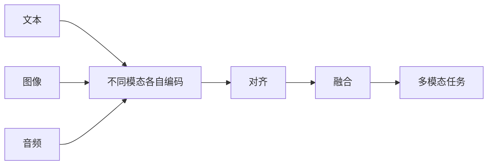

# 多模态学习基础

## 学习目标

完成本节后，你将能够：

- 理解什么是“模态”
- 说清楚多模态系统为什么更接近真实世界
- 理解融合（fusion）和对齐（alignment）的直觉
- 跑通一个极简的图文匹配小例子

## 历史背景：多模态为什么会突然变成主线？

这一节最值得知道的历史节点是：

| 年份 | 论文 / 方法 | 关键作者 | 它最重要地解决了什么 |
|---|---|---|---|
| 2021 | CLIP | Radford 等 | 把图像和文本对齐到同一语义空间，显著推进了图文检索、视觉语言理解和多模态基础模型路线 |

对新人来说，最值得先记的是：

> **CLIP 的意义，不只是“图文检索更强了”，而是它让“不同模态先对齐、再做任务”这条路线真正站稳了。**

所以你在这节看到的“对齐”和“共享语义空间”，不是抽象概念，  
而是后来很多多模态系统真正能工作的基础。

### 为什么 CLIP 这类工作会让很多人第一次觉得“多模态真的成了”？

因为在更早的时候，很多图文系统更像：

- 为单个任务单独搭一个模型
- 每换一个任务，就重新做一套

而 CLIP 带来的那种感觉很不一样：

- 图像和文本也许可以先学到一个共同空间
- 一旦这层对齐站稳，很多任务都能在上面继续长

这和很多人第一次接触 BERT / GPT 时的感觉有一点像：

- 不再只是“某个任务做得更好”
- 而像是“底座本身变强了”

所以 CLIP 让人兴奋的地方，  
往往不只是图文检索成绩，  
而是它让“多模态基础模型”第一次显得特别像一条真正会继续长大的主线。

### 为什么 CLIP 这类工作会让多模态突然变得“很像一个时代”？

因为在此之前，很多图文任务更像：

- 为单个任务单独造系统

而 CLIP 让很多人第一次强烈感觉到：

- 也许图像和文本可以先学到同一个共享语义空间
- 然后很多任务都能从这个底座继续长出来

这件事非常像 NLP 里预训练模型带来的那种感觉：

- 不再只是“做一个任务”
- 而是在搭一个更通用的底座

所以 CLIP 对很多初学者最有吸引力的地方在于：

> **它让“图文真的能互相理解”这件事，第一次显得不只是 Demo，而像一条稳定技术路线。**

---

## 先建立一张地图

如果你刚学完前面的文本系统和 Agent 主线，可以先把这节理解成：

- 前面很多系统主要只处理文本
- 这一节开始回答：如果系统还要看图、听音频、理解视频，它该怎样把这些信息放进同一条链路里

所以这节真正重要的不是概念堆叠，而是：

- 给后面多模态理解和多模态生成铺一层最小系统直觉

多模态基础这节最适合新人的理解顺序不是“先记概念名词”，而是先看清：



所以这节真正想解决的是：

- 什么叫“模态”
- 为什么对齐和融合是多模态的两个核心动作

## 一、什么叫模态？

模态（modality）可以简单理解成“信息的表现形式”。

常见模态包括：

- 文本
- 图像
- 音频
- 视频
- 结构化表格

所以多模态系统，就是同时处理两种或更多种信息形式的系统。

类比一下：

> 人类理解世界不是只靠文字，而是会同时看、听、读、说。多模态 AI 也是在往这个方向走。

### 1.1 第一次学多模态，最该先抓住什么？

最该先抓住的不是模态种类列表，而是这句：

> **多模态真正想解决的，是把不同来源的信息放进同一条理解链路里。**

这句话一旦稳住，后面你看：

- 图文检索
- 视觉问答
- 多模态对话

就会更自然地先问：这些系统到底是怎么把不同信号对起来的。

---

## 二、为什么真实世界天然是多模态的？

想几个日常场景：

- 看商品图 + 读商品描述
- 看病历文字 + 看医学影像
- 看监控视频 + 听报警音
- 上传截图 + 问“这是什么错误”

如果 AI 只能看文字，它就像“闭着眼工作”；  
如果只能看图片，它又像“不会读说明书”。

所以多模态系统的重要性在于：

> **它能把不同来源的信息拼在一起理解。**

---

## 三、多模态任务有哪些？

| 任务 | 例子 |
|---|---|
| 图像描述 | 给图片生成一句话说明 |
| 图文检索 | 用文字找图、用图找文字 |
| 视觉问答 | 看图回答问题 |
| OCR + 理解 | 读图中文字并理解内容 |
| 视频理解 | 总结视频内容 |
| 语音助手 | 听懂语音并回答 |

---

## 四、融合（Fusion）是什么意思？

融合可以理解成：

> 把不同模态的信息合在一起，形成更完整的理解。

比如做商品推荐时：

- 只看图片，可能知道风格
- 只看文字，可能知道用途
- 图文一起看，理解才更完整

### 一个极简例子

假设我们把商品图片和文案都提取成特征，再合并：

```python
import numpy as np

# 图片特征：亮度、红色程度、圆形程度
image_feature = np.array([0.8, 0.7, 0.2])

# 文本特征：时尚感、运动感、商务感
text_feature = np.array([0.6, 0.2, 0.1])

# 最简单的融合：拼接
fused_feature = np.concatenate([image_feature, text_feature])

print("图像特征:", image_feature)
print("文本特征:", text_feature)
print("融合后特征:", fused_feature)
print("融合后维度:", fused_feature.shape)
```

真实模型里当然比这复杂得多，但“多源信息合并”的思路就是这样。

### 4.1 融合这件事最值得先记住的，不是方式，而是目的

最值得先记的是：

- 单模态看不全
- 多模态是为了让系统判断得更完整

所以融合不只是把向量拼起来，而是在回答：

- 哪些信息源应该被一起看
- 哪些信息是互补的

---

## 五、对齐（Alignment）是什么意思？

对齐是多模态里另一个关键概念。

你可以把它理解成：

> **让不同模态里的“同一个意思”，在表示空间里彼此靠近。**

比如：

- 一张猫的图片
- 文本 “a cute cat”

如果模型学得好，它们的向量表示应该比较接近。

### 5.1 为什么“对齐”会成为多模态里最核心的词之一？

因为如果不同模态的表示根本对不上，后面几乎什么都做不了：

- 文本找图
- 图文问答
- 图像描述

这些能力的前提，都是：

- 不同模态得先在某种共享空间里“知道彼此在说同一件事”

---

## 六、一个可运行的图文匹配玩具例子

```python
import numpy as np

images = {
    "red_apple.jpg": np.array([0.9, 0.1, 0.0]),   # 红色、圆形、不是交通工具
    "blue_car.jpg": np.array([0.1, 0.2, 1.0]),    # 非红、略圆、是交通工具
    "orange_ball.jpg": np.array([0.8, 0.9, 0.0])  # 偏暖色、很圆、不是交通工具
}

texts = {
    "red fruit": np.array([0.95, 0.2, 0.0]),
    "vehicle": np.array([0.0, 0.1, 1.0]),
    "round toy": np.array([0.7, 0.95, 0.0])
}

def cosine_similarity(a, b):
    return float(np.dot(a, b) / (np.linalg.norm(a) * np.linalg.norm(b)))

for text_name, text_vec in texts.items():
    print(f"\\n查询文本: {text_name}")
    scores = []
    for image_name, image_vec in images.items():
        scores.append((cosine_similarity(text_vec, image_vec), image_name))
    scores.sort(reverse=True)
    for score, image_name in scores:
        print(f"  {image_name}: {score:.4f}")
```

这就是“跨模态检索”的最小原理版：

- 文本和图像都变成向量
- 再比较相似度

---

## 七、多模态为什么更难？

因为它同时要解决两类问题：

1. 每种模态内部怎么建模
2. 不同模态之间怎么对齐和融合

比如图像有图像自己的难点：

- 空间结构
- 光照变化
- 视角变化

而文本又有文本自己的难点：

- 歧义
- 上下文
- 长文本结构

两边一合起来，复杂度自然更高。

---

## 八、今天常见的多模态路线

### 1. 双塔检索路线

图像一套编码器，文本一套编码器，最后比向量相似度。

### 2. 统一 Transformer 路线

把图像、文本都映射到统一序列空间，再统一建模。

### 3. 大模型扩展路线

在语言模型前面接上图像编码器、音频编码器等模块。

这就是为什么今天很多系统都能做到：

- 看图问答
- 图文对话
- OCR 理解

---

## 九、初学者常见误区

### 1. 以为多模态就是“图片 + 文本”

不止。  
语音、视频、传感器信号也都属于模态。

### 2. 以为多模态一定比单模态强

不一定。  
如果额外模态质量差，反而可能引入噪声。

### 3. 只看酷炫 Demo，不看对齐问题

多模态真正难的地方，往往就在对齐和融合。

---

## 这节最该带走什么

- 多模态系统的本质是把不同形式的信息放进同一条理解链路
- “对齐”和“融合”是最该先记住的两个核心动作
- 先把输入和任务想清楚，比一上来追模型名更重要

如果再压成一句话，那就是：

> **多模态的关键，不是模态更多，而是系统终于开始把不同信息来源放到同一个判断框架里。**

---

## 小结

这节课最重要的一句话是：

> **多模态的价值，在于把不同信息来源拼起来，形成更完整的理解。**

后面继续学视觉语言模型时，你会看到这种“图文对齐”是如何被真正用到模型里的。

---

## 练习

1. 修改上面的图像和文本向量，观察匹配排序怎么变化。
2. 自己设计一个“食物 / 交通工具 / 动物”的玩具向量空间。
3. 想一想：为什么“截图报错 + 提问文字”比只给报错文字，更适合用多模态系统？
