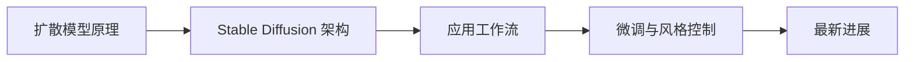

# 学前导读：图像生成这一章到底在学什么

这一章解决的是：

> **图像不是被分类，而是被一步步生成出来。**

## 零、先建立一张桥接线

如果你是从多模态基础过来的，这一章最值得先看清的一件事是：

- 前面你已经知道多模态系统怎样接图像
- 这一章开始回答：图像不只是被理解，还能怎样被生成和编辑

所以这一章真正重要的不是“会不会画图”，而是：

> **生成任务怎样从“理解输入”走向“逐步构造输出”。**

## 这一章的主线

## 这一章更适合新人的学习顺序

1. 先看扩散模型原理  
   先把“先加噪、再去噪”这条主线立住。

2. 再看 Stable Diffusion 架构  
   这时你更容易理解 latent、文本条件和 U-Net 各自在做什么。

3. 再看应用工作流  
   先把文生图、图生图、修图和控制条件这些常见入口放进一个整体视角里。

## 这一章最该先抓住什么

- 图像生成和图像分类的任务目标根本不同
- 扩散模型是后面这一整章的底层直觉
- 真正要学的是“生成链路”，不只是某个具体模型名
