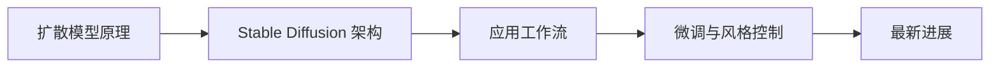

# 学前导读：图像生成这一章到底在学什么

这一章解决的是：

> **图像不是被分类，而是被一步步生成出来。**

## 这一章的主线

```mermaid
flowchart LR
    A["扩散模型原理"] --> B["Stable Diffusion 架构"]
    B --> C["应用工作流"]
    C --> D["微调与风格控制"]
    D --> E["最新进展"]
```
