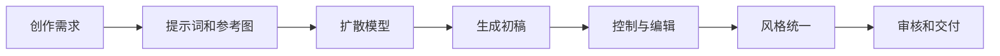
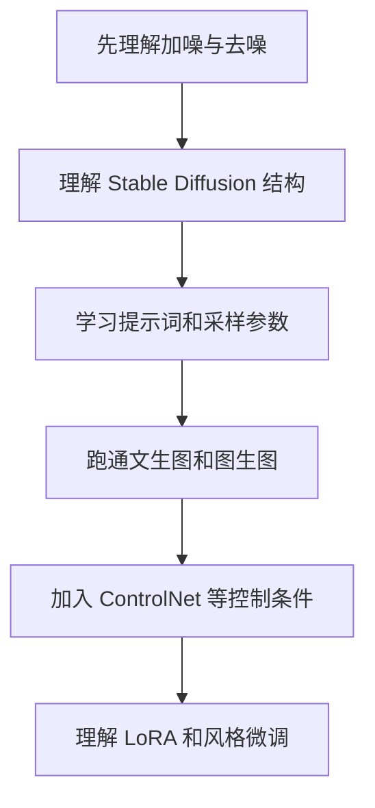
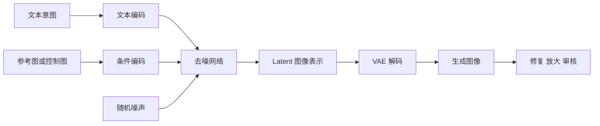

# 学前导读：图像生成这一章到底在学什么

这一章解决的是：图像不只是可以被分类、检测和理解，也可以被模型一步步生成、编辑和控制。

如果前面的计算机视觉更强调“看懂图像”，那么图像生成更强调“创造图像”。这不仅是任务目标不同，系统链路也不同：分类输出标签，检测输出框，分割输出像素区域，而生成任务要从文本、草图、参考图、姿态或风格条件出发，逐步构造出新的图像结果。

## 这一章在整个课程里的位置

你已经学过视觉基础、多模态基础和大模型应用。图像生成章会把这些能力接到 AIGC 创作工作流中：文本提供意图，图像模型负责生成，控制模块负责结构约束，微调方法负责风格或角色一致性，后处理和审核负责交付质量。

图像生成不是“写一个提示词然后等出图”。真实工作流通常包含需求拆解、提示词设计、参考素材、控制条件、生成迭代、局部修复、风格统一、版权和安全检查。

## 这一章真正要解决的问题

这一章要回答五个问题：扩散模型为什么可以通过“加噪和去噪”生成图像；Stable Diffusion 的文本编码器、U-Net、VAE 和 latent 空间分别在做什么；提示词、负面提示词、采样步数、种子和 CFG 等参数如何影响结果；ControlNet、图生图、局部重绘和参考图如何增强可控性；LoRA、DreamBooth 等微调方式为什么能学习特定风格或角色。

新人最容易误解的是：图像生成能力只取决于模型名。实际上，生成质量很大程度取决于工作流设计，包括提示词、控制条件、素材来源、参数选择、后处理和人工筛选。

## 新人推荐学习顺序

建议先理解扩散模型的直觉：训练时学习如何从噪声中还原图像，生成时从噪声一步步去噪得到结果。然后看 Stable Diffusion 架构，把文本条件、latent 表示、U-Net 去噪和 VAE 解码放到同一张图里。接着学习常见应用工作流，例如文生图、图生图、局部重绘和风格迁移。最后再看控制条件和微调，不要一上来就追复杂插件。

## 学这一章时要抓住的主线

这一章的主线可以概括为：图像生成是“意图表达 + 条件控制 + 逐步去噪 + 编辑审核”的完整链路。

看懂这条线后，你会知道为什么同一个提示词可能生成不同结果，为什么参考图和控制图能改变构图，为什么 LoRA 能影响风格，为什么生成结果需要后处理和审核。

## 这一章和后面章节的关系

图像生成是视频生成、数字人和 AIGC 综合项目的基础。视频生成可以看成在时间维度上连续生成和保持一致性；数字人需要图像、语音、动作和身份一致性；综合项目则要把图像生成接入文案、审核、导出和产品界面。

如果这一章没学稳，后面常见的问题是：只会写提示词，不知道为什么结果不稳定；不知道 ControlNet 和 LoRA 解决的是不同问题；忽略素材授权和肖像风险；把模型输出当成最终作品，没有编辑和审核流程。

## 本章小项目出口

学完这一章后，建议做一个“课程封面生成工作流”。输入课程主题、目标学习者、风格要求和尺寸规格，系统生成提示词，产出 3 到 5 张候选封面，并记录每张图的提示词、参数、优缺点和修改建议。

如果继续扩展，可以加入参考图、ControlNet 构图约束或 LoRA 风格控制，并在最终导出前加入版权和内容安全检查清单。

## 过关标准

这一章结束时，你应该能用通俗语言解释扩散模型的加噪和去噪直觉，能说明 Stable Diffusion 中文本条件、U-Net、VAE 和 latent 空间的大致作用，能区分文生图、图生图、局部重绘、ControlNet 和 LoRA 的使用场景。

如果你能设计一个带提示词、参数记录、生成迭代、人工筛选、后处理和审核步骤的图像生成工作流，就达到了 AIGC 图像方向的入门标准。
