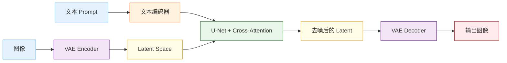

# Stable Diffusion 架构

:::tip 本节定位
上一节我们已经知道扩散模型的核心是：

> 从噪声一步步恢复结构。

这一节要回答的是：

> **为什么 Stable Diffusion 能把这件事真正做得工程上可用？**

答案的核心不只是“扩散”，还包括：

- latent space
- 文本条件
- U-Net
- VAE
- cross-attention
:::

## 学习目标

- 理解 Stable Diffusion 的整体模块分工
- 理解为什么它不在像素空间扩散，而在 latent space 中扩散
- 理解文本编码器、U-Net 和 VAE 分别负责什么
- 理解 cross-attention 怎样把文本真正接进图像生成
- 建立对 Stable Diffusion 整体工作流的系统地图

---

## 一、为什么原始扩散思路还不够“实用”？

### 1.1 一个最直观的问题：像素空间太大

如果你直接在原始图像像素空间做扩散：

- 分辨率一大，张量就会非常大
- 推理和训练都会很重

例如：

- `512 x 512 x 3`

本身就已经是非常大的表示空间。

### 1.2 Stable Diffusion 的关键转向

它最重要的一步，就是：

> **不直接在原图像上扩散，而先把图像压缩进 latent space，再在那里做扩散。**

这个思路后来被称为：

- latent diffusion

它极大提升了工程可行性。

---

## 二、先把整体结构看一遍



可以先粗暴记成三大块：

1. 文本编码器：把 prompt 变成条件表示
2. U-Net：在 latent 中做去噪
3. VAE：负责图像和 latent 之间的转换

---

## 三、VAE 在这里的角色到底是什么？

### 3.1 它在这里更像压缩器，而不是主生成器

在 Stable Diffusion 里，VAE 的核心作用是：

- Encoder：把图像压成 latent
- Decoder：把 latent 解码回图像

也就是说，它主要是在做：

> 图像空间和 latent 空间之间的桥接。 

### 3.2 为什么这一步如此关键？

因为扩散如果直接在原图空间里做，成本太高。  
而 VAE 提供了一个更小、更抽象的中间空间。

你可以把它理解成：

> 不在巨大的高清画布上直接雕刻，而先压成一张小很多的“语义草图板”。 

### 3.3 一个最小“压缩 / 展开”直觉示例

```python
import numpy as np

image = np.random.randn(8, 8).astype(np.float32)

# 用均值池化模拟压缩
latent = image.reshape(4, 2, 4, 2).mean(axis=(1, 3))

# 用 repeat 模拟解码
reconstructed = np.repeat(np.repeat(latent, 2, axis=0), 2, axis=1)

print("image shape        :", image.shape)
print("latent shape       :", latent.shape)
print("reconstructed shape:", reconstructed.shape)
```

这个例子当然不是 VAE，但它足够帮你抓住最核心的直觉：

- latent 比原图小
- latent 是更压缩的表示

---

## 四、文本编码器为什么不可少？

### 4.1 prompt 不能直接被 U-Net 理解

U-Net 处理的是数值张量，不会直接理解：

- “一只坐在窗边的橘猫”

这种自然语言。

### 4.2 所以要先有文本编码器

文本编码器负责把 prompt 变成：

- 一组语义向量

你可以先把它理解成：

> **把语言条件翻译成图像生成流程能消费的数值条件。**

### 4.3 一个简单示意

```python
text_condition = {
    "prompt": "一只坐在窗边的橘猫",
    "embedding_shape": (77, 768)
}

print(text_condition)
```

这里最重要的不是具体维度，而是理解：

- prompt 会先变成向量
- 后面的视觉主干会用到这些向量

---

## 五、U-Net 为什么会成为扩散主干？

### 5.1 U-Net 本来就擅长“多尺度信息处理”

U-Net 的典型特征包括：

- 编码路径：逐步压缩、提抽象特征
- 解码路径：逐步恢复空间细节
- 跳连：让细节信息别完全丢掉

### 5.2 为什么这很适合去噪？

因为去噪本身就需要：

- 理解全局结构
- 同时保住局部细节

而 U-Net 正好很适合做这种事。

所以在 Stable Diffusion 里，U-Net 的角色是：

> **在 latent 空间里预测噪声，并逐步把噪声清掉。**

---

## 六、cross-attention 为什么这么关键？

### 6.1 文字和图像不是天然就接上的

如果你只有：

- 文本编码器
- U-Net

但没有明确机制让图像去“看”文本，那 prompt 的控制效果就会很弱。

### 6.2 cross-attention 的直觉

它的核心就是：

> 让图像去噪过程在更新自己时，参考文本条件。 

也就是说，图像 latent 的更新不只是看自身状态，还会看：

- prompt 提供的语义信号

### 6.3 一个极简示意

```python
latent_feature = "当前图像 latent 特征"
text_feature = "橘猫 + 窗边 + 夕阳"

fusion = f"{latent_feature} 在更新时参考 {text_feature}"
print(fusion)
```

虽然只是文字示意，但它已经抓住本质：

- self-attention 更像“自己看自己”
- cross-attention 更像“图像看文本”

---

## 七、把整个工作流串起来

可以先把 Stable Diffusion 的主线压成这 5 步：

1. prompt -> 文本编码器
2. 随机初始化 latent 噪声
3. U-Net 在文本条件下逐步去噪
4. 得到更干净的 latent
5. VAE Decoder 把 latent 解码成图像

```python
workflow = [
    "prompt -> text encoder",
    "latent noise",
    "U-Net denoise with text condition",
    "clean latent",
    "decode to image"
]

for step in workflow:
    print(step)
```

这就是 Stable Diffusion 的最重要主线。

---

## 八、为什么它会成为文生图时代的重要架构？

### 8.1 因为它兼顾了效果和工程可行性

相比直接像素扩散：

- latent diffusion 更轻
- 训练和推理更现实

### 8.2 因为它很适合条件控制

Stable Diffusion 天然很适合做：

- 文生图
- 图像编辑
- 局部修复
- 风格控制

### 8.3 因为模块边界很清楚

这一点很重要：

- 文本编码器管语义
- U-Net 管去噪
- VAE 管空间转换

模块清楚，生态就更容易发展起来。

---

## 九、最常见的误区

### 9.1 以为 Stable Diffusion 就是“一个大黑盒”

其实它是多个模块协作：

- 文本编码器
- U-Net
- VAE
- 条件注入机制

### 9.2 不理解 latent diffusion 的工程意义

这是它之所以“能用起来”的关键之一。

### 9.3 只记模块名，不理解模块职责

这样后面学微调和应用时会很虚。

---

## 十、小结

这一节最重要的不是记住名词，而是抓住这条主线：

> **Stable Diffusion 的核心，是在 latent space 中做条件扩散，其中 VAE 负责压缩与解码，文本编码器提供语义条件，U-Net 负责去噪，cross-attention 负责把文本真正接进图像生成过程。**

理解了这条主线，后面你再看文生图应用、图像编辑和微调时，就会清楚很多。

---

## 练习

1. 用自己的话解释：为什么 Stable Diffusion 不直接在像素空间做扩散？
2. 想一想：为什么文本编码器和 cross-attention 必须同时存在？
3. 如果把 U-Net 换成普通小网络，为什么效果通常会很差？
4. 用自己的话总结：VAE、U-Net、文本编码器各自负责什么？
