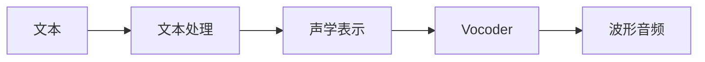
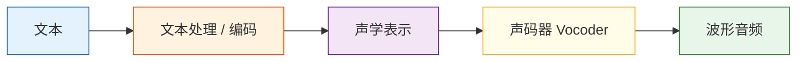

# 语音合成

:::tip 本节定位
如果说视频生成在解决“连续视觉”，那语音合成在解决的是：

> **如何把一段文字变成听起来自然、稳定、可控的声音。**

这件事听起来很直观，但真正做起来并不简单，因为语音不只是“发音”，还包括：

- 节奏
- 音高
- 停顿
- 情绪
:::

## 学习目标

- 理解语音合成为什么比“文本转声音文件”复杂得多
- 理解 TTS 系统通常要拆成哪些模块
- 看懂一个最小的文本到语音流程示意
- 理解多说话人、情感控制和语音克隆分别在解决什么问题

---

## 先建立一张地图

TTS 这节最适合新人的理解顺序不是“文字直接变声音”，而是先看清：



所以这节真正想解决的是：

- 为什么 TTS 是多阶段生成任务
- 为什么它既像语言任务，也像音频生成任务

## 一、语音合成到底在做什么？

### 1.1 不是简单把字一个个读出来

如果你真的机械地把文字逐个字念出来，结果通常会非常生硬。  
自然语音里包含的东西远比“文字内容”多，例如：

- 断句
- 重音
- 语气
- 说话速度
- 情绪

所以 TTS 的真正问题不是：

> “能不能发出声音”

而是：

> “能不能发出像人说话那样的声音”

### 1.2 一个很重要的直觉

语音合成本质上是在做：

- 文本理解
- 发音建模
- 声学特征生成
- 波形重建

也就是说，它不是一层转换，而是一个多阶段生成问题。

---

## 二、一个最小 TTS 流程长什么样？

可以先把它粗略理解成这几步：

1. 文本预处理
2. 生成中间声学表示
3. 通过声码器变成波形



这个流程图最重要的作用是让你先建立一个正确认知：

> 语音合成不是一步，而是多层管线。

---

## 三、为什么文本处理这一步不能省？

### 3.1 因为文字本身并不等于发音信息

例如同样一句话，不同场景下停顿和语气可能不同：

- “你来了。”
- “你来了？”

仅仅字面很像，但语音表达完全不同。

### 3.2 文本处理通常在做什么？

- 分词 / 音素映射
- 数字读法转换
- 标点和停顿处理
- 语气特征提示

也就是说，TTS 系统首先要把“文字”翻译成“更接近发音的表示”。

---

## 四、声学表示是什么？

### 4.1 为什么不直接从文字到波形？

直接从文本一步生成波形是很难的，因为波形非常长、非常细、非常敏感。

所以很多 TTS 系统会先生成一种中间表示，例如：

- mel spectrogram（梅尔频谱）

你可以先把它理解成：

> **声音的一张“频率热力图”。**

### 4.2 一个直觉示意

```python
tts_pipeline = {
    "input": "你好，欢迎来到 AI 全栈课程。",
    "intermediate": "mel_spectrogram",
    "output": "waveform"
}

print(tts_pipeline)
```

这个例子虽然只是结构示意，但它已经说明：

- 文本不是直接变成声音
- 中间还有一层更适合建模的表示

---

## 五、Vocoder（声码器）在做什么？

### 5.1 它的角色很像“把频谱翻译成真正能听的声音”

如果说前面模块生成的是一种“声学蓝图”，那 vocoder 就负责把蓝图真正变成波形。

### 5.2 一个很实用的理解

可以先记成：

- 声学模型：决定“该说成什么样”
- Vocoder：决定“怎样把它真的发出来”

这两个模块经常会分别设计和优化。

---

## 六、一个最小“多说话人控制”示意

很多现代语音合成系统不只会“读文字”，还会控制：

- 说话人
- 语速
- 情绪

例如：

```python
tts_config = {
    "text": "欢迎来到课程学习。",
    "speaker": "female_voice_01",
    "speed": 1.0,
    "emotion": "neutral"
}

print(tts_config)
```

### 6.2 这个例子在教什么？

它在教你：

> TTS 的输入经常不只是文本，还会包括“怎么说”的控制条件。

这也是现代语音合成比早期系统更强大的地方之一。

---

## 七、为什么说语音合成比想象中更像生成任务？

因为它也有这些典型生成难点：

- 结果要自然
- 结果要稳定
- 结果要可控

而且它和图像生成一样，也会面临：

- 风格控制
- 个性化
- 质量与速度权衡

所以你可以把 TTS 理解成：

> 一个音频世界里的生成模型问题。

---

## 八、TTS 真实产品里最重要的几个方向

### 8.1 多说话人

系统能不能切换不同音色。

### 8.2 情感与韵律控制

系统能不能表达：

- 开心
- 冷静
- 严肃

### 8.3 语音克隆

系统能不能学习某个特定人的声音特征。

### 8.4 实时性

如果是对话助手，延迟会非常关键。

---

## 九、初学者第一次学 TTS 最该先记什么

最值得先记住的是：

1. 文本不等于发音信息
2. 声学表示是中间层，不是可有可无
3. Vocoder 决定的是“怎么真正发出来”

---

## 十、初学者最常踩的坑

### 10.1 以为 TTS 就是“把字读出来”

实际上它更像“生成自然说话过程”。

### 10.2 只关注音色，不关注节奏和停顿

很多“不自然”的根源其实在韵律，而不是音色本身。

### 10.3 以为 TTS 天然就是实时的

很多高质量模型并不一定能做到很低延迟。

---

## 小结

这一节最重要的不是记住某个 TTS 模型名字，而是建立这个直觉：

> **语音合成的本质，是把文字和说话控制信息，逐步变成自然、可听、可控的声音波形。**

理解了这条主线，后面你再看数字人、配音系统和语音助手时，就会清楚很多。

## 这节最该带走什么

- TTS 不是把文字朗读出来那么简单
- 它本质上是一条文本到声学再到波形的生成链路
- “自然、稳定、可控”比“能发声”更接近真实产品要求

---

## 练习

1. 用自己的话解释：为什么 TTS 不能简单理解成“把字一个个念出来”？
2. 想一想：为什么很多 TTS 系统会把“说话人、语速、情绪”也当作输入？
3. 如果你在做实时语音助手，为什么 TTS 延迟会成为关键工程指标？
4. 用自己的话说明：声学模型和 vocoder 分别更像在解决什么问题？
