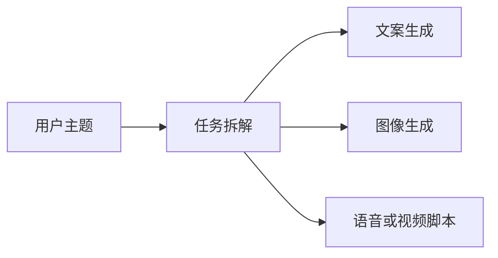
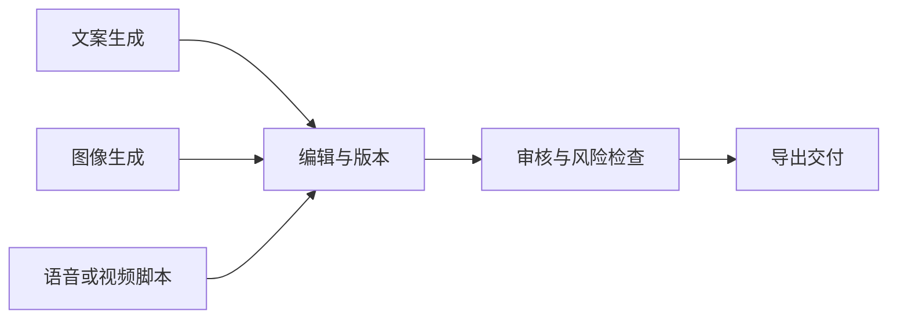
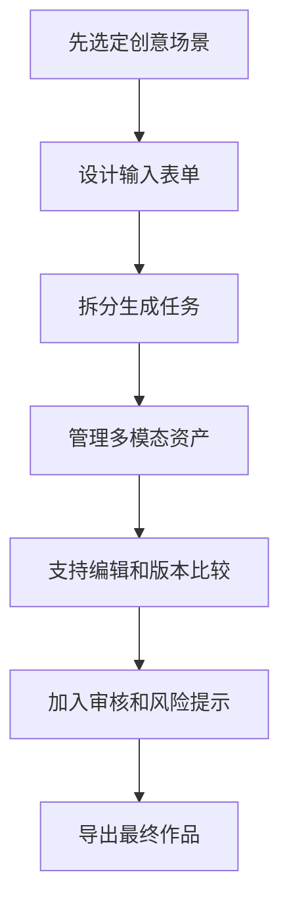
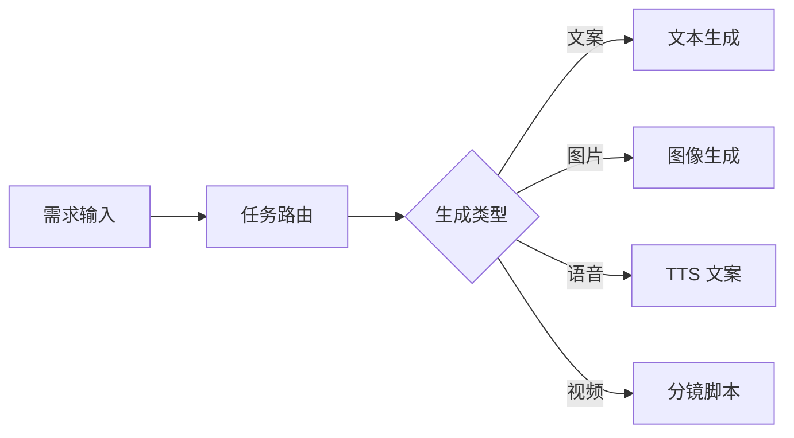
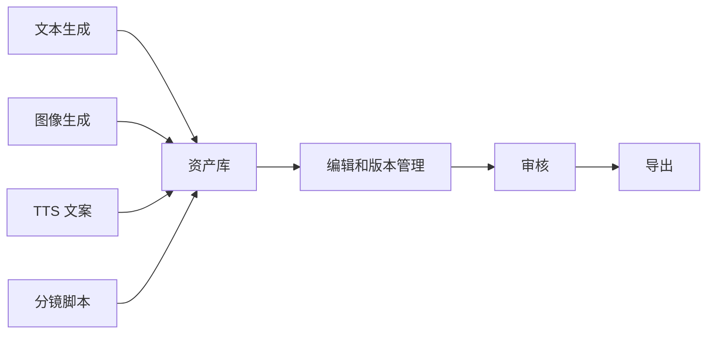

# 学前导读：综合项目这一章到底该怎么学

这一章不是继续看单步生成，而是把多模态与 AIGC 能力真正组织成产品工作流。

前面你已经分别学过多模态理解、图像生成、视频语音生成、数字人、前沿趋势和伦理合规。综合项目要做的事情，是把这些能力从“单个 Demo”升级为“一个用户能完成创作任务的产品原型”。

## 这一章在整个课程里的位置

12 AIGC 与多模态是方向拓展与毕业项目阶段，而综合项目是它的出口。它要证明你不只是知道几个生成模型，也能把输入、生成、编辑、审核、导出和记录组织成闭环。

一个 AIGC 产品不是用户输入一句话、模型返回一张图就结束。真实产品需要理解用户目标，拆分生成任务，管理不同模态资产，保存版本，支持人工编辑，进行内容审核，最后导出可交付结果。

生成不是终点。综合项目还要把不同产物收回来，进入编辑、审核和交付流程。

## 这一章真正要解决的问题

这一章要回答五个问题：如何把一个创意需求拆成文案、图片、语音和视频脚本等子任务；如何管理不同模态资产和版本；如何让用户参与编辑，而不是完全依赖一次生成；如何加入版权、肖像、内容安全和合规检查；如何把最终结果导出成海报、短视频脚本、课程宣传页或内容包。

新人最容易误解的是：综合项目就是把几个模型 API 串起来。真正的项目能力体现在流程设计：任务如何路由，资产如何保存，用户如何修改，风险如何检查，失败如何重试，结果如何交付。

## 新人推荐学习顺序

建议先定义产品场景，例如课程封面生成、短视频脚本生成、营销内容包生成或学习资料创作助手。然后设计用户输入表单，明确主题、受众、风格、尺寸、用途和限制。接着拆分生成模块，把文案、图像、语音、视频脚本分成可独立迭代的步骤。再设计资产和版本管理，让每次生成结果可以比较和回退。最后加入审核和导出流程。

## 学这一章时要抓住的主线

这一章的主线可以概括为：AIGC 综合项目练的不是单次生成，而是生成式产品工作流。

不同生成分支会统一进入资产库，后续才能支持比较、编辑、审核和导出。

看懂这条线后，你会知道为什么项目里要有任务状态、资产结构、版本记录、审核清单和导出格式。这些内容让 AIGC 从“玩具 Demo”变成“产品原型”。

## 这一章和整个课程的关系

这个综合项目可以和前面的 LLM 应用、RAG、Agent 和工程化主线结合。比如，平台可以用 RAG 读取课程资料，用 Prompt 生成结构化文案，用图像生成创建封面，用 Agent 自动拆任务，用评估和审核模块控制质量，最后用前端页面展示和导出。

如果这一章没学稳，项目常见的问题是：功能很多但流程不清；每次生成结果无法保存和比较；用户不能编辑；没有素材来源和风险检查；导出结果不能直接使用；项目像模型展示，而不像产品。

## 新人和进阶学习者怎么读

新人第一次学这一章时，先抓住主线和最小可运行例子。你不需要一次理解所有细节，只要能说清楚这一章解决什么问题、输入输出是什么、最小项目怎么跑起来，就可以继续往后走。

有经验的学习者可以把这一章当成查漏补缺和工程化练习：关注边界条件、失败案例、评估方式、代码可复现性，以及它和前后阶段的连接。读完后最好能把本章内容沉淀到自己的作品 README 或实验记录里。

## 学习时间与难度建议

| 学习方式 | 建议投入 | 目标 |
|---|---|---|
| 快速浏览 | 20～30 分钟 | 看懂本章解决什么问题，知道后面会用到哪里 |
| 最小通关 | 1～2 小时 | 跑通一个最小例子，完成本章小项目出口 |
| 深入练习 | 半天～1 天 | 补充错误分析、对比实验或项目 README 记录 |

## 本章自测问题

| 自测问题 | 通过标准 |
|---|---|
| 这一章解决什么问题？ | 能用一句话说明它在整门课里的位置 |
| 最小输入输出是什么？ | 能说清楚例子需要什么输入，会产生什么结果 |
| 常见失败点在哪里？ | 能列出至少一个报错、效果差或理解偏差的原因 |
| 学完后能沉淀什么？ | 能把本章产出写进项目 README、实验记录或作品集 |

## 本章小项目出口

学完这一章后，建议完成一个“AI 创意内容平台原型”。最小版本可以支持：输入主题和目标受众，生成标题、宣传文案、封面提示词、候选图像说明、短视频脚本和审核清单，并支持导出为 Markdown 或 JSON 内容包。

增强版本可以继续加入真实图像生成 API、TTS、文件上传、RAG 课程资料读取、版本历史、用户反馈和部署说明。

## 项目交付物标准

每个综合项目都建议按同一套作品集标准交付，而不是只把代码跑通。最小交付物应该包括：一份 README、一条可复现运行命令、一组示例输入输出、一张关键流程图、一次失败样本分析，以及下一步改进计划。

| 交付物 | 最低要求 | 进阶要求 |
|---|---|---|
| README | 写清项目目标、运行方式、依赖和示例 | 增加架构图、设计取舍和复盘 |
| 示例输入输出 | 至少保留 1 个完整案例 | 保留成功、失败和边界案例 |
| 评估记录 | 写清用什么指标判断效果 | 加入 baseline、对比实验和错误分析 |
| 工程记录 | 记录一次环境或接口问题 | 记录日志、成本、耗时和排障过程 |
| 展示材料 | 截图或短 GIF 证明能运行 | 做成可讲解的作品集页面 |

做项目时最重要的不是功能堆得多，而是能讲清楚：你解决了什么问题，系统怎样工作，效果怎么判断，失败时怎么定位，下一版准备怎样改。

## 过关标准

这一章结束时，你应该能把一个 AIGC 产品拆成输入、任务路由、生成模块、资产管理、编辑、审核和导出几个部分，能说明每个部分的输入输出，能为项目加入版权、肖像、内容安全和导出标识检查。

如果你能做出一个带输入、生成、编辑、审核、导出和版本记录的 AIGC 小产品原型，就达到了多模态与 AIGC 阶段的作品集标准。
