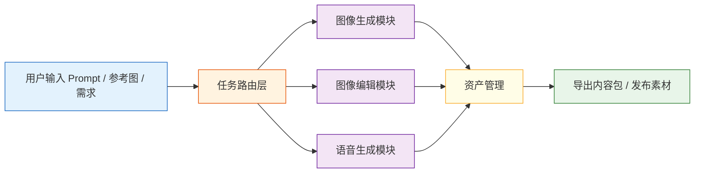

# 项目：AI 创意内容平台

:::tip 本节定位
前面整个第十阶段，其实都在回答一个问题：

> **如果把多模态生成和理解能力放进一个产品里，它会长什么样？**

这一节就是在做这个收口：  
把图像、视频、语音、工作流这些能力拼成一个更像“创作平台”的项目。
:::

## 学习目标

- 理解一个 AI 创意内容平台最核心的模块有哪些
- 学会把生成能力放进可交互工作流里
- 设计一个有产品味道的多模态项目骨架
- 理解这类项目该如何分层建设和迭代

---

## 一、为什么这个项目值得做？

因为它非常典型地体现了当代 AIGC 产品的结构：

- 文生图
- 图像编辑
- 视频生成
- 语音合成
- 多轮工作流

换句话说，这不是一个“单模型项目”，而是：

> **一个多模态创作工作台。**

这类项目很适合作为作品集，因为它能同时展示：

- 技术广度
- 系统设计能力
- 产品理解

---

## 二、先把产品目标说清楚

我们先定义一个最小平台目标：

用户可以：

1. 输入 prompt 生成海报图
2. 基于已有图做改图
3. 生成一段配音文案
4. 组合成一个小型创意内容资产包

也就是说，平台不是只给一张图，而是在帮助用户完成一整段创意生产流程。

---

## 三、先画整体结构图



这个结构最重要的一点是：

> 平台的核心不是某个单模型，而是任务路由和资产流转。 

---

## 四、定义一个最小项目骨架

```python
from dataclasses import dataclass, field

@dataclass
class CreativeProject:
    prompt: str
    style: str
    outputs: list[str] = field(default_factory=list)
    assets: dict = field(default_factory=dict)

project = CreativeProject(
    prompt="做一张科技大会海报，并生成一句宣传配音",
    style="futuristic"
)

print(project)
```

### 4.2 为什么先从这个骨架开始？

因为多模态项目最怕的不是“模型不会调”，而是：

- 输出物太多
- 资源管理太乱
- 工作流不清楚

所以先定义项目对象和资产结构，本身就很重要。

---

## 五、最小任务路由器

平台首先要知道：

- 当前用户是在做图像生成
- 还是图像编辑
- 还是语音生成

```python
def route_task(user_request):
    if "海报" in user_request or "图片" in user_request:
        return "image_generation"
    if "改图" in user_request or "修图" in user_request:
        return "image_editing"
    if "配音" in user_request or "语音" in user_request:
        return "tts"
    return "general"

print(route_task("做一张科技海报"))
print(route_task("帮我生成一句宣传配音"))
```

这个路由层虽然简单，但已经是“平台感”的开始。

---

## 六、用函数模拟三个核心生成模块

为了保证代码可以直接运行，我们不用真实大模型，而先做任务级模拟。

```python
def generate_image(prompt, style):
    return f"image_asset({style}): {prompt}"

def edit_image(image_name, instruction):
    return f"edited_{image_name}: {instruction}"

def generate_voice(script, speaker="default"):
    return f"voice_asset({speaker}): {script}"
```

### 6.2 为什么这里不用真实模型？

因为本节重点不是“调某个具体生成 API”，而是：

> 学会怎样把多模态生成能力组织成产品工作流。 

---

## 七、把平台主流程串起来

```python
def run_creative_platform(user_request):
    result = {"request": user_request, "assets": []}
    task_type = route_task(user_request)
    result["task_type"] = task_type

    if task_type == "image_generation":
        img = generate_image(user_request, style="futuristic")
        result["assets"].append(img)

    elif task_type == "tts":
        voice = generate_voice(user_request, speaker="brand_voice")
        result["assets"].append(voice)

    else:
        result["assets"].append("暂未命中明确创意流程")

    return result

print(run_creative_platform("做一张科技海报"))
print(run_creative_platform("帮我生成一句宣传配音"))
```

这就是一个最小“内容平台”骨架：

- 接用户任务
- 做路由
- 调对应模块
- 收集资产

---

## 八、为什么创意平台一定会遇到“资产管理”问题？

因为一旦项目不再只生成一个结果，而是：

- 一张图
- 一段音频
- 一版改图
- 多个候选结果

你就会立刻面对：

- 文件命名
- 版本管理
- 输出组织

### 一个最小资产管理示意

```python
assets = {
    "images": ["poster_v1.png", "poster_v2.png"],
    "voices": ["voice_v1.wav"],
    "metadata": {
        "project_name": "tech_event_campaign",
        "style": "futuristic"
    }
}

print(assets)
```

这也是为什么真正的平台项目和“单次生成 demo”差别很大。

---

## 九、怎样评估这个项目？

### 9.1 不只是看模型质量

你至少可以从这几层看：

- 路由是否正确
- 资产是否生成完整
- 工作流是否通顺
- 用户是否能快速得到可用结果

### 9.2 一个最小评估示意

```python
test_cases = [
    {"request": "做一张科技海报", "expected_task": "image_generation"},
    {"request": "帮我生成一句宣传配音", "expected_task": "tts"}
]

for case in test_cases:
    result = run_creative_platform(case["request"])
    print(case["request"], "->", result["task_type"] == case["expected_task"])
```

这虽然简单，但已经说明：

> 平台类项目不只评估模型，还评估流程。 

---

## 十、这个项目为什么特别适合作品集？

因为它很容易展示出：

- 多模态能力
- 工作流设计
- 产品化思维
- 资产管理意识

也就是说，这类项目很适合说明你不只是“会调模型”，而是真的在考虑“如何把模型变成产品”。

---

## 小结

这一节最重要的不是把所有生成模型都塞进去，而是理解：

> **AI 创意内容平台的关键，不是某一个模型最强，而是如何把多模态生成能力组织进一个清晰、稳定、可管理的创作工作流。**

这才是它最像真实产品的地方。

---

## 练习

1. 给这个平台再加一个 `image_editing` 分支。
2. 想一想：为什么平台项目比单模型 demo 更需要“资产管理”？
3. 用自己的话解释：为什么平台类项目评估时不能只看生成质量？
4. 如果你要把这个平台做成作品集，你会优先展示哪三项能力？
