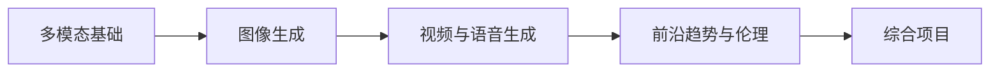

# 第十阶段：AIGC 与多模态生成

| 信息 | 说明 |
|---|---|
| **预估学时** | 80～120 小时 |
| **前置要求** | 完成第八B阶段 |

## 阶段概述

掌握多模态大模型、图像生成、视频生成与生成式产品工作流。

## 阶段导读

这一阶段适合在你已经掌握 LLM 应用和 Agent 基础之后，再往更广的生成式系统和多模态方向扩展。

这里最重要的不是追每个新模型名字，而是理解四件事：

1. 文本、图像、语音、视频怎样被放进同一个系统里
2. 生成模型为什么和分类模型的思路不同
3. 多模态产品的工作流通常由哪些模块组成
4. 前沿变化很快时，应该抓住哪些稳定主线

## 这一阶段的教学安排是否由浅入深？

整体上是顺的，而且对第一次系统接触 AIGC 的人来说，这种“先基础、再生成、再应用、最后看趋势”的路径是合理的。

更适合新人的理解主线是：

也就是说：

- **前两章在回答生成式系统怎么表示和怎么生成**
- **第三章在回答时序内容为什么更复杂**
- **第四章在回答这些能力落到现实世界会碰到什么边界**
- **第五章负责把它们真正做成产品工作流**

## 建议学习顺序

1. 第一章：多模态基础
2. 第二章：图像生成
3. 第三章：视频与语音生成
4. 第四章：前沿趋势
5. 第五章：项目实践

## 更适合新人的学习节奏

如果你是第一次系统学多模态和 AIGC，更稳的节奏通常是：

1. 先学第一章  
   先把“模态、对齐、融合、多模态系统”这些最基础的输入直觉建立起来。

2. 再学第二章  
   先把图像生成主线看懂，理解扩散模型和 Stable Diffusion 在做什么。

3. 再学第三章  
   这时再去理解视频、语音和数字人，会更容易知道为什么时序生成更难。

4. 然后看第四章  
   先学会怎么看趋势、伦理和法规，而不是只追模型名。

5. 最后做第五章项目  
   把图像、语音和资产管理真正组织成一条创作工作流。

## 本阶段章节地图

| 章节 | 主题 | 主要解决什么问题 |
|---|---|---|
| 第一章 | 多模态基础 | 理解文本、图像、视觉语言模型的基本关系 |
| 第二章 | 图像生成 | 理解扩散模型、Stable Diffusion 与图像工作流 |
| 第三章 | 视频与语音生成 | 理解视频生成、TTS、数字人等时序生成任务 |
| 第四章 | 前沿趋势 | 理解趋势、伦理、安全与法规的工程含义 |
| 第五章 | 项目实践 | 把多模态能力组织成真实产品原型 |

## 学这一阶段时要特别注意什么

- 不要只收集模型名，要理解输入输出和工作流
- 不要把“能生成”误当成“能产品化”
- 这部分变化快，要抓稳定结构，不要被热点牵着跑

## 这一阶段最值得优先补强的能力

- 能把文本、图像、语音、视频放进同一个系统视角里理解
- 能分清“生成一个内容”和“组织一条生成工作流”的差别
- 能从产品和工程角度判断多模态能力值不值得接进系统

## 学完后的出口能力

- 能解释一个多模态系统通常由哪些模块组成
- 能看懂图像、语音、视频生成的基本主线
- 能设计一个最小创意内容或多模态应用原型
