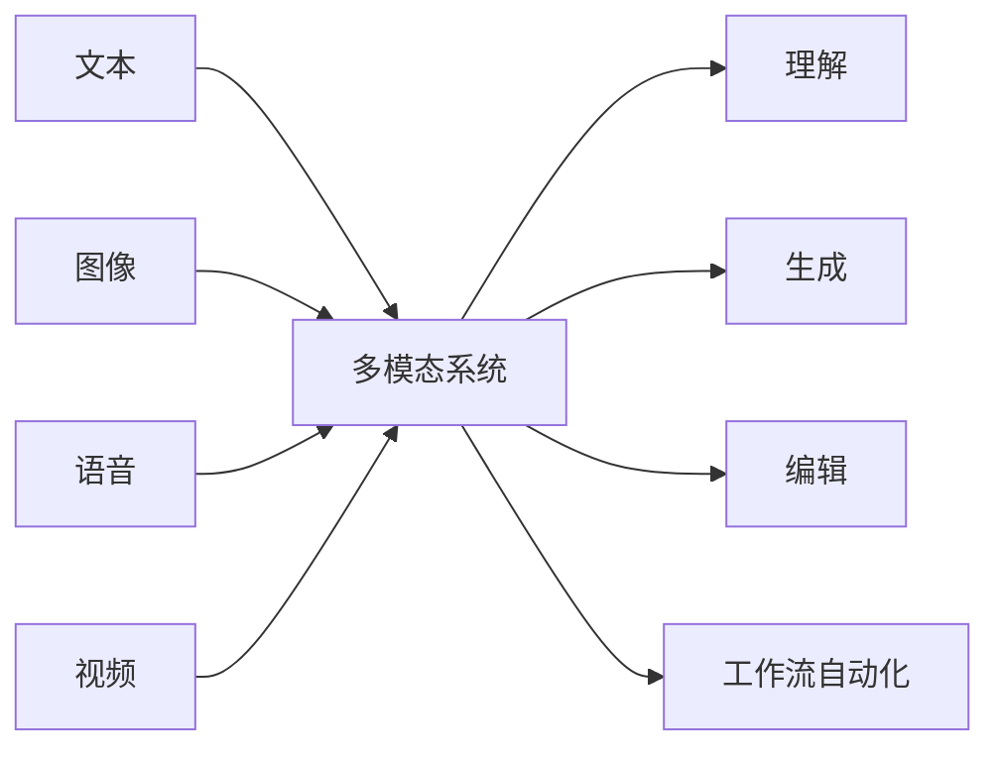

# 11 AIGC 与多模态

这一阶段解决的是“当输入输出不再只是文字时，AI 系统会怎样扩展”。它属于方向拓展，适合在你已经理解 LLM 应用、RAG 和 Agent 后，再进入图像、语音、视频和跨模态生成。

## 阶段定位

| 信息 | 说明 |
|---|---|
| 适合对象 | 已完成大模型应用主线，希望进入多模态、生成式内容或创意工具方向的学习者 |
| 预估学时 | 80～120 小时 |
| 前置要求 | 完成 LLM 应用开发与 RAG，建议了解 Agent 基础 |
| 阶段产出 | 多模态问答、图像生成工作流、视频/语音生成 Demo 或创意平台原型 |

## 多模态为什么重要

真实世界不是纯文本的。人类通过文字、图像、声音、视频和动作理解世界。多模态模型试图把这些不同形式的信息放进统一系统里，让 AI 能看图、读文档、听语音、生成图片和辅助创作。

## 本阶段学习路径

第一章学习多模态大模型，理解图文对齐、视觉语言模型和多模态应用。

第二章学习图像生成，理解扩散模型、Stable Diffusion、常见应用、微调和最新进展。

第三章学习视频生成与数字人，理解视频生成、语音合成、TTS 和数字人系统。

第四章学习 AIGC 前沿与伦理，包括趋势、版权、偏见、合规和安全边界。

第五章完成综合项目，把生成能力组织成一个产品工作流。

## 学完后你应该能做到

- 能解释文本、图像、语音、视频在多模态系统中的角色
- 能理解扩散模型和 Stable Diffusion 的基本工作流
- 能搭建一个简单图像生成或多模态问答 Demo
- 能分析 AIGC 产品中的素材、提示词、模型、后处理和交付流程
- 能意识到版权、肖像、偏见和内容安全等风险

## 常见误区

不要只把 AIGC 当成“好玩的图片工具”。真正的多模态产品会涉及资产管理、提示词工程、模型选择、后处理、用户工作流和合规边界。

也不要追逐每一个新模型。前沿变化很快，更重要的是抓住稳定主线：表示、对齐、生成、编辑、评估和工作流。

## 阶段项目

推荐完成一个创意内容生成平台原型，例如输入主题后自动生成文案、配图、语音或视频脚本。项目重点不是模型最强，而是流程完整：输入、生成、编辑、审核、导出。

如果你想看更细的学习节奏，可以阅读 [学习指南：多模态与 AIGC 怎么学最不容易学乱](./study-guide.md)。