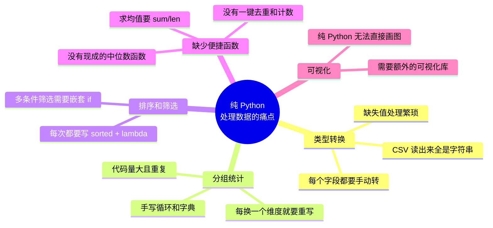
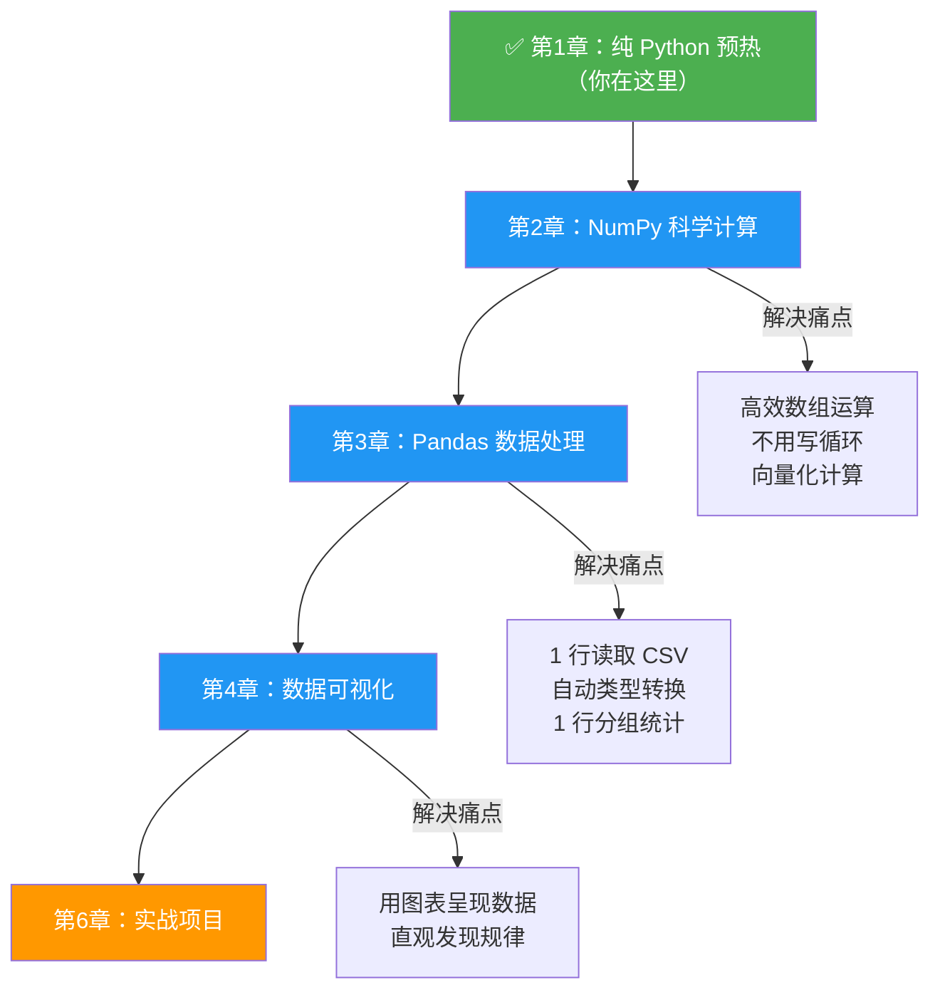

# 预热：纯 Python 处理数据

## 学习目标

- 用纯 Python（csv 模块 + 字典 + 列表）处理真实数据集
- 亲身体会纯 Python 处理数据的**痛点**
- 理解为什么需要专门的数据分析工具（NumPy、Pandas）
- 为后续学习建立直觉和动力

---

## 为什么要做这个预热？

你可能会想："我已经会 Python 了，直接学 NumPy 和 Pandas 不就行了？"

不急。先来做一个小实验。

这就像学开车之前先骑一次自行车走 20 公里——只有亲身体验过"自行车太慢太累"，你才会真正珍惜汽车的价值。

**本节的目标：用纯 Python 处理一份真实数据，然后你会说出那句话——"有没有更简单的方法？！"**

---

## 数据分析的全景图

在动手之前，先看看数据分析的典型流程：


今天我们用**纯 Python** 走完前四步。后面学了 NumPy 和 Pandas，你会发现同样的事情代码量能少 **5-10 倍**。

---

## 认识我们的数据集：Titanic

我们使用经典的 **Titanic（泰坦尼克号）数据集**——这是数据科学入门最常用的数据集。

每一行代表一位乘客，包含以下信息：

| 字段 | 含义 | 示例值 |
|------|------|--------|
| `PassengerId` | 乘客编号 | 1 |
| `Survived` | 是否幸存（0=遇难, 1=幸存） | 0 |
| `Pclass` | 船舱等级（1=头等, 2=二等, 3=三等） | 3 |
| `Name` | 姓名 | Braund, Mr. Owen Harris |
| `Sex` | 性别 | male |
| `Age` | 年龄 | 22 |
| `SibSp` | 船上的兄弟姐妹/配偶数 | 1 |
| `Parch` | 船上的父母/子女数 | 0 |
| `Ticket` | 船票号 | A/5 21171 |
| `Fare` | 票价 | 7.25 |
| `Cabin` | 船舱号 | C85 |
| `Embarked` | 登船港口（C/Q/S） | S |

---

## 第一步：准备数据

首先，让我们创建一份用于练习的小型 Titanic 数据。把以下代码保存并运行，它会生成一个 `titanic_sample.csv` 文件：

```python
# create_sample_data.py
# 创建一份小型 Titanic 样本数据

csv_content = """PassengerId,Survived,Pclass,Name,Sex,Age,SibSp,Parch,Ticket,Fare,Cabin,Embarked
1,0,3,"Braund, Mr. Owen Harris",male,22,1,0,A/5 21171,7.25,,S
2,1,1,"Cumings, Mrs. John Bradley",female,38,1,0,PC 17599,71.2833,C85,C
3,1,3,"Heikkinen, Miss. Laina",female,26,0,0,STON/O2. 3101282,7.925,,S
4,1,1,"Futrelle, Mrs. Jacques Heath",female,35,1,0,113803,53.1,C123,S
5,0,3,"Allen, Mr. William Henry",male,35,0,0,373450,8.05,,S
6,0,3,"Moran, Mr. James",male,,0,0,330877,8.4583,,Q
7,0,1,"McCarthy, Mr. Timothy J",male,54,0,0,17463,51.8625,E46,S
8,0,3,"Palsson, Master. Gosta Leonard",male,2,3,1,349909,21.075,,S
9,1,3,"Johnson, Mrs. Oscar W",female,27,0,2,347742,11.1333,,S
10,1,2,"Nasser, Mrs. Nicholas",female,14,1,0,237736,30.0708,,C
11,1,3,"Sandstrom, Miss. Marguerite Rut",female,4,1,1,PP 9549,16.7,G6,S
12,1,1,"Bonnell, Miss. Elizabeth",female,58,0,0,113783,26.55,C103,S
13,0,3,"Saundercock, Mr. William Henry",male,20,0,0,A/5. 2151,8.05,,S
14,0,3,"Andersson, Mr. Anders Johan",male,39,1,5,347082,31.275,,S
15,0,3,"Vestrom, Miss. Hulda Amanda",female,14,0,0,350406,7.8542,,S
16,1,2,"Hewlett, Mrs. Mary D",female,55,0,0,248706,16,,S
17,0,3,"Rice, Master. Eugene",male,2,4,1,382652,29.125,,Q
18,1,2,"Williams, Mr. Charles Eugene",male,,0,0,244373,13,,S
19,0,3,"Vander Planke, Mrs. Julius",female,31,1,0,345763,18,,S
20,1,3,"Masselmani, Mrs. Fatima",female,,0,0,2649,7.225,,C
21,0,2,"Fynney, Mr. Joseph J",male,35,0,0,239865,26,,S
22,1,2,"Beesley, Mr. Lawrence",male,34,0,0,248698,13,,S
23,1,3,"McGowan, Miss. Anna",female,15,0,0,330923,8.0292,,Q
24,1,1,"Sloper, Mr. William Thompson",male,28,0,0,113788,35.5,A6,S
25,0,3,"Palsson, Miss. Torborg Danira",female,8,3,1,349909,21.075,,S
26,1,3,"Asplund, Mrs. Carl Oscar",female,38,1,5,347077,31.3875,,S
27,0,3,"Emir, Mr. Farred Chehab",male,,0,0,2631,7.225,,C
28,0,1,"Fortune, Mr. Charles Alexander",male,19,3,2,19950,263,,S
29,1,3,"O'Dwyer, Miss. Ellen",female,,0,0,330959,7.8792,,Q
30,0,3,"Todoroff, Mr. Lalio",male,,0,0,349216,7.8958,,S"""

with open("titanic_sample.csv", "w", encoding="utf-8") as f:
    f.write(csv_content)

print("✅ titanic_sample.csv 已创建！（30 条记录）")
```

运行这段代码后，你的目录下会多出一个 `titanic_sample.csv` 文件。

:::tip 也可以用真实数据
如果你想挑战完整数据集（891 条记录），可以从 [Kaggle Titanic 页面](https://www.kaggle.com/c/titanic/data) 下载 `train.csv`。本教程的代码对两者都适用。
:::

---

## 第二步：读取 CSV 文件

### 任务：把 CSV 文件读取为 Python 数据结构

```python
import csv

def read_csv(filename):
    """读取 CSV 文件，返回字典列表"""
    passengers = []

    with open(filename, "r", encoding="utf-8") as f:
        reader = csv.DictReader(f)
        for row in reader:
            passengers.append(dict(row))

    return passengers

# 读取数据
passengers = read_csv("titanic_sample.csv")

# 看看第一条数据长什么样
print(f"共读取 {len(passengers)} 条记录\n")
print("第一位乘客的信息：")
for key, value in passengers[0].items():
    print(f"  {key}: {value}")
```

输出：

```
共读取 30 条记录

第一位乘客的信息：
  PassengerId: 1
  Survived: 0
  Pclass: 3
  Name: Braund, Mr. Owen Harris
  Sex: male
  Age: 22
  SibSp: 1
  Parch: 0
  Ticket: A/5 21171
  Fare: 7.25
  Cabin:
  Embarked: S
```

:::caution 第一个痛点：所有数据都是字符串！
注意看——`Age` 是 `"22"` 不是 `22`，`Survived` 是 `"0"` 不是 `0`。CSV 读出来的**全部是字符串**！要做数学运算，每个字段都得手动转换类型。
:::

---

## 第三步：数据清洗与类型转换

在分析之前，我们需要把字符串转成正确的类型，并处理缺失值：

```python
def clean_data(passengers):
    """清洗数据：类型转换 + 缺失值处理"""
    cleaned = []

    for p in passengers:
        # 尝试转换 Age（有些乘客没有年龄数据）
        age = None
        if p["Age"] and p["Age"].strip():
            try:
                age = float(p["Age"])
            except ValueError:
                age = None

        # 转换 Fare
        fare = 0.0
        if p["Fare"] and p["Fare"].strip():
            try:
                fare = float(p["Fare"])
            except ValueError:
                fare = 0.0

        cleaned.append({
            "id": int(p["PassengerId"]),
            "survived": int(p["Survived"]),
            "pclass": int(p["Pclass"]),
            "name": p["Name"],
            "sex": p["Sex"],
            "age": age,             # 可能是 None
            "sibsp": int(p["SibSp"]),
            "parch": int(p["Parch"]),
            "fare": fare,
            "cabin": p["Cabin"] if p["Cabin"] else None,
            "embarked": p["Embarked"] if p["Embarked"] else None,
        })

    return cleaned

passengers = clean_data(passengers)

# 验证清洗结果
p = passengers[0]
print(f"姓名: {p['name']}")
print(f"年龄: {p['age']} (类型: {type(p['age']).__name__})")
print(f"票价: {p['fare']} (类型: {type(p['fare']).__name__})")
print(f"幸存: {p['survived']} (类型: {type(p['survived']).__name__})")

# 检查有多少人缺少年龄数据
missing_age = sum(1 for p in passengers if p["age"] is None)
print(f"\n缺少年龄数据的乘客: {missing_age} 人")
```

看到这里你可能已经感觉到了——**光是把数据读出来并清洗干净，就写了几十行代码。** 而且这只是一个小数据集！

---

## 第四步：数据分析任务

现在数据干净了，让我们做几个分析任务。

### 任务 1：统计不同性别的生存率

```python
def survival_rate_by_gender(passengers):
    """统计不同性别的生存率"""
    # 分别统计男性和女性的总人数和幸存人数
    stats = {}

    for p in passengers:
        sex = p["sex"]
        if sex not in stats:
            stats[sex] = {"total": 0, "survived": 0}
        stats[sex]["total"] += 1
        stats[sex]["survived"] += p["survived"]

    # 计算生存率
    print("=== 不同性别的生存率 ===")
    print(f"{'性别':<10}{'总人数':<10}{'幸存人数':<10}{'生存率'}")
    print("-" * 40)

    for sex, data in stats.items():
        rate = data["survived"] / data["total"] * 100
        print(f"{sex:<10}{data['total']:<10}{data['survived']:<10}{rate:.1f}%")

survival_rate_by_gender(passengers)
```

输出：

```
=== 不同性别的生存率 ===
性别        总人数      幸存人数    生存率
----------------------------------------
male      14        3         21.4%
female    16        13        81.2%
```

**历史事实：** "女士和孩子优先"的规则在泰坦尼克号沉没时确实被执行了——女性生存率远高于男性。

### 任务 2：找出票价最高的前 5 位乘客

```python
def top_fare_passengers(passengers, n=5):
    """找出票价最高的前 n 位乘客"""
    # 按票价排序（需要手动写排序逻辑）
    sorted_passengers = sorted(passengers, key=lambda p: p["fare"], reverse=True)

    print(f"\n=== 票价最高的前 {n} 位乘客 ===")
    print(f"{'排名':<6}{'姓名':<35}{'舱位':<6}{'票价'}")
    print("-" * 60)

    for i, p in enumerate(sorted_passengers[:n], 1):
        pclass_name = {1: "头等", 2: "二等", 3: "三等"}[p["pclass"]]
        print(f"{i:<6}{p['name']:<35}{pclass_name:<6}${p['fare']:.2f}")

top_fare_passengers(passengers)
```

输出：

```
=== 票价最高的前 5 位乘客 ===
排名    姓名                                 舱位    票价
------------------------------------------------------------
1     Fortune, Mr. Charles Alexander       头等    $263.00
2     Cumings, Mrs. John Bradley           头等    $71.28
3     Futrelle, Mrs. Jacques Heath         头等    $53.10
4     McCarthy, Mr. Timothy J              头等    $51.86
5     Sloper, Mr. William Thompson         头等    $35.50
```

### 任务 3：按船舱等级分组统计平均年龄

这个任务最能体现纯 Python 处理数据的痛苦：

```python
def avg_age_by_class(passengers):
    """按船舱等级分组统计平均年龄"""
    # 第一步：按船舱等级分组
    groups = {}  # {pclass: [age1, age2, ...]}

    for p in passengers:
        pclass = p["pclass"]
        if pclass not in groups:
            groups[pclass] = []

        # 只统计有年龄数据的乘客
        if p["age"] is not None:
            groups[pclass].append(p["age"])

    # 第二步：计算每组的统计量
    print("\n=== 各船舱等级的年龄统计 ===")
    print(f"{'舱位':<10}{'人数':<10}{'平均年龄':<12}{'最大年龄':<12}{'最小年龄'}")
    print("-" * 55)

    for pclass in sorted(groups.keys()):
        ages = groups[pclass]
        if ages:
            avg = sum(ages) / len(ages)
            max_age = max(ages)
            min_age = min(ages)
            pclass_name = {1: "头等舱", 2: "二等舱", 3: "三等舱"}[pclass]
            print(f"{pclass_name:<10}{len(ages):<10}{avg:<12.1f}{max_age:<12.0f}{min_age:.0f}")

avg_age_by_class(passengers)
```

输出：

```
=== 各船舱等级的年龄统计 ===
舱位        人数      平均年龄      最大年龄      最小年龄
-------------------------------------------------------
头等舱      5         39.4        58          19
二等舱      4         34.5        55          14
三等舱      14        19.4        39          2
```

### 任务 4：计算各登船港口的平均票价

```python
def avg_fare_by_embarked(passengers):
    """计算各登船港口的平均票价"""
    port_names = {"S": "Southampton", "C": "Cherbourg", "Q": "Queenstown"}
    groups = {}

    for p in passengers:
        port = p["embarked"]
        if port is None:
            continue
        if port not in groups:
            groups[port] = []
        groups[port].append(p["fare"])

    print("\n=== 各登船港口的票价统计 ===")
    print(f"{'港口':<20}{'人数':<10}{'平均票价':<15}{'总票价'}")
    print("-" * 55)

    for port, fares in sorted(groups.items()):
        avg = sum(fares) / len(fares)
        total = sum(fares)
        name = port_names.get(port, port)
        print(f"{name:<20}{len(fares):<10}${avg:<14.2f}${total:.2f}")

avg_fare_by_embarked(passengers)
```

---

## 第五步：感受痛点

让我们回顾一下，用纯 Python 做这些分析，我们遇到了哪些问题：



### 痛点总结表

| 痛点 | 纯 Python 的做法 | 写多少代码 |
|------|-----------------|-----------|
| 读取 CSV | `csv.DictReader` + 手动类型转换 | ~30 行 |
| 按性别统计生存率 | 手写字典分组 + 循环计算 | ~15 行 |
| 排序取前 N | `sorted()` + 切片 + 格式化输出 | ~10 行 |
| 按舱位分组算均值 | 手写字典分组 + 手动过滤缺失值 + 手动计算 | ~20 行 |

**总计：** 大约 75-100 行代码，才完成了 4 个简单的分析任务。

---

## 第六步：预告——同样的任务，Pandas 需要多少代码？

先别急着学 Pandas 的语法，只看看效果对比：

```python
# ⚠️ 这是预告！后面会详细学习每一行的含义

import pandas as pd

# 读取 + 自动类型转换（1 行，替代你写的 30 行）
df = pd.read_csv("titanic_sample.csv")

# 按性别统计生存率（1 行，替代你写的 15 行）
print(df.groupby("Sex")["Survived"].mean())

# 票价最高的前 5 位（1 行，替代你写的 10 行）
print(df.nlargest(5, "Fare")[["Name", "Pclass", "Fare"]])

# 按舱位分组算平均年龄（1 行，替代你写的 20 行）
print(df.groupby("Pclass")["Age"].mean())

# 各港口平均票价（1 行）
print(df.groupby("Embarked")["Fare"].mean())
```

**5 行 Pandas 代码 = 75 行纯 Python 代码。**

而且 Pandas 还**自动处理了类型转换和缺失值**，你一行额外代码都不用写。

### 代码量对比

```mermaid
xychart-beta
    title "代码行数对比：纯 Python vs Pandas"
    x-axis ["读取数据", "性别生存率", "票价Top5", "分组均值", "总计"]
    y-axis "代码行数" 0 --> 100
    bar [30, 15, 10, 20, 75]
    bar [1, 1, 1, 1, 5]
```



---

## 动手练习

### 练习 1：统计幸存者和遇难者的平均票价

用纯 Python 计算：
- 幸存者的平均票价
- 遇难者的平均票价
- 两者的差异

```python
def avg_fare_by_survival(passengers):
    """统计幸存者和遇难者的平均票价"""
    # 提示：和按性别分组类似
    # survived == 1 的是幸存者，survived == 0 的是遇难者
    pass  # 补充代码

avg_fare_by_survival(passengers)
```

想一想：票价（船舱等级）和生存率之间有什么关系？

### 练习 2：找出所有儿童乘客（年龄 < 18）

```python
def find_children(passengers):
    """找出所有 18 岁以下的乘客"""
    # 注意：要处理 age 为 None 的情况
    children = []
    # 补充代码

    print(f"共有 {len(children)} 名儿童乘客：")
    for c in children:
        status = "幸存" if c["survived"] else "遇难"
        print(f"  {c['name']}, {c['age']:.0f}岁, {status}")

    # 计算儿童的生存率
    # 补充代码

find_children(passengers)
```

### 练习 3：综合统计表

生成一个综合统计表，格式如下：

```
=== 泰坦尼克号数据综合统计 ===
总乘客数: 30
幸存人数: 16 (53.3%)
平均年龄: 26.8 岁
平均票价: $31.23
男性人数: 14 (46.7%)
女性人数: 16 (53.3%)
缺失年龄: 7 人 (23.3%)
缺失船舱: 21 人 (70.0%)
```

### 挑战练习：交叉分析

统计**每个舱位等级中，男女的生存率**（2 个维度的交叉统计）：

```
=== 各舱位等级男女生存率 ===
        男性生存率    女性生存率
头等舱   33.3%       100.0%
二等舱   50.0%       100.0%
三等舱   0.0%        62.5%
```

提示：你需要同时按两个字段（pclass + sex）分组。试试看需要写多少行代码。

---

## 本节完整代码

把上面所有代码整合到一个文件中：

```python
"""
纯 Python 数据分析预热练习
数据集：Titanic（泰坦尼克号）
目标：体会纯 Python 处理数据的痛点，为学习 NumPy/Pandas 做铺垫
"""

import csv


def read_csv(filename: str) -> list[dict]:
    """读取 CSV 文件"""
    with open(filename, "r", encoding="utf-8") as f:
        return [dict(row) for row in csv.DictReader(f)]


def clean_data(passengers: list[dict]) -> list[dict]:
    """数据清洗：类型转换 + 缺失值处理"""
    cleaned = []
    for p in passengers:
        age = None
        if p["Age"] and p["Age"].strip():
            try:
                age = float(p["Age"])
            except ValueError:
                age = None

        fare = 0.0
        if p["Fare"] and p["Fare"].strip():
            try:
                fare = float(p["Fare"])
            except ValueError:
                fare = 0.0

        cleaned.append({
            "id": int(p["PassengerId"]),
            "survived": int(p["Survived"]),
            "pclass": int(p["Pclass"]),
            "name": p["Name"],
            "sex": p["Sex"],
            "age": age,
            "fare": fare,
            "cabin": p["Cabin"] if p["Cabin"] else None,
            "embarked": p["Embarked"] if p["Embarked"] else None,
        })
    return cleaned


def analyze(passengers: list[dict]) -> None:
    """执行所有分析任务"""

    # 任务 1：性别生存率
    print("=== 不同性别的生存率 ===")
    gender_stats = {}
    for p in passengers:
        sex = p["sex"]
        if sex not in gender_stats:
            gender_stats[sex] = {"total": 0, "survived": 0}
        gender_stats[sex]["total"] += 1
        gender_stats[sex]["survived"] += p["survived"]

    for sex, data in gender_stats.items():
        rate = data["survived"] / data["total"] * 100
        print(f"  {sex}: {data['survived']}/{data['total']} ({rate:.1f}%)")

    # 任务 2：票价 Top 5
    print(f"\n=== 票价最高的前 5 位 ===")
    sorted_by_fare = sorted(passengers, key=lambda p: p["fare"], reverse=True)
    for i, p in enumerate(sorted_by_fare[:5], 1):
        print(f"  {i}. {p['name'][:30]:<32} ${p['fare']:.2f}")

    # 任务 3：各舱位平均年龄
    print(f"\n=== 各舱位平均年龄 ===")
    class_ages = {}
    for p in passengers:
        pc = p["pclass"]
        if pc not in class_ages:
            class_ages[pc] = []
        if p["age"] is not None:
            class_ages[pc].append(p["age"])

    for pc in sorted(class_ages.keys()):
        ages = class_ages[pc]
        avg = sum(ages) / len(ages) if ages else 0
        label = {1: "头等舱", 2: "二等舱", 3: "三等舱"}[pc]
        print(f"  {label}: {avg:.1f} 岁 ({len(ages)} 人)")


if __name__ == "__main__":
    raw = read_csv("titanic_sample.csv")
    passengers = clean_data(raw)
    print(f"共加载 {len(passengers)} 条数据\n")
    analyze(passengers)
```

---

## 小结

| 要点 | 说明 |
|------|------|
| CSV 读出来全是字符串 | 每个字段都需要手动 `int()` / `float()` 转换 |
| 缺失值处理很繁琐 | 要逐个判断空值，用 try/except 防止转换出错 |
| 分组统计代码量大 | 每次分组都要手写字典 + 循环 |
| 统计函数不够用 | 没有现成的均值、中位数、标准差等函数 |
| 代码复用性差 | 换一个维度分组，整段代码要重写 |

:::tip 核心体会
这个预热练习的目的不是让你背下这些代码，而是让你**亲手感受痛点**。记住这些痛苦的感觉——接下来学 NumPy 和 Pandas 时，每学到一个新功能，你都会想："啊，这就是我之前想要的！"

这种"先苦后甜"的学习方式，会让你理解得更深、记得更牢。
:::

---

## 接下来学什么？

下面的学习路线是这样的：



准备好了吗？让我们进入 NumPy 的世界！
