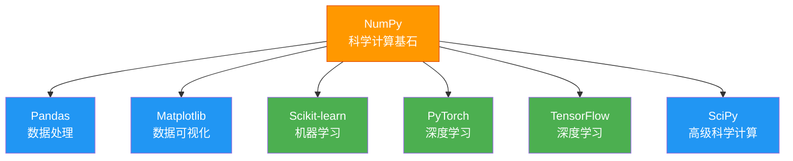

# NumPy 概述

## 学习目标

- 了解 NumPy 是什么以及它在 Python 生态中的地位
- 理解 ndarray 和 Python list 的区别
- 安装 NumPy 并运行第一段代码
- 直观感受 NumPy 的性能优势

---

## NumPy 是什么？

**NumPy**（Numerical Python）是 Python 中用于**科学计算**的核心库。如果说 Python 是一辆汽车，那 NumPy 就是它的引擎——几乎所有数据科学和 AI 相关的库都建立在 NumPy 之上。



简单来说：**学数据分析和 AI，NumPy 是绕不开的第一站。**

---

## 为什么需要 NumPy？

在第 1 章的预热练习中，我们用纯 Python 处理数据，遇到了很多痛点。那 NumPy 能帮我们解决什么问题呢？

### Python 列表的局限

回忆一下，如果我们想把一组数字都乘以 2：

```python
# 纯 Python：需要写循环
numbers = [1, 2, 3, 4, 5]
result = []
for n in numbers:
    result.append(n * 2)
print(result)  # [2, 4, 6, 8, 10]

# 或者用列表推导式
result = [n * 2 for n in numbers]
```

如果想计算两组数据对应位置的和：

```python
a = [1, 2, 3, 4, 5]
b = [10, 20, 30, 40, 50]
result = [a[i] + b[i] for i in range(len(a))]
print(result)  # [11, 22, 33, 44, 55]
```

这些操作很常见，但每次都要写循环，既麻烦又慢。

### NumPy 的解决方案

```python
import numpy as np

# NumPy：直接对整个数组操作，不用循环！
numbers = np.array([1, 2, 3, 4, 5])
result = numbers * 2
print(result)  # [ 2  4  6  8 10]

# 两组数据相加
a = np.array([1, 2, 3, 4, 5])
b = np.array([10, 20, 30, 40, 50])
result = a + b
print(result)  # [11 22 33 44 55]
```

**不用循环，一行搞定！** 这就是 NumPy 的核心能力——**向量化运算**。

---

## 安装 NumPy

如果你用 Miniconda / Anaconda，NumPy 通常已经预装了。如果没有：

```bash
# 用 pip 安装
pip install numpy

# 或用 conda 安装
conda install numpy
```

验证安装：

```python
import numpy as np
print(np.__version__)  # 如 1.26.4
print("NumPy 安装成功！")
```

:::tip import 别名
`import numpy as np` 是约定俗成的写法。在整个数据科学社区中，几乎所有人都把 NumPy 简写为 `np`。后面我们也统一用 `np`。
:::

---

## ndarray vs Python list

NumPy 的核心是 **ndarray**（N-dimensional array，N 维数组）。它和 Python 的 list 有什么区别？

### 外观对比

```python
import numpy as np

# Python list
py_list = [1, 2, 3, 4, 5]
print(type(py_list))   # <class 'list'>
print(py_list)          # [1, 2, 3, 4, 5]

# NumPy ndarray
np_array = np.array([1, 2, 3, 4, 5])
print(type(np_array))  # <class 'numpy.ndarray'>
print(np_array)         # [1 2 3 4 5]  ← 注意：没有逗号！
```

### 核心区别

| 特性 | Python list | NumPy ndarray |
|------|-------------|---------------|
| **数据类型** | 可以混装（整数、字符串、对象混在一起） | 所有元素必须是**同一类型** |
| **运算方式** | 需要循环逐个处理 | 支持**向量化运算**，整体操作 |
| **内存布局** | 元素分散存储 | 元素**连续存储**，更紧凑 |
| **运算速度** | 慢（Python 解释器逐个处理） | 快（底层用 C 语言优化） |
| **功能** | 通用容器 | 专为数值计算设计，自带大量数学函数 |

### 为什么同类型这么重要？

```python
# Python list 可以混装
mixed = [1, "hello", 3.14, True]  # ✅ 没问题

# NumPy 数组要求同类型
arr = np.array([1, 2, 3])       # 全是整数 → int64
arr2 = np.array([1, 2.5, 3])    # 有浮点数 → 自动变成 float64
print(arr.dtype)   # int64
print(arr2.dtype)  # float64
```

正因为所有元素类型相同，NumPy 才能使用底层 C 代码进行高效的批量运算，而不用像 Python list 那样逐个检查类型。

---

## 性能对比：眼见为实

空口无凭，让我们实际测一下 NumPy 到底有多快：

```python
import numpy as np
import time

# 准备 100 万个数字
size = 1_000_000
py_list = list(range(size))
np_array = np.arange(size)

# Python list：用循环把每个数乘以 2
start = time.time()
result_py = [x * 2 for x in py_list]
time_py = time.time() - start
print(f"Python list: {time_py:.4f} 秒")

# NumPy：直接向量化运算
start = time.time()
result_np = np_array * 2
time_np = time.time() - start
print(f"NumPy array: {time_np:.4f} 秒")

# 速度对比
print(f"\nNumPy 快了约 {time_py / time_np:.0f} 倍！")
```

典型输出：

```
Python list: 0.0580 秒
NumPy array: 0.0008 秒

NumPy 快了约 72 倍！
```

:::info 为什么这么快？
NumPy 的底层是用 **C 语言**编写的，并且利用了 CPU 的 **SIMD 指令**（单指令多数据），可以一次处理多个数据。而 Python 的 for 循环每次只能处理一个元素，还要经过 Python 解释器的类型检查。

打个比方：Python list 是手工一个一个搬砖，NumPy 是开铲车批量搬运。
:::

---

## 快速体验：NumPy 能做什么

在深入学习之前，先快速体验一些 NumPy 的常见操作：

### 创建数组

```python
import numpy as np

# 从列表创建
a = np.array([1, 2, 3, 4, 5])

# 创建全 0 数组
zeros = np.zeros(5)
print(zeros)  # [0. 0. 0. 0. 0.]

# 创建全 1 数组
ones = np.ones(3)
print(ones)   # [1. 1. 1.]

# 创建等差数列
seq = np.arange(0, 10, 2)  # 从 0 到 10，步长 2
print(seq)    # [0 2 4 6 8]

# 创建均匀分布的数列
lin = np.linspace(0, 1, 5)  # 从 0 到 1，均匀取 5 个点
print(lin)    # [0.   0.25 0.5  0.75 1.  ]
```

### 数学运算

```python
a = np.array([1, 2, 3, 4, 5])

print(a + 10)      # [11 12 13 14 15]  每个元素加 10
print(a ** 2)       # [ 1  4  9 16 25]  每个元素平方
print(np.sqrt(a))   # [1.   1.41 1.73 2.   2.24]  每个元素开方
```

### 统计计算

```python
scores = np.array([85, 92, 78, 95, 88, 72, 90, 85])

print(f"平均分: {np.mean(scores):.1f}")     # 85.6
print(f"最高分: {np.max(scores)}")           # 95
print(f"最低分: {np.min(scores)}")           # 72
print(f"标准差: {np.std(scores):.1f}")       # 7.3
print(f"中位数: {np.median(scores):.1f}")    # 86.5
```

### 多维数组

```python
# 创建一个 3×3 的二维数组（矩阵）
matrix = np.array([
    [1, 2, 3],
    [4, 5, 6],
    [7, 8, 9]
])
print(matrix)
# [[1 2 3]
#  [4 5 6]
#  [7 8 9]]

print(f"形状: {matrix.shape}")   # (3, 3)
print(f"维度: {matrix.ndim}")    # 2
print(f"总元素: {matrix.size}")  # 9
```

---

## NumPy 在 AI 中的应用

你可能会问：NumPy 和 AI 有什么关系？其实关系非常密切：

| AI 场景 | NumPy 的角色 |
|---------|-------------|
| 图像处理 | 一张图片就是一个三维数组（高度 × 宽度 × 颜色通道） |
| 数据预处理 | 归一化、标准化、缺失值填充都用 NumPy |
| 特征计算 | 计算均值、方差、相关系数等统计量 |
| 神经网络 | PyTorch 的 Tensor 和 NumPy 的 ndarray 可以无缝转换 |
| 词向量 | NLP 中的词嵌入就是一组 NumPy 向量 |
| 矩阵运算 | 机器学习的核心就是矩阵乘法和梯度计算 |

举个例子——一张 RGB 彩色图片在计算机中就是一个 NumPy 数组：

```python
import numpy as np

# 模拟一张 4×4 的彩色图片（实际图片可能是 1920×1080×3）
image = np.random.randint(0, 256, size=(4, 4, 3), dtype=np.uint8)
print(f"图片形状: {image.shape}")  # (4, 4, 3)  → 4 行 × 4 列 × 3 个颜色通道(RGB)
print(f"总像素值: {image.size}")   # 48 个数字
```

---

## 小结

| 要点 | 说明 |
|------|------|
| NumPy 是什么 | Python 科学计算的核心库，几乎所有 AI/数据库都依赖它 |
| 核心数据结构 | ndarray（N 维数组），所有元素类型相同 |
| 为什么快 | 底层 C 实现 + 连续内存 + 向量化运算 |
| vs Python list | 速度快几十到上百倍，运算更方便 |
| 导入约定 | `import numpy as np` |

:::tip 预告
下一节我们将深入学习 NumPy 数组的创建方法和基本属性——这是后续所有操作的基础。
:::

---

## 动手练习

### 练习 1：安装与验证

确保你的环境中已安装 NumPy，并打印版本号。

### 练习 2：性能对比

自己跑一遍性能对比代码，试试把数据量改成 500 万、1000 万，看看速度差异变化。

### 练习 3：初体验

创建一个包含 1 到 100 所有整数的 NumPy 数组，然后：
1. 计算所有数字的总和
2. 计算平均值
3. 找出最大值和最小值
4. 计算所有数字的平方和

```python
import numpy as np

arr = np.arange(1, 101)  # 1 到 100

# 补充代码：
# total = ?
# average = ?
# max_val = ?
# min_val = ?
# square_sum = ?
```
