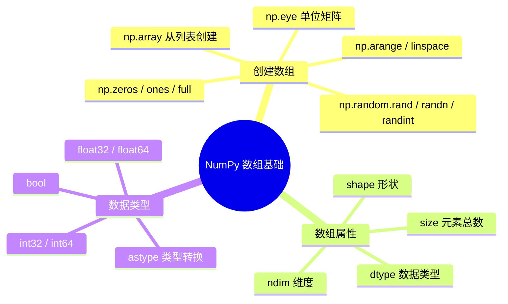

# 数组基础

## 学习目标

- 掌握多种数组创建方式
- 理解数组的核心属性（shape、dtype、ndim、size）
- 了解 NumPy 的数据类型系统
- 掌握数组的数据类型转换

---

## 创建数组

### 从 Python 列表创建

最基本的方式是用 `np.array()` 把 Python 列表转成 NumPy 数组：

```python
import numpy as np

# 一维数组
a = np.array([1, 2, 3, 4, 5])
print(a)         # [1 2 3 4 5]
print(type(a))   # <class 'numpy.ndarray'>

# 二维数组（矩阵）
b = np.array([
    [1, 2, 3],
    [4, 5, 6]
])
print(b)
# [[1 2 3]
#  [4 5 6]]

# 三维数组
c = np.array([
    [[1, 2], [3, 4]],
    [[5, 6], [7, 8]]
])
print(c.shape)  # (2, 2, 2)
```

:::caution 常见错误
```python
# ❌ 错误：嵌套列表长度不一致
bad = np.array([[1, 2, 3], [4, 5]])  # 会报警告或创建 object 数组

# ✅ 正确：每一行长度必须相同
good = np.array([[1, 2, 3], [4, 5, 6]])
```
:::

### 快捷创建函数

NumPy 提供了大量快速创建数组的函数，不需要你手写每个元素：

```python
import numpy as np

# ========== 全 0 / 全 1 数组 ==========
zeros_1d = np.zeros(5)
print(zeros_1d)  # [0. 0. 0. 0. 0.]

zeros_2d = np.zeros((3, 4))   # 3 行 4 列
print(zeros_2d)
# [[0. 0. 0. 0.]
#  [0. 0. 0. 0.]
#  [0. 0. 0. 0.]]

ones_2d = np.ones((2, 3))     # 2 行 3 列
print(ones_2d)
# [[1. 1. 1.]
#  [1. 1. 1.]]

# ========== 填充指定值 ==========
fives = np.full((2, 3), 5)    # 全部填充 5
print(fives)
# [[5 5 5]
#  [5 5 5]]

# ========== 单位矩阵 ==========
eye = np.eye(3)                # 3×3 单位矩阵
print(eye)
# [[1. 0. 0.]
#  [0. 1. 0.]
#  [0. 0. 1.]]
```

### 等差数列：arange 和 linspace

```python
# arange：类似 Python 的 range，但返回 NumPy 数组
a = np.arange(10)          # 0 到 9
print(a)                    # [0 1 2 3 4 5 6 7 8 9]

b = np.arange(2, 10, 2)    # 从 2 开始，到 10（不含），步长 2
print(b)                    # [2 4 6 8]

c = np.arange(0, 1, 0.2)   # 支持小数步长！（range 不支持）
print(c)                    # [0.  0.2 0.4 0.6 0.8]

# linspace：指定个数，自动计算步长
d = np.linspace(0, 10, 5)   # 从 0 到 10（含），均匀取 5 个点
print(d)                     # [ 0.   2.5  5.   7.5 10. ]

e = np.linspace(0, 1, 11)   # 0 到 1 之间取 11 个点
print(e)                     # [0.  0.1 0.2 ... 0.9 1. ]
```

:::tip arange vs linspace
- `arange(start, stop, step)`：你指定**步长**，NumPy 自动算出有多少个元素
- `linspace(start, stop, num)`：你指定**元素个数**，NumPy 自动算出步长

画图的时候 `linspace` 更常用，因为你通常想控制采样点的数量。
:::

### 创建随机数组

```python
# 0~1 之间的均匀分布随机数
rand = np.random.rand(3, 4)       # 3×4
print(rand)

# 标准正态分布随机数（均值0，标准差1）
randn = np.random.randn(3, 4)     # 3×4

# 指定范围的随机整数
randint = np.random.randint(1, 100, size=(3, 4))  # 1~99 之间的 3×4 整数
print(randint)
```

### 创建方法速查表

| 函数 | 作用 | 示例 |
|------|------|------|
| `np.array()` | 从列表创建 | `np.array([1, 2, 3])` |
| `np.zeros()` | 全 0 数组 | `np.zeros((3, 4))` |
| `np.ones()` | 全 1 数组 | `np.ones((2, 3))` |
| `np.full()` | 填充指定值 | `np.full((2, 3), 7)` |
| `np.eye()` | 单位矩阵 | `np.eye(4)` |
| `np.arange()` | 等差数列（指定步长） | `np.arange(0, 10, 2)` |
| `np.linspace()` | 等差数列（指定个数） | `np.linspace(0, 1, 100)` |
| `np.random.rand()` | 均匀随机数 [0, 1) | `np.random.rand(3, 4)` |
| `np.random.randn()` | 标准正态分布 | `np.random.randn(3, 4)` |
| `np.random.randint()` | 随机整数 | `np.random.randint(0, 10, (3, 4))` |

---

## 数组属性

每个 NumPy 数组都有一些重要属性，了解它们是后续操作的基础：

```python
import numpy as np

arr = np.array([
    [1, 2, 3, 4],
    [5, 6, 7, 8],
    [9, 10, 11, 12]
])

print(f"形状 (shape):  {arr.shape}")    # (3, 4) → 3 行 4 列
print(f"维度 (ndim):   {arr.ndim}")     # 2 → 二维数组
print(f"元素总数 (size): {arr.size}")    # 12 → 3 × 4 = 12
print(f"数据类型 (dtype): {arr.dtype}")  # int64
print(f"每个元素字节数: {arr.itemsize}") # 8 → int64 占 8 字节
print(f"总字节数: {arr.nbytes}")         # 96 → 12 × 8 = 96
```

### shape 的含义

`shape` 是最常用的属性，它告诉你数组的"形状"：

```python
# 一维数组
a = np.array([1, 2, 3])
print(a.shape)      # (3,) → 3 个元素

# 二维数组
b = np.array([[1, 2, 3], [4, 5, 6]])
print(b.shape)      # (2, 3) → 2 行 3 列

# 三维数组
c = np.ones((2, 3, 4))
print(c.shape)      # (2, 3, 4) → 2 个 "3行4列的矩阵"
```

理解 shape 的方式：**从外到内，逐层数**。

```
三维数组 shape = (2, 3, 4)
          ↓  ↓  ↓
          │  │  └── 最内层：每行 4 个元素
          │  └───── 中间层：每个矩阵 3 行
          └──────── 最外层：共 2 个矩阵
```

---

## 数据类型（dtype）

NumPy 数组中所有元素必须是同一类型。这也是它能快速运算的关键。

### 常用数据类型

| dtype | 含义 | 示例值 | 常见场景 |
|-------|------|--------|---------|
| `int32` | 32位整数 | -2147483648 ~ 2147483647 | 计数、索引 |
| `int64` | 64位整数（默认） | 更大范围 | 通用整数 |
| `float32` | 32位浮点数 | 约7位有效数字 | 深度学习（节省显存） |
| `float64` | 64位浮点数（默认） | 约15位有效数字 | 科学计算（高精度） |
| `bool` | 布尔值 | True / False | 条件过滤 |
| `str_` | 字符串 | "hello" | 文本标签（少用） |

### 指定数据类型

```python
# 自动推断类型
a = np.array([1, 2, 3])         # int64（全是整数）
b = np.array([1.0, 2.0, 3.0])   # float64（有小数点）
c = np.array([1, 2.5, 3])       # float64（混合时自动向上转）

# 手动指定类型
d = np.array([1, 2, 3], dtype=np.float32)
print(d)        # [1. 2. 3.]
print(d.dtype)  # float32

e = np.zeros(5, dtype=np.int32)
print(e)        # [0 0 0 0 0]
print(e.dtype)  # int32
```

### 类型转换：astype

```python
# 整数转浮点数
int_arr = np.array([1, 2, 3, 4])
float_arr = int_arr.astype(np.float64)
print(float_arr)        # [1. 2. 3. 4.]
print(float_arr.dtype)  # float64

# 浮点数转整数（直接截断，不是四舍五入！）
float_arr2 = np.array([1.7, 2.3, 3.9])
int_arr2 = float_arr2.astype(np.int32)
print(int_arr2)  # [1 2 3]  ← 注意：3.9 变成了 3，不是 4！

# 布尔转换
bool_arr = np.array([0, 1, 0, 2, -1]).astype(bool)
print(bool_arr)  # [False  True False  True  True]  ← 0 是 False，非 0 是 True
```

:::caution float 转 int 的陷阱
`astype(int)` 是**直接截断小数部分**，不是四舍五入。如果你需要四舍五入，先用 `np.round()`：

```python
arr = np.array([1.5, 2.3, 3.7])
print(arr.astype(int))     # [1 2 3] ← 截断
print(np.round(arr).astype(int))  # [2 2 4] ← 四舍五入后再转
```
:::

### float32 vs float64：什么时候用哪个？

```python
# float64：默认，精度高
a = np.array([1.0, 2.0, 3.0])  # 默认 float64，每个元素 8 字节

# float32：省内存，深度学习常用
b = np.array([1.0, 2.0, 3.0], dtype=np.float32)  # 每个元素 4 字节

# 内存对比
big_f64 = np.random.rand(1000000)                        # float64
big_f32 = np.random.rand(1000000).astype(np.float32)     # float32
print(f"float64 占内存: {big_f64.nbytes / 1024 / 1024:.1f} MB")  # 7.6 MB
print(f"float32 占内存: {big_f32.nbytes / 1024 / 1024:.1f} MB")  # 3.8 MB
```

:::tip 实用建议
- **数据分析**阶段：用默认的 float64，精度高，不用操心
- **深度学习**阶段：模型参数和数据通常用 float32（甚至 float16），因为 GPU 显存很宝贵
- 现在你只需要知道有这两种类型就行，后面深度学习阶段会深入讲
:::

---

## 从已有数组创建

有时候你需要基于已有数组的形状创建新数组：

```python
original = np.array([[1, 2, 3], [4, 5, 6]])

# 创建和 original 形状相同的全 0 数组
z = np.zeros_like(original)
print(z)
# [[0 0 0]
#  [0 0 0]]

# 创建和 original 形状相同的全 1 数组
o = np.ones_like(original)
print(o)
# [[1 1 1]
#  [1 1 1]]

# 创建和 original 形状相同的指定值数组
f = np.full_like(original, 99)
print(f)
# [[99 99 99]
#  [99 99 99]]

# 创建未初始化的数组（快但值随机）
e = np.empty_like(original)
# ⚠️ 值是随机的，不要直接使用未赋值的 empty 数组！
```

---

## 小结



---

## 动手练习

### 练习 1：创建各种数组

```python
import numpy as np

# 1. 创建一个包含 1 到 20 的一维数组
arr1 = ?

# 2. 创建一个 4×5 的全零矩阵
arr2 = ?

# 3. 创建一个 3×3 的矩阵，所有元素为 7
arr3 = ?

# 4. 创建一个从 0 到 2π (np.pi * 2) 之间均匀分布的 100 个点
arr4 = ?

# 5. 创建一个 5×5 的随机整数矩阵（范围 1~50）
arr5 = ?
```

### 练习 2：属性查看

创建一个 shape 为 (3, 4, 5) 的全 1 数组，回答以下问题：
1. 它的维度（ndim）是多少？
2. 它有多少个元素（size）？
3. 默认的 dtype 是什么？
4. 把它转换成 int32 类型后，每个元素占多少字节？

### 练习 3：类型转换

```python
# 给定考试成绩（浮点数）
scores = np.array([85.6, 92.3, 78.8, 95.1, 60.5, 73.9])

# 1. 把成绩四舍五入到整数
rounded = ?

# 2. 判断每个成绩是否及格（>= 60），得到布尔数组
passed = ?

# 3. 计算及格人数（提示：True 算 1，False 算 0）
pass_count = ?
```
