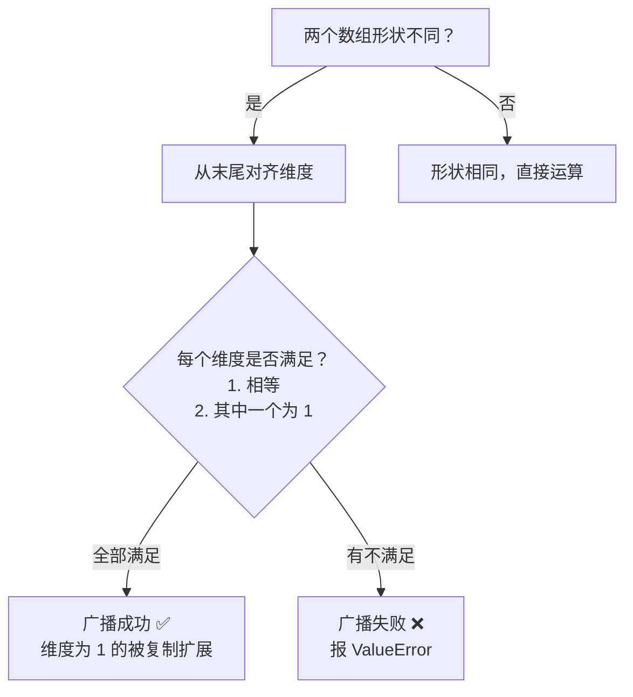

# 数组运算

## 学习目标

- 理解向量化运算的概念和优势
- 掌握元素级运算和通用函数（ufunc）
- 理解广播机制（Broadcasting）的规则
- 熟练使用聚合函数进行统计计算

---

## 向量化运算：告别循环

**向量化运算**是 NumPy 的核心思想——对整个数组进行操作，不用写循环。

### 纯 Python vs NumPy

```python
import numpy as np

# 纯 Python：逐个计算
prices = [100, 200, 300, 400, 500]
discounted = []
for p in prices:
    discounted.append(p * 0.8)
print(discounted)  # [80.0, 160.0, 240.0, 320.0, 400.0]

# NumPy：一行搞定
prices = np.array([100, 200, 300, 400, 500])
discounted = prices * 0.8
print(discounted)  # [ 80. 160. 240. 320. 400.]
```

### 元素级运算

NumPy 数组的算术运算是**逐元素**进行的：

```python
a = np.array([1, 2, 3, 4])
b = np.array([10, 20, 30, 40])

print(a + b)     # [11 22 33 44]    对应位置相加
print(a - b)     # [ -9 -18 -27 -36]
print(a * b)     # [ 10  40  90 160]  对应位置相乘（不是矩阵乘法！）
print(a / b)     # [0.1 0.1 0.1 0.1]
print(a ** 2)    # [ 1  4  9 16]      平方
print(b % 3)     # [1 2 0 1]          取余
print(b // 3)    # [ 3  6 10 13]      整除
```

### 与标量运算

数组和单个数字（标量）运算时，会自动把标量应用到每个元素：

```python
arr = np.array([10, 20, 30, 40])

print(arr + 5)    # [15 25 35 45]
print(arr * 2)    # [20 40 60 80]
print(arr / 10)   # [1. 2. 3. 4.]
print(1 / arr)    # [0.1  0.05 0.033 0.025]
```

### 比较运算

```python
arr = np.array([15, 23, 8, 42, 31])

print(arr > 20)      # [False  True False  True  True]
print(arr == 23)     # [False  True False False False]
print(arr != 8)      # [ True  True False  True  True]
```

---

## 通用函数（ufunc）

NumPy 提供了大量的**通用函数**，可以对数组中每个元素应用数学运算：

### 常用数学函数

```python
arr = np.array([1, 4, 9, 16, 25])

# 平方根
print(np.sqrt(arr))     # [1. 2. 3. 4. 5.]

# 绝对值
neg = np.array([-3, -1, 0, 2, 5])
print(np.abs(neg))      # [3 1 0 2 5]

# 幂运算
print(np.power(arr, 0.5))  # 和 sqrt 一样

# 指数和对数
print(np.exp([0, 1, 2]))      # [1.    2.718 7.389]  e 的幂
print(np.log([1, np.e, 10]))   # [0.    1.    2.303]  自然对数
print(np.log10([1, 10, 100]))  # [0. 1. 2.]           以 10 为底
print(np.log2([1, 2, 8, 64]))  # [0. 1. 3. 6.]       以 2 为底
```

### 三角函数

```python
# 创建 0 到 2π 的角度
angles = np.linspace(0, 2 * np.pi, 5)  # [0, π/2, π, 3π/2, 2π]

print(np.sin(angles))  # [ 0.  1.  0. -1.  0.]  ← 正弦
print(np.cos(angles))  # [ 1.  0. -1.  0.  1.]  ← 余弦
```

### 取整函数

```python
arr = np.array([1.2, 2.5, 3.7, -1.3, -2.8])

print(np.floor(arr))    # [ 1.  2.  3. -2. -3.]  向下取整
print(np.ceil(arr))     # [ 2.  3.  4. -1. -2.]  向上取整
print(np.round(arr))    # [ 1.  2.  4. -1. -3.]  四舍五入
print(np.trunc(arr))    # [ 1.  2.  3. -1. -2.]  截断小数
```

### 两个数组间的运算

```python
a = np.array([3, 5, 7, 9])
b = np.array([1, 4, 2, 8])

print(np.maximum(a, b))  # [3 5 7 9]   对应位置取较大值
print(np.minimum(a, b))  # [1 4 2 8]   对应位置取较小值
print(np.where(a > b, a, b))  # 同 maximum，但更灵活
```

---

## 广播机制（Broadcasting）

当两个形状不同的数组运算时，NumPy 会自动"广播"较小的数组，使它们形状兼容。

### 最简单的例子

```python
arr = np.array([1, 2, 3])

# 标量 + 数组 → 标量被广播成 [10, 10, 10]
print(arr + 10)   # [11 12 13]
```

这其实就是广播——NumPy 把 `10` 扩展成了 `[10, 10, 10]`，然后逐元素相加。

### 二维数组 + 一维数组

```python
matrix = np.array([
    [1, 2, 3],
    [4, 5, 6],
    [7, 8, 9]
])

row = np.array([10, 20, 30])

# row 被广播到每一行
result = matrix + row
print(result)
# [[11 22 33]
#  [14 25 36]
#  [17 28 39]]
```

广播的过程可以这样理解：

```
matrix:         row (广播前):      row (广播后):
[[1, 2, 3],    [10, 20, 30]  →   [[10, 20, 30],
 [4, 5, 6],                        [10, 20, 30],
 [7, 8, 9]]                        [10, 20, 30]]
```

### 列向量 + 行向量

```python
col = np.array([[1], [2], [3]])    # shape: (3, 1) 列向量
row = np.array([10, 20, 30])       # shape: (3,)   行向量

# 两者都被广播
result = col + row
print(result)
# [[11 21 31]
#  [12 22 32]
#  [13 23 33]]
```

### 广播规则



简单记忆：**维度从后往前比，要么相等，要么其中一个是 1。**

```python
# ✅ 可以广播
# (3, 4) + (4,)     → (3, 4)     最后一维都是 4
# (3, 4) + (1, 4)   → (3, 4)     第一维 3 和 1 → 广播成 3
# (3, 1) + (1, 4)   → (3, 4)     两个维度都广播

# ❌ 不能广播
# (3, 4) + (3,)     → 报错！最后一维 4 ≠ 3，且都不是 1
```

### 广播的实际应用

```python
# 标准化数据：每列减去该列的均值
data = np.array([
    [85, 170, 60],
    [92, 180, 75],
    [78, 165, 55],
    [90, 175, 70]
])  # 4 个学生：成绩、身高、体重

# 计算每列均值
col_mean = data.mean(axis=0)        # [86.25 172.5  65.  ]  shape: (3,)

# 广播：(4, 3) - (3,) → (4, 3)
centered = data - col_mean
print(centered)
# [[-1.25 -2.5  -5.  ]
#  [ 5.75  7.5  10.  ]
#  [-8.25 -7.5 -10.  ]
#  [ 3.75  2.5   5.  ]]
```

---

## 聚合函数

聚合函数把一组数据"汇总"成一个或一组值：

### 常用聚合函数

```python
arr = np.array([4, 7, 2, 9, 1, 5, 8, 3, 6])

print(np.sum(arr))      # 45    总和
print(np.mean(arr))     # 5.0   均值
print(np.median(arr))   # 5.0   中位数
print(np.std(arr))      # 2.58  标准差
print(np.var(arr))      # 6.67  方差
print(np.min(arr))      # 1     最小值
print(np.max(arr))      # 9     最大值
print(np.argmin(arr))   # 4     最小值的索引
print(np.argmax(arr))   # 3     最大值的索引
print(np.cumsum(arr))   # [ 4 11 13 22 23 28 36 39 45]  累积和
print(np.cumprod(arr[:5]))  # [  4  28  56 504 504]  累积积
```

### 按轴（axis）聚合

对于多维数组，`axis` 参数控制沿哪个方向聚合：

```python
matrix = np.array([
    [1, 2, 3],
    [4, 5, 6],
    [7, 8, 9]
])

# 不指定 axis：对所有元素聚合
print(np.sum(matrix))          # 45

# axis=0：沿行方向（按列聚合）—— 上下压缩
print(np.sum(matrix, axis=0))  # [12 15 18]

# axis=1：沿列方向（按行聚合）—— 左右压缩
print(np.sum(matrix, axis=1))  # [ 6 15 24]
```

`axis` 的理解方式——**axis=0 消灭行，axis=1 消灭列**：

```
原始 (3, 3):
[[1, 2, 3],
 [4, 5, 6],
 [7, 8, 9]]

axis=0 (消灭行 → 结果 shape=(3,)):
[1+4+7, 2+5+8, 3+6+9] = [12, 15, 18]

axis=1 (消灭列 → 结果 shape=(3,)):
[1+2+3, 4+5+6, 7+8+9] = [6, 15, 24]
```

### 实战：成绩分析

```python
# 5 个学生的 3 科成绩
scores = np.array([
    [85, 92, 78],   # 学生 1：语文、数学、英语
    [90, 88, 95],   # 学生 2
    [72, 65, 80],   # 学生 3
    [95, 98, 92],   # 学生 4
    [60, 55, 70]    # 学生 5
])

subjects = ["语文", "数学", "英语"]

# 每个学生的总分
total = np.sum(scores, axis=1)
print("每个学生的总分:", total)   # [255 273 217 285 185]

# 每个学生的平均分
avg_per_student = np.mean(scores, axis=1)
print("每个学生的平均分:", avg_per_student)

# 每科的平均分
avg_per_subject = np.mean(scores, axis=0)
for sub, avg in zip(subjects, avg_per_subject):
    print(f"  {sub}平均分: {avg:.1f}")

# 全班最高分是谁的哪科
max_idx = np.unravel_index(np.argmax(scores), scores.shape)
print(f"最高分: {scores[max_idx]} (学生{max_idx[0]+1}的{subjects[max_idx[1]]})")

# 哪个学生的总分最高
best_student = np.argmax(total)
print(f"总分最高: 学生{best_student + 1}, 总分 {total[best_student]}")
```

---

## np.where：条件选择

`np.where` 是 NumPy 版的三元表达式：

```python
arr = np.array([85, 42, 91, 67, 55, 78])

# 及格的标记为 "PASS"，不及格标记为 "FAIL"
result = np.where(arr >= 60, "PASS", "FAIL")
print(result)  # ['PASS' 'FAIL' 'PASS' 'PASS' 'FAIL' 'PASS']

# 不及格的补到 60
adjusted = np.where(arr >= 60, arr, 60)
print(adjusted)  # [85 60 91 67 60 78]
```

---

## 小结

| 类别 | 内容 | 示例 |
|------|------|------|
| 向量化运算 | 整个数组一起运算，不用循环 | `arr * 2`, `a + b` |
| 通用函数 | 逐元素的数学函数 | `np.sqrt()`, `np.exp()`, `np.log()` |
| 广播 | 不同形状的数组自动扩展 | `(3,4) + (4,)` → `(3,4)` |
| 聚合函数 | 汇总统计 | `np.sum()`, `np.mean()`, `np.std()` |
| axis 参数 | 控制聚合方向 | `axis=0` 按列，`axis=1` 按行 |
| np.where | 条件选择 | `np.where(arr > 0, arr, 0)` |

---

## 动手练习

### 练习 1：向量化计算

```python
# 计算华氏温度转摄氏温度
# 公式：C = (F - 32) × 5/9
fahrenheit = np.array([32, 68, 100, 212, 72, 98.6])

# 用向量化运算一行完成转换
celsius = ?
```

### 练习 2：广播练习

```python
# 3 个商品的原价
prices = np.array([100, 200, 300])

# 3 种折扣率（列向量）
discounts = np.array([[0.9], [0.8], [0.7]])

# 用广播计算每个商品在每种折扣下的价格（3×3 矩阵）
final_prices = ?
# 预期结果：
# [[ 90. 180. 270.]
#  [ 80. 160. 240.]
#  [ 70. 140. 210.]]
```

### 练习 3：成绩统计

```python
# 生成 50 个学生的随机成绩（40~100 之间）
np.random.seed(42)
scores = np.random.randint(40, 101, size=50)

# 1. 计算均值、中位数、标准差
# 2. 找出最高分、最低分和它们的位置
# 3. 统计各分数段人数：不及格(<60)、及格(60-69)、中等(70-79)、良好(80-89)、优秀(90+)
# 4. 计算及格率
```
