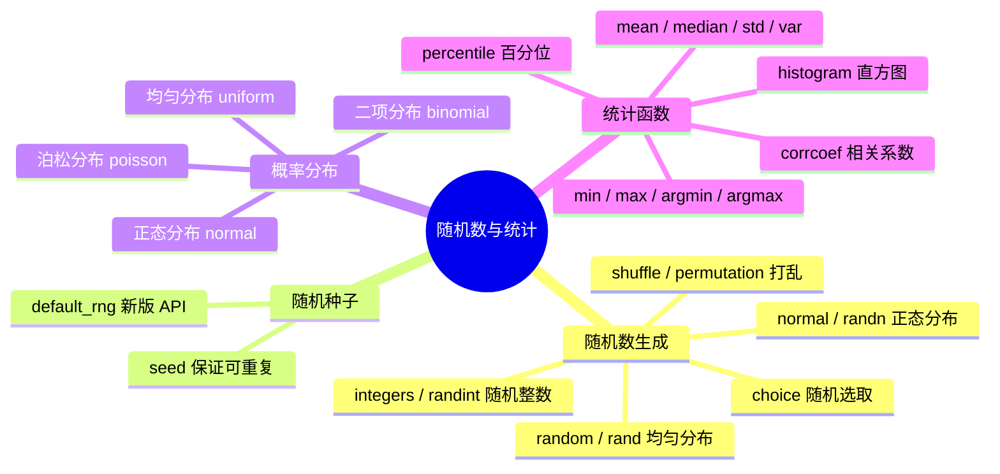
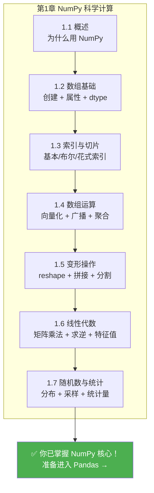

# 随机数与统计

## 学习目标

- 掌握 `numpy.random` 模块的常用函数
- 了解常用概率分布（均匀分布、正态分布、二项分布）
- 理解随机种子（seed）的作用
- 学会用 NumPy 进行基本统计运算

---

## 为什么需要随机数？

在数据科学和 AI 中，随机数无处不在：

| 场景 | 为什么需要随机数 |
|------|----------------|
| 数据集拆分 | 随机拆分训练集和测试集 |
| 模型初始化 | 神经网络权重需要随机初始化 |
| 数据增强 | 随机裁剪、旋转、翻转图片 |
| 蒙特卡洛模拟 | 用随机采样估计复杂问题 |
| A/B 测试 | 随机分配用户到对照组和实验组 |

---

## numpy.random 基础

### 新版 API（推荐）

NumPy 推荐使用新版的 `Generator` API：

```python
import numpy as np

# 创建随机数生成器
rng = np.random.default_rng(seed=42)

# 均匀分布随机数 [0, 1)
print(rng.random(5))
# [0.773... 0.438... 0.858... 0.697... 0.094...]

# 指定范围的随机整数
print(rng.integers(1, 100, size=5))
# [67 82 42 91 23]（示例值）

# 正态分布随机数
print(rng.standard_normal(5))
# [-0.15... 0.74... -0.27... ...]
```

### 旧版 API（仍然常用）

很多教程和代码中还在用旧版 API，你也需要认识：

```python
# 旧版写法（仍然有效）
np.random.seed(42)  # 设置全局种子

# 均匀随机数 [0, 1)
print(np.random.rand(3))

# 标准正态分布
print(np.random.randn(3))

# 随机整数
print(np.random.randint(1, 100, size=5))
```

:::tip 新版 vs 旧版
- **新版** `default_rng()`：更灵活，支持独立的随机状态，推荐在新代码中使用
- **旧版** `np.random.xxx()`：全局状态，简单直接，旧代码中很常见

两种都要认识，本教程兼顾两种写法。
:::

---

## 随机种子：让"随机"可重复

在科学研究和调试中，我们经常需要"可重复的随机"——每次运行代码得到相同的结果。

```python
# 不设种子：每次结果不同
print(np.random.rand(3))  # 每次都不一样

# 设置种子：每次结果相同
np.random.seed(42)
print(np.random.rand(3))  # [0.374... 0.950... 0.731...]

np.random.seed(42)        # 重新设置相同的种子
print(np.random.rand(3))  # [0.374... 0.950... 0.731...]  一模一样！
```

```python
# 新版 API 的种子设置
rng = np.random.default_rng(seed=42)
print(rng.random(3))

rng2 = np.random.default_rng(seed=42)  # 相同的种子
print(rng2.random(3))                    # 相同的结果
```

:::info 种子的作用
随机种子就像一本"随机数菜谱"——相同的种子总是产生相同序列的随机数。在以下场景中一定要设置种子：

- **学习/教程中**：方便验证结果
- **科学实验中**：确保结果可重复
- **调试代码时**：排除随机性干扰
- **机器学习训练时**：确保对比实验的公平性
:::

---

## 常用概率分布

### 均匀分布

每个值出现的概率相同：

```python
rng = np.random.default_rng(42)

# [0, 1) 之间的均匀分布
uniform_01 = rng.random(10000)
print(f"均值: {uniform_01.mean():.4f}")  # ≈ 0.5
print(f"最小: {uniform_01.min():.4f}")   # ≈ 0
print(f"最大: {uniform_01.max():.4f}")   # ≈ 1

# [low, high) 之间的均匀分布
uniform_custom = rng.uniform(low=10, high=50, size=1000)
print(f"均值: {uniform_custom.mean():.1f}")  # ≈ 30
```

### 正态分布（高斯分布）

这是最重要的分布——在自然界和数据中无处不在：

```python
rng = np.random.default_rng(42)

# 标准正态分布：均值=0, 标准差=1
standard = rng.standard_normal(10000)
print(f"均值: {standard.mean():.4f}")  # ≈ 0
print(f"标准差: {standard.std():.4f}")  # ≈ 1

# 指定均值和标准差的正态分布
# 例如：中国成年男性身高约 170cm，标准差约 6cm
heights = rng.normal(loc=170, scale=6, size=10000)
print(f"平均身高: {heights.mean():.1f} cm")
print(f"标准差: {heights.std():.1f} cm")
print(f"最矮: {heights.min():.1f} cm")
print(f"最高: {heights.max():.1f} cm")
```

### 二项分布

n 次独立实验中成功的次数（比如掷硬币）：

```python
rng = np.random.default_rng(42)

# 模拟掷 10 次硬币（正面概率 0.5），重复 10000 次
results = rng.binomial(n=10, p=0.5, size=10000)
print(f"平均正面次数: {results.mean():.2f}")  # ≈ 5
print(f"最少: {results.min()}")
print(f"最多: {results.max()}")
```

### 其他常用分布

```python
rng = np.random.default_rng(42)

# 泊松分布（事件发生次数）
# 比如：平均每小时来 5 个客人
visitors = rng.poisson(lam=5, size=1000)
print(f"泊松分布 - 均值: {visitors.mean():.2f}")

# 指数分布（事件间隔时间）
wait_times = rng.exponential(scale=2.0, size=1000)
print(f"指数分布 - 均值: {wait_times.mean():.2f}")

# 选择：从数组中随机选取
names = np.array(["Alice", "Bob", "Charlie", "Diana", "Eve"])
chosen = rng.choice(names, size=3, replace=False)  # 不放回抽样
print(f"随机选取: {chosen}")
```

---

## 随机操作

### 随机打乱

```python
rng = np.random.default_rng(42)

arr = np.arange(10)    # [0 1 2 3 4 5 6 7 8 9]

# 打乱（原地修改）
rng.shuffle(arr)
print(arr)              # [8 1 5 0 7 2 9 4 3 6]（随机顺序）

# 打乱并返回新数组（不修改原数组）
arr2 = np.arange(10)
shuffled = rng.permutation(arr2)
print(arr2)       # [0 1 2 3 4 5 6 7 8 9]  原数组不变
print(shuffled)   # 打乱后的新数组
```

### 随机抽样

```python
rng = np.random.default_rng(42)

data = np.arange(100)

# 有放回抽样（可能重复）
sample1 = rng.choice(data, size=10, replace=True)
print(f"有放回: {sample1}")

# 无放回抽样（不重复）
sample2 = rng.choice(data, size=10, replace=False)
print(f"无放回: {sample2}")

# 加权随机抽样
items = np.array(["常见", "一般", "稀有", "传说"])
weights = np.array([0.6, 0.25, 0.1, 0.05])  # 概率
drops = rng.choice(items, size=20, p=weights)
unique, counts = np.unique(drops, return_counts=True)
for item, count in zip(unique, counts):
    print(f"  {item}: {count} 次")
```

---

## 统计运算

NumPy 提供了丰富的统计函数：

### 描述性统计

```python
np.random.seed(42)
data = np.random.normal(loc=75, scale=10, size=100)  # 100 个学生的成绩

print("=== 描述性统计 ===")
print(f"均值 (mean):     {np.mean(data):.2f}")
print(f"中位数 (median): {np.median(data):.2f}")
print(f"标准差 (std):    {np.std(data):.2f}")
print(f"方差 (var):      {np.var(data):.2f}")
print(f"最小值 (min):    {np.min(data):.2f}")
print(f"最大值 (max):    {np.max(data):.2f}")
print(f"极差 (ptp):      {np.ptp(data):.2f}")   # max - min
```

### 百分位数

```python
data = np.random.normal(loc=75, scale=10, size=1000)

# 百分位数
print(f"25th 百分位: {np.percentile(data, 25):.2f}")
print(f"50th 百分位: {np.percentile(data, 50):.2f}")  # = 中位数
print(f"75th 百分位: {np.percentile(data, 75):.2f}")
print(f"90th 百分位: {np.percentile(data, 90):.2f}")

# 四分位距 (IQR)
q1 = np.percentile(data, 25)
q3 = np.percentile(data, 75)
iqr = q3 - q1
print(f"四分位距 (IQR): {iqr:.2f}")
```

### 相关系数

```python
np.random.seed(42)

# 身高和体重通常正相关
height = np.random.normal(170, 8, 100)
weight = height * 0.6 - 30 + np.random.normal(0, 5, 100)  # 近似线性关系 + 噪声

# 计算相关系数矩阵
corr_matrix = np.corrcoef(height, weight)
print(f"相关系数: {corr_matrix[0, 1]:.4f}")  # ≈ 0.7~0.9（正相关）

# 解读：
# 1.0  = 完全正相关
# 0.0  = 无关
# -1.0 = 完全负相关
```

### 直方图统计

```python
scores = np.random.normal(75, 10, 200)

# 统计各分数段人数
bins = [0, 60, 70, 80, 90, 100]
counts, bin_edges = np.histogram(scores, bins=bins)
labels = ["不及格", "及格", "中等", "良好", "优秀"]

print("=== 成绩分布 ===")
for label, count, left, right in zip(labels, counts, bin_edges[:-1], bin_edges[1:]):
    bar = "█" * count
    print(f"  {label} [{left:.0f}-{right:.0f}): {count:3d} {bar}")
```

---

## 实战：模拟蒙特卡洛

蒙特卡洛方法是用随机数估计复杂问题的经典方法。下面用它来估计圆周率 π：

```python
import numpy as np

def estimate_pi(n_points):
    """
    通过在正方形中随机撒点估计 π
    落在四分之一圆内的点的比例 ≈ π/4
    """
    rng = np.random.default_rng(42)

    # 在 [0, 1] × [0, 1] 的正方形中随机撒点
    x = rng.random(n_points)
    y = rng.random(n_points)

    # 计算到原点的距离
    distance = np.sqrt(x**2 + y**2)

    # 落在四分之一圆内（距离 <= 1）的点的数量
    inside = np.sum(distance <= 1)

    # π ≈ 4 × (圆内点数 / 总点数)
    pi_estimate = 4 * inside / n_points
    return pi_estimate

# 不同点数的估计精度
for n in [100, 1000, 10000, 100000, 1000000]:
    pi_est = estimate_pi(n)
    error = abs(pi_est - np.pi)
    print(f"  {n:>10,} 个点 → π ≈ {pi_est:.6f}  误差: {error:.6f}")
```

输出：

```
       100 个点 → π ≈ 3.120000  误差: 0.021593
     1,000 个点 → π ≈ 3.156000  误差: 0.014407
    10,000 个点 → π ≈ 3.153200  误差: 0.011607
   100,000 个点 → π ≈ 3.140480  误差: 0.001113
 1,000,000 个点 → π ≈ 3.142484  误差: 0.000891
```

点越多，估计越精确！这就是蒙特卡洛方法的魅力。

---

## 小结



---

## 动手练习

### 练习 1：模拟掷骰子

```python
rng = np.random.default_rng(42)

# 模拟掷 2 个骰子 10000 次
# 1. 生成 10000×2 的随机整数数组（每行是一次投掷的两个骰子）
# 2. 计算每次投掷的点数之和
# 3. 统计每种点数和（2~12）出现的次数
# 4. 找出出现最多的点数和（应该是 7）
```

### 练习 2：模拟股票价格

```python
rng = np.random.default_rng(42)

# 模拟一只股票 250 个交易日的价格变化
# 初始价格 100 元
# 每天的收益率服从正态分布：均值 0.05%，标准差 2%
initial_price = 100
n_days = 250

# 1. 生成 250 天的日收益率
# daily_returns = rng.normal(loc=?, scale=?, size=?)

# 2. 计算每天的价格（提示：用 np.cumprod）
# prices = initial_price * np.cumprod(1 + daily_returns)

# 3. 计算最终价格、最高价、最低价
# 4. 计算年化收益率
```

### 练习 3：成绩分析

```python
np.random.seed(42)

# 生成 200 个学生的成绩
math_scores = np.random.normal(75, 12, 200).clip(0, 100)    # 数学
english_scores = np.random.normal(78, 10, 200).clip(0, 100)  # 英语

# 1. 分别计算两科的均值、标准差、中位数
# 2. 计算两科的相关系数
# 3. 统计数学不及格但英语及格的人数
# 4. 用 histogram 统计两科的分数段分布
# 5. 计算两科总分的 Top 10 学生的平均分
```

---

## 章节总结：NumPy 知识全景

恭喜你完成了 NumPy 的全部内容！来回顾一下这一章学了什么：



> **✅ 自检：** 你能用 NumPy 创建一个 100×3 的随机矩阵，计算每列的均值和标准差，并找出每行最大值所在的列索引吗？

```python
import numpy as np

rng = np.random.default_rng(42)
matrix = rng.normal(loc=50, scale=15, size=(100, 3))

# 每列均值
print("每列均值:", np.mean(matrix, axis=0))

# 每列标准差
print("每列标准差:", np.std(matrix, axis=0))

# 每行最大值所在的列索引
print("每行最大值列索引:", np.argmax(matrix, axis=1))
```

如果这些都不在话下——恭喜，准备好进入 Pandas 的世界了！
