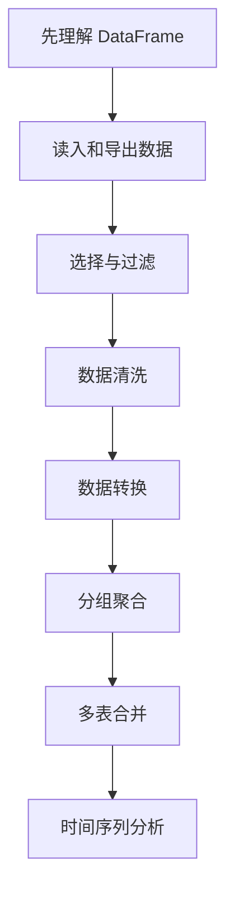

# Pandas 导读：这一章到底在学什么

这一章解决的是：拿到一张真实数据表后，怎样用代码把它读进来、看清楚、整理干净、筛选出来、统计汇总，并交给后面的可视化、机器学习或业务分析。

很多新人第一次学 `Pandas` 时会觉得每个函数都能看懂一点，但放到真实分析题里还是不知道先做什么。这很正常，因为 `Pandas` 真正难的地方从来不只是 API，而是你能不能把“读数据 → 清洗 → 筛选 → 聚合 → 合并 → 输出结果”串成一个顺手的数据工作流。

## 这一章在整个课程里的位置

第二阶段是数据分析与可视化，而 `Pandas` 是这一阶段的主心骨。前面的 NumPy 更像底层计算能力，Pandas 更像现实数据工作台：它处理有列名、有缺失值、有类别字段、有时间字段、有脏数据的表格。

如果 Pandas 学顺了，后面的可视化、EDA、机器学习特征准备、项目分析都会顺很多。因为真实项目里，模型和图表之前通常都有大量表格整理工作。

## 这一章真正要解决的问题

这一章要回答五个问题：`DataFrame` 到底是什么；数据怎样从 CSV、Excel、JSON 等文件读入；如何选择、过滤和清洗数据；如何用 `groupby` 做按类别、按时间、按部门的统计；如何把多张表合并成一张可分析的数据表。

新人最容易犯的错误，是一上来就背函数。更稳的方式是先想数据流：我现在手里有什么表，我要得到什么结果，中间需要清洗、筛选、转换、聚合还是合并。

## 新人推荐学习顺序

建议先学核心数据结构，把 `Series / DataFrame / Index` 看顺。然后学数据读写和选择过滤，先做到“读得进来、挑得出来”。接着学数据清洗，把缺失值、重复值、类型错误和字符串问题处理到能放心分析。再学 `groupby`，把真正的统计主线抓住。最后学数据转换、合并和时间序列，处理更复杂的业务表格。

## 学这一章时要抓住的主线

这一章的主线可以概括为：Pandas 最重要的不是 API 多，而是数据流要顺。

如果你每一步都能说清楚“输入是什么、输出是什么、为什么要这样处理”，Pandas 就不会变成函数碎片。

## 这一章 8 节课分别在解决什么

| 章节 | 它最该帮你解决什么问题 |
|---|---|
| [3.1 Pandas 核心数据结构](./01-core-structures.md) | 先搞懂 `Series / DataFrame / Index` 到底是什么 |
| [3.2 数据读写](./02-read-write.md) | 把 CSV / Excel / JSON 读进来、导出去 |
| [3.3 数据选择与过滤](./03-selection-filter.md) | 真正开始“挑出我想要的那部分数据” |
| [3.4 数据清洗](./04-data-cleaning.md) | 处理缺失值、重复值、异常值和格式问题 |
| [3.5 数据转换](./05-data-transform.md) | 在列和列之间做变换、映射和派生 |
| [3.6 分组与聚合](./06-groupby.md) | 做“按部门 / 按月份 / 按类别”的统计分析 |
| [3.7 数据合并](./07-merge.md) | 把多张表拼起来 |
| [3.8 时间序列](./08-time-series.md) | 让表格开始按时间维度工作 |

## 这一章和后面阶段的关系

Pandas 是后面很多能力的输入层。可视化需要它整理数据，机器学习需要它准备特征，RAG 和 Agent 项目也常常需要它读取表格、分析日志或处理评估数据。

如果这一章没学稳，后面常见的问题是：图表画不出来不是因为可视化不会，而是数据没整理好；机器学习分数差不是模型问题，而是字段类型、缺失值或数据泄漏没处理好；Agent 数据分析工具能跑，但表格逻辑错了。

## 本章小项目出口

学完这一章后，建议做一个“小型销售数据清洗与分析”。输入一份包含订单、用户、商品和时间字段的表格，完成数据读入、字段检查、缺失值处理、类型转换、按月份和品类聚合、关键指标输出，并保存一份可供可视化使用的干净数据表。

项目重点不是函数用得多，而是能把每一步整理成清晰数据流。

## 过关标准

这一章结束时，你应该能拿到一张表后先查看结构，能完成读写、筛选、清洗、转换、分组聚合和简单多表合并，能解释 `groupby`、`merge`、`loc/iloc` 各自在数据流中的作用。

如果你能把一份原始表格处理成干净分析表，并说明每一步为什么这样做，就达到了数据分析阶段的 Pandas 入门标准。

## 学到这里，下一步怎么读最顺

建议先读 Pandas 核心数据结构、数据读写、数据选择与过滤、数据清洗、分组与聚合。等这几篇顺了，再继续看数据转换、数据合并和时间序列。
