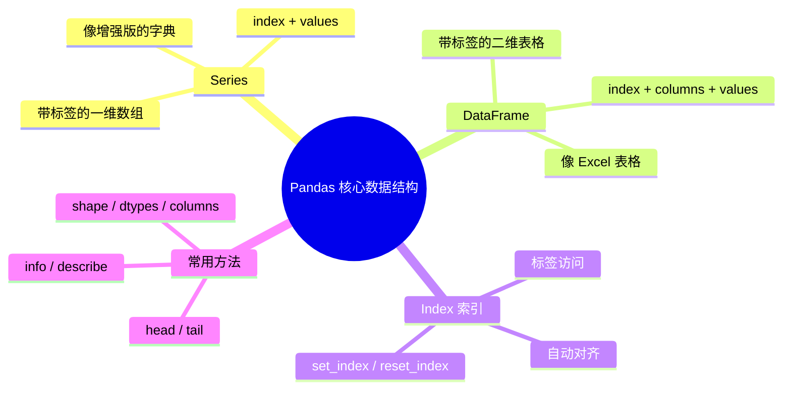

# Pandas 核心数据结构

## 学习目标

- 理解 Pandas 在数据分析中的地位
- 掌握 Series 的创建和基本操作
- 掌握 DataFrame 的创建和基本属性
- 理解索引（Index）机制

---

## Pandas 是什么？

如果说 NumPy 是 Python 数据科学的**引擎**，那 Pandas 就是**方向盘和仪表盘**——它让你能方便地操控和观察数据。


Pandas 的核心能力：

| 能力 | 说明 |
|------|------|
| 数据读写 | 一行代码读取 CSV、Excel、JSON、SQL |
| 数据清洗 | 处理缺失值、重复值、异常值 |
| 数据筛选 | 像 SQL 一样灵活地过滤和查询数据 |
| 分组统计 | groupby 比纯 Python 循环快几十倍 |
| 数据合并 | 像 SQL JOIN 一样合并多张表 |

还记得第 1 章的预热练习吗？75 行纯 Python 代码做的事情，Pandas 5 行就搞定了。现在让我们正式学习它。

```python
import pandas as pd
import numpy as np

print(pd.__version__)  # 如 2.2.0
```

:::tip 导入约定
和 NumPy 用 `np` 一样，Pandas 统一简写为 `pd`。
:::

---

## Series：带标签的一维数组

**Series** 是 Pandas 最基本的数据结构——你可以把它理解为一个**带标签的 NumPy 数组**。

### 创建 Series

```python
import pandas as pd

# 从列表创建（自动生成 0, 1, 2... 索引）
s1 = pd.Series([85, 92, 78, 95, 88])
print(s1)
# 0    85
# 1    92
# 2    78
# 3    95
# 4    88
# dtype: int64

# 指定索引
s2 = pd.Series(
    [85, 92, 78, 95, 88],
    index=["语文", "数学", "英语", "物理", "化学"]
)
print(s2)
# 语文    85
# 数学    92
# 英语    78
# 物理    95
# 化学    88
# dtype: int64

# 从字典创建（键自动成为索引）
scores = {"语文": 85, "数学": 92, "英语": 78, "物理": 95}
s3 = pd.Series(scores)
print(s3)
```

### Series 的结构

```
索引 (Index)    值 (Values)
───────────    ──────────
语文            85
数学            92
英语            78
物理            95
化学            88
```

每个 Series 都由两部分组成：
- **索引（Index）**：标签，用来定位数据
- **值（Values）**：实际数据，底层是 NumPy 数组

```python
s = pd.Series([85, 92, 78], index=["语文", "数学", "英语"])

print(s.index)    # Index(['语文', '数学', '英语'], dtype='object')
print(s.values)   # [85 92 78]  ← 这是一个 NumPy 数组！
print(s.dtype)    # int64
print(s.shape)    # (3,)
print(len(s))     # 3
```

### Series 的访问

```python
s = pd.Series([85, 92, 78, 95], index=["语文", "数学", "英语", "物理"])

# 用标签索引
print(s["数学"])      # 92

# 用位置索引
print(s.iloc[1])      # 92

# 切片
print(s["语文":"英语"])  # 标签切片（包含末尾！）
# 语文    85
# 数学    92
# 英语    78

# 布尔索引
print(s[s >= 90])
# 数学    92
# 物理    95
```

:::caution 标签切片 vs 位置切片
- **标签切片** `s["语文":"英语"]`：**包含**末尾
- **位置切片** `s.iloc[0:2]`：**不包含**末尾（和 Python 列表一致）

这是新手容易混淆的地方。
:::

### Series 的运算

```python
s = pd.Series([85, 92, 78, 95], index=["语文", "数学", "英语", "物理"])

# 向量化运算（和 NumPy 一样）
print(s + 5)         # 每科加 5 分
print(s * 1.1)       # 每科乘以 1.1
print(s.mean())      # 87.5  平均分
print(s.max())       # 95    最高分
print(s.describe())  # 一键生成描述性统计
```

---

## DataFrame：带标签的二维表格

**DataFrame** 是 Pandas 的核心——你可以把它理解为一张**Excel 表格**，或者一个**由多个 Series 组成的字典**。

### 创建 DataFrame

```python
# 方法 1：从字典创建（最常用）
data = {
    "姓名": ["张三", "李四", "王五", "赵六", "钱七"],
    "年龄": [22, 25, 23, 28, 21],
    "城市": ["北京", "上海", "广州", "深圳", "杭州"],
    "薪资": [15000, 22000, 18000, 25000, 16000]
}
df = pd.DataFrame(data)
print(df)
#    姓名  年龄  城市     薪资
# 0  张三   22  北京  15000
# 1  李四   25  上海  22000
# 2  王五   23  广州  18000
# 3  赵六   28  深圳  25000
# 4  钱七   21  杭州  16000
```

```python
# 方法 2：从列表的列表创建
data = [
    ["张三", 22, "北京"],
    ["李四", 25, "上海"],
    ["王五", 23, "广州"]
]
df = pd.DataFrame(data, columns=["姓名", "年龄", "城市"])

# 方法 3：从 NumPy 数组创建
arr = np.random.randint(60, 100, size=(5, 3))
df = pd.DataFrame(arr, columns=["语文", "数学", "英语"])

# 方法 4：从 Series 字典创建
df = pd.DataFrame({
    "数学": pd.Series([90, 85, 78], index=["张三", "李四", "王五"]),
    "英语": pd.Series([88, 92, 75], index=["张三", "李四", "王五"])
})
```

### DataFrame 的结构

```
        列 (Columns)
        ↓
索引 →  姓名   年龄   城市     薪资
(Index)
  0     张三    22    北京    15000
  1     李四    25    上海    22000
  2     王五    23    广州    18000
  3     赵六    28    深圳    25000
  4     钱七    21    杭州    16000
```

DataFrame = **行索引（Index）** + **列名（Columns）** + **数据（Values）**

### 基本属性

```python
data = {
    "姓名": ["张三", "李四", "王五", "赵六", "钱七"],
    "年龄": [22, 25, 23, 28, 21],
    "城市": ["北京", "上海", "广州", "深圳", "杭州"],
    "薪资": [15000, 22000, 18000, 25000, 16000]
}
df = pd.DataFrame(data)

print(df.shape)      # (5, 4)  → 5 行 4 列
print(df.columns)    # Index(['姓名', '年龄', '城市', '薪资'], dtype='object')
print(df.index)      # RangeIndex(start=0, stop=5, step=1)
print(df.dtypes)
# 姓名    object    ← 字符串
# 年龄     int64
# 城市    object
# 薪资     int64
print(df.size)       # 20  → 5 × 4 = 20 个元素
print(len(df))       # 5   → 行数
```

### 快速查看数据

```python
# 前 3 行
print(df.head(3))

# 后 2 行
print(df.tail(2))

# 基本信息
print(df.info())
# <class 'pandas.core.frame.DataFrame'>
# RangeIndex: 5 entries, 0 to 4
# Data columns (total 4 columns):
#  #   Column  Non-Null Count  Dtype
# ---  ------  --------------  -----
#  0   姓名     5 non-null      object
#  1   年龄     5 non-null      int64
#  2   城市     5 non-null      object
#  3   薪资     5 non-null      int64

# 数值列的统计摘要
print(df.describe())
#              年龄           薪资
# count   5.000000      5.000000
# mean   23.800000  19200.000000
# std     2.774887   4147.288271
# min    21.000000  15000.000000
# 25%    22.000000  16000.000000
# 50%    23.000000  18000.000000
# 75%    25.000000  22000.000000
# max    28.000000  25000.000000
```

:::tip info() 和 describe() 是你的好朋友
拿到一份新数据，第一件事就是跑 `df.info()` 和 `df.describe()`——它们能让你在几秒内了解数据的"全貌"。
:::

### 访问列

```python
# 访问单列 → 返回 Series
print(df["姓名"])
# 0    张三
# 1    李四
# ...

# 也可以用点语法（列名不含空格且不与方法冲突时）
print(df.年龄)

# 访问多列 → 返回 DataFrame
print(df[["姓名", "薪资"]])
#    姓名     薪资
# 0  张三  15000
# 1  李四  22000
# ...
```

### 添加和删除列

```python
# 添加新列
df["税后薪资"] = df["薪资"] * 0.85
print(df[["姓名", "薪资", "税后薪资"]])

# 基于条件添加列
df["薪资等级"] = np.where(df["薪资"] >= 20000, "高", "中")
print(df[["姓名", "薪资", "薪资等级"]])

# 删除列
df = df.drop(columns=["税后薪资"])  # 返回新 DataFrame
# 或者
# df.drop(columns=["税后薪资"], inplace=True)  # 原地修改
```

---

## 索引（Index）的重要性

索引是 Pandas 区别于 NumPy 的关键特性。

### 设置索引

```python
df = pd.DataFrame({
    "姓名": ["张三", "李四", "王五"],
    "年龄": [22, 25, 23],
    "薪资": [15000, 22000, 18000]
})

# 把"姓名"列设为索引
df_indexed = df.set_index("姓名")
print(df_indexed)
#       年龄     薪资
# 姓名
# 张三    22  15000
# 李四    25  22000
# 王五    23  18000

# 通过索引访问
print(df_indexed.loc["李四"])
# 年龄       25
# 薪资    22000

# 重置索引
df_reset = df_indexed.reset_index()
print(df_reset)  # 和原来一样
```

### 索引对齐

Pandas 的运算会**自动按索引对齐**——这是一个非常强大的特性：

```python
s1 = pd.Series({"语文": 85, "数学": 92, "英语": 78})
s2 = pd.Series({"数学": 88, "英语": 82, "物理": 90})

# 自动按索引对齐相加
result = s1 + s2
print(result)
# 数学    180.0
# 物理      NaN   ← s1 没有物理，结果为 NaN
# 英语    160.0
# 语文      NaN   ← s2 没有语文，结果为 NaN
```

---

## Series vs DataFrame 对比

| 特性 | Series | DataFrame |
|------|--------|-----------|
| 维度 | 一维 | 二维 |
| 类比 | Excel 的一列 | 整张 Excel 表格 |
| 创建 | `pd.Series([1,2,3])` | `pd.DataFrame({"a":[1,2]})` |
| 访问列 | — | `df["列名"]` 返回 Series |
| 索引 | 一个 Index | 行索引 + 列索引 |

---

## 小结



---

## 动手练习

### 练习 1：创建 Series

```python
# 创建一个 Series 表示一周每天的步数
# 索引用 "周一" 到 "周日"
# 1. 打印平均步数
# 2. 找出步数最多的一天
# 3. 找出步数超过 8000 的天数
```

### 练习 2：创建 DataFrame

```python
# 创建一个学生成绩 DataFrame，包含：
# 姓名、语文、数学、英语 四列，至少 5 个学生
# 1. 添加一列"总分"
# 2. 添加一列"平均分"
# 3. 添加一列"等级"（平均分>=90优秀，>=80良好，>=70中等，其他及格）
# 4. 用 describe() 查看数值列的统计信息
```

### 练习 3：索引操作

```python
# 使用练习 2 的 DataFrame
# 1. 把"姓名"设为索引
# 2. 通过姓名查找某个学生的所有成绩
# 3. 重置索引
```
