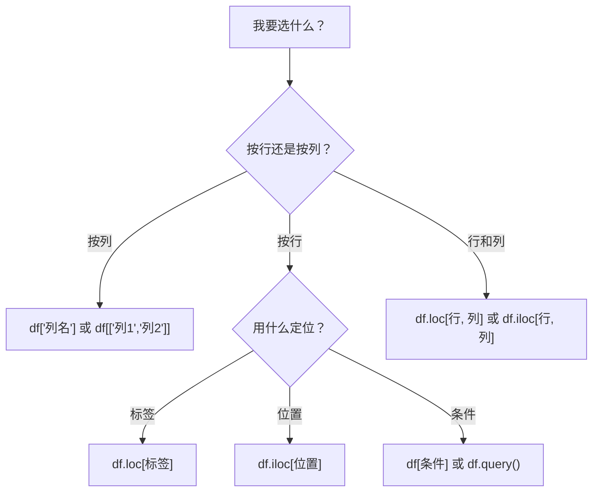

# 数据选择与过滤

## 学习目标

- 掌握 `loc`（标签索引）和 `iloc`（位置索引）
- 学会使用布尔索引进行条件过滤
- 掌握 `query()` 方法
- 学会多条件组合筛选

---

## 准备示例数据

```python
import pandas as pd
import numpy as np

df = pd.DataFrame({
    "姓名": ["张三", "李四", "王五", "赵六", "钱七", "孙八"],
    "年龄": [22, 28, 25, 35, 21, 30],
    "部门": ["技术", "市场", "技术", "管理", "技术", "市场"],
    "薪资": [15000, 18000, 22000, 35000, 12000, 20000],
    "入职年份": [2023, 2020, 2021, 2018, 2024, 2019]
})
print(df)
```

---

## loc：标签索引

`loc` 用**标签（名称）** 来定位数据，格式：`df.loc[行标签, 列标签]`

```python
# 取单行
print(df.loc[0])         # 第一行（标签为 0 的行）

# 取多行
print(df.loc[0:2])       # 标签 0 到 2（包含 2！）

# 取特定行和列
print(df.loc[0, "姓名"])          # "张三"
print(df.loc[0:2, "姓名"])       # 前 3 行的姓名
print(df.loc[0:2, ["姓名", "薪资"]])  # 前 3 行的姓名和薪资

# 取所有行的某些列
print(df.loc[:, ["姓名", "年龄"]])

# 条件筛选（最常用！）
print(df.loc[df["年龄"] > 25])    # 年龄大于 25 的所有行
```

---

## iloc：位置索引

`iloc` 用**位置（整数）** 来定位数据，和 Python 列表的切片规则一致：

```python
# 取单行
print(df.iloc[0])        # 第一行

# 取多行（不包含末尾！和 Python 一致）
print(df.iloc[0:3])      # 第 0、1、2 行

# 取特定位置
print(df.iloc[0, 0])     # 第 0 行第 0 列 → "张三"
print(df.iloc[0:3, 0:2]) # 前 3 行、前 2 列
print(df.iloc[[0, 2, 4]])  # 第 0、2、4 行

# 取最后一行
print(df.iloc[-1])
```

### loc vs iloc 对比

| 特性 | `loc` | `iloc` |
|------|-------|--------|
| 索引方式 | 标签（名称） | 位置（整数） |
| 切片末尾 | **包含** | **不包含** |
| 示例 | `df.loc[0:2]` → 3 行 | `df.iloc[0:2]` → 2 行 |
| 条件筛选 | ✅ 支持 | ❌ 不支持 |

:::caution 最常见的坑
当索引是默认的 0, 1, 2... 时，`loc[0:2]` 返回 **3 行**，`iloc[0:2]` 返回 **2 行**。

```python
print(len(df.loc[0:2]))    # 3  （包含标签 2）
print(len(df.iloc[0:2]))   # 2  （不包含位置 2）
```
:::

---

## 布尔索引：条件筛选

这是数据分析中**使用最频繁**的操作：

### 单条件筛选

```python
# 薪资大于 20000 的员工
high_salary = df[df["薪资"] > 20000]
print(high_salary)

# 部门是"技术"的员工
tech = df[df["部门"] == "技术"]
print(tech)

# 年龄不等于 22 的员工
print(df[df["年龄"] != 22])
```

### 多条件组合

```python
# 技术部门且薪资大于 15000（用 & 表示 AND）
result = df[(df["部门"] == "技术") & (df["薪资"] > 15000)]
print(result)

# 技术部门或管理部门（用 | 表示 OR）
result = df[(df["部门"] == "技术") | (df["部门"] == "管理")]
print(result)

# 取反（用 ~ 表示 NOT）
result = df[~(df["部门"] == "技术")]  # 非技术部门
print(result)
```

:::caution 多条件必须加括号
和 NumPy 一样，每个条件必须加括号，用 `&` `|` `~` 而不是 `and` `or` `not`。

```python
# ❌ 错误
df[df["年龄"] > 25 and df["薪资"] > 20000]

# ✅ 正确
df[(df["年龄"] > 25) & (df["薪资"] > 20000)]
```
:::

### isin：匹配多个值

```python
# 部门在 ["技术", "市场"] 中的员工
result = df[df["部门"].isin(["技术", "市场"])]
print(result)

# 反向：不在这些部门中
result = df[~df["部门"].isin(["技术", "市场"])]
print(result)
```

### between：范围筛选

```python
# 年龄在 22~30 之间（包含两端）
result = df[df["年龄"].between(22, 30)]
print(result)
```

### 字符串条件

```python
# 姓名包含"三"
result = df[df["姓名"].str.contains("三")]

# 姓名以"张"开头
result = df[df["姓名"].str.startswith("张")]
```

---

## query() 方法

`query()` 让你用更接近自然语言的方式筛选数据：

```python
# 等价于 df[df["薪资"] > 20000]
result = df.query("薪资 > 20000")
print(result)

# 多条件
result = df.query("部门 == '技术' and 薪资 > 15000")
print(result)

# 用变量
min_salary = 20000
result = df.query("薪资 > @min_salary")  # @引用外部变量
print(result)

# 范围查询
result = df.query("22 <= 年龄 <= 30")
print(result)
```

:::tip 什么时候用 query()？
- 条件简单时：布尔索引 `df[df["col"] > 5]` 更直接
- 条件复杂时：`query()` 更可读，尤其是多条件组合
- 需要引用变量时：`query("col > @var")` 很方便
:::

---

## 选择特定数据的方法总结



---

## 实战：数据筛选

```python
import pandas as pd
import numpy as np

# 创建一份电商订单数据
np.random.seed(42)
n = 100
orders = pd.DataFrame({
    "订单ID": range(1001, 1001 + n),
    "客户": np.random.choice(["Alice", "Bob", "Charlie", "Diana", "Eve"], n),
    "商品类别": np.random.choice(["电子", "服装", "食品", "图书"], n),
    "金额": np.random.randint(10, 500, n),
    "数量": np.random.randint(1, 10, n),
    "是否退货": np.random.choice([True, False], n, p=[0.1, 0.9])
})

# 查看数据
print(orders.head(10))
print(orders.info())

# 筛选练习
# 1. 金额大于 300 的订单
print(orders[orders["金额"] > 300])

# 2. Alice 购买的电子产品
print(orders.query("客户 == 'Alice' and 商品类别 == '电子'"))

# 3. 未退货且金额前 10 的订单
not_returned = orders[~orders["是否退货"]]
top10 = not_returned.nlargest(10, "金额")
print(top10[["订单ID", "客户", "金额"]])
```

---

## 动手练习

### 练习 1：基本筛选

```python
# 用上面的 orders 数据
# 1. 找出所有退货的订单
# 2. 找出金额在 100~200 之间的订单数量
# 3. 找出购买"图书"或"食品"类别的订单
# 4. 找出 Bob 的非退货订单的平均金额
```

### 练习 2：综合筛选

```python
# 1. 每个客户的最大订单金额是多少？（提示：先筛选再统计）
# 2. 哪些客户有退货记录？
# 3. 金额排名前 5% 的订单有哪些？（提示：用 quantile）
```
