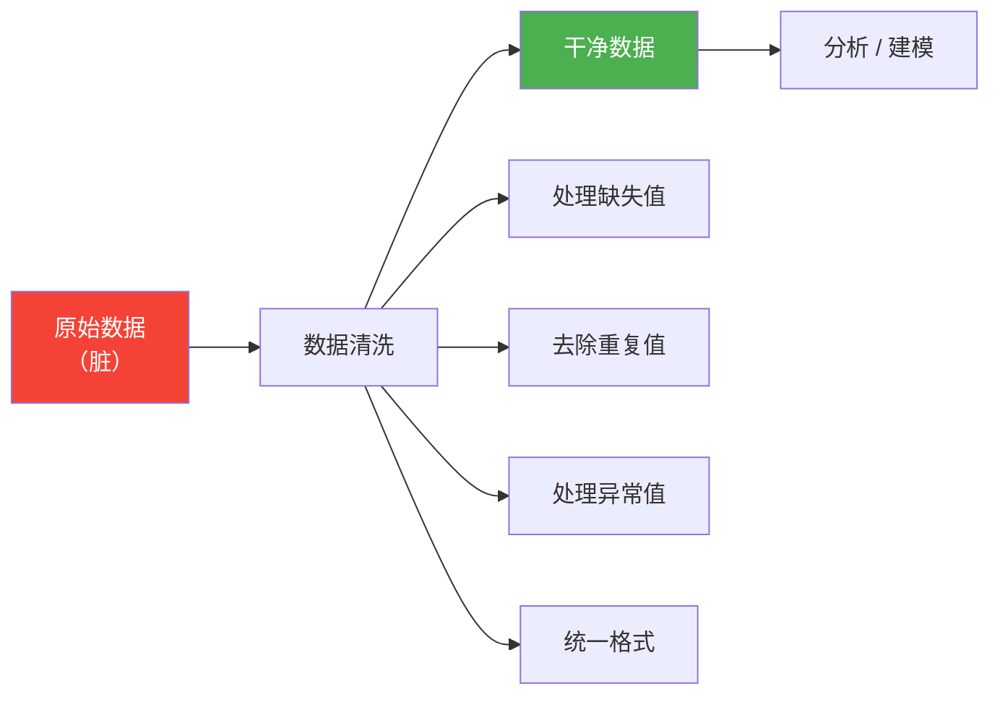

# 数据清洗

## 学习目标

- 掌握缺失值的检测、删除和填充策略
- 学会处理重复值
- 了解异常值检测方法
- 掌握数据类型转换和字符串处理

---

## 为什么需要数据清洗？

真实世界的数据**很脏**——缺失值、重复行、格式不统一、异常值……如果不清洗就直接分析，结果一定不靠谱。

> "数据科学家 80% 的时间花在数据清洗上，20% 花在抱怨数据清洗上。" —— 业界名言



---

## 缺失值处理

### 创建含缺失值的数据

```python
import pandas as pd
import numpy as np

df = pd.DataFrame({
    "姓名": ["张三", "李四", "王五", "赵六", "钱七"],
    "年龄": [22, np.nan, 25, 28, np.nan],
    "城市": ["北京", "上海", None, "深圳", "杭州"],
    "薪资": [15000, 22000, np.nan, 35000, 12000]
})
print(df)
```

### 检测缺失值

```python
# 检测每个位置是否缺失
print(df.isna())        # True = 缺失（isnull() 也一样）
print(df.notna())       # True = 非缺失

# 每列的缺失数量
print(df.isna().sum())
# 姓名    0
# 年龄    2
# 城市    1
# 薪资    1

# 缺失比例
print(df.isna().mean())
# 年龄    0.4
# 城市    0.2
# 薪资    0.2

# 有缺失值的行
print(df[df.isna().any(axis=1)])
```

### 删除缺失值

```python
# 删除任何含缺失值的行
df_cleaned = df.dropna()
print(df_cleaned)  # 只剩 2 行（张三、赵六）

# 删除全部为缺失值的行
df.dropna(how="all")

# 只看特定列
df.dropna(subset=["年龄"])         # 年龄缺失的行删除
df.dropna(subset=["年龄", "薪资"]) # 年龄或薪资缺失的行删除

# 保留至少 N 个非缺失值的行
df.dropna(thresh=3)  # 至少 3 个列有值才保留
```

### 填充缺失值

```python
# 用固定值填充
df["城市"].fillna("未知")

# 用均值填充（数值列常用）
df["年龄"].fillna(df["年龄"].mean())

# 用中位数填充
df["薪资"].fillna(df["薪资"].median())

# 用前一个值填充（时间序列常用）
df["年龄"].fillna(method="ffill")    # forward fill

# 用后一个值填充
df["年龄"].fillna(method="bfill")    # backward fill

# 对不同列用不同策略
df_filled = df.fillna({
    "年龄": df["年龄"].median(),
    "城市": "未知",
    "薪资": 0
})
print(df_filled)
```

### 缺失值处理策略

| 策略 | 适用场景 | 方法 |
|------|---------|------|
| 删除行 | 缺失比例小（低于 5%）、数据量大 | `dropna()` |
| 均值/中位数填充 | 数值型、分布对称 | `fillna(mean/median)` |
| 众数填充 | 分类变量 | `fillna(mode()[0])` |
| 前/后值填充 | 时间序列数据 | `fillna(method="ffill")` |
| 固定值填充 | 业务逻辑明确 | `fillna(0)` 或 `fillna("未知")` |
| 插值 | 连续数据 | `interpolate()` |

---

## 重复值处理

```python
df = pd.DataFrame({
    "姓名": ["张三", "李四", "张三", "王五", "李四"],
    "部门": ["技术", "市场", "技术", "技术", "市场"],
    "薪资": [15000, 18000, 15000, 22000, 18000]
})

# 检测重复行
print(df.duplicated())
# 0    False
# 1    False
# 2     True   ← 和第 0 行完全相同
# 3    False
# 4     True   ← 和第 1 行完全相同

# 重复行数量
print(f"重复行数: {df.duplicated().sum()}")  # 2

# 删除重复行
df_unique = df.drop_duplicates()
print(df_unique)  # 3 行

# 按特定列判断重复
df.drop_duplicates(subset=["姓名"])        # 同姓名只保留第一条
df.drop_duplicates(subset=["姓名"], keep="last")  # 保留最后一条
```

---

## 异常值处理

### Z-score 方法

```python
np.random.seed(42)
df = pd.DataFrame({
    "薪资": np.concatenate([
        np.random.normal(20000, 5000, 97),  # 正常数据
        np.array([100000, 150000, 200000])    # 异常值
    ])
})

# 计算 Z-score
z_scores = (df["薪资"] - df["薪资"].mean()) / df["薪资"].std()

# |Z| > 3 视为异常
outliers = df[z_scores.abs() > 3]
print(f"检测到 {len(outliers)} 个异常值")
print(outliers)

# 去除异常值
df_clean = df[z_scores.abs() <= 3]
```

### IQR 方法（更稳健）

```python
Q1 = df["薪资"].quantile(0.25)
Q3 = df["薪资"].quantile(0.75)
IQR = Q3 - Q1

lower = Q1 - 1.5 * IQR
upper = Q3 + 1.5 * IQR

print(f"正常范围: [{lower:.0f}, {upper:.0f}]")

# 去除范围外的数据
df_clean = df[(df["薪资"] >= lower) & (df["薪资"] <= upper)]

# 或者将异常值截断到边界
df["薪资_clipped"] = df["薪资"].clip(lower, upper)
```

---

## 数据类型转换

```python
df = pd.DataFrame({
    "ID": ["001", "002", "003"],
    "价格": ["12.5", "23.8", "15.0"],
    "数量": ["3", "5", "2"],
    "日期": ["2024-01-15", "2024-02-20", "2024-03-10"]
})
print(df.dtypes)  # 全是 object（字符串）

# 转换数据类型
df["价格"] = df["价格"].astype(float)
df["数量"] = df["数量"].astype(int)
df["日期"] = pd.to_datetime(df["日期"])
print(df.dtypes)
# ID       object
# 价格    float64
# 数量      int64
# 日期    datetime64[ns]

# 处理转换错误
dirty = pd.Series(["10", "20", "abc", "40"])
# dirty.astype(int)  # ❌ 报错

# 用 to_numeric 优雅处理
clean = pd.to_numeric(dirty, errors="coerce")  # 无法转换的变成 NaN
print(clean)
# 0    10.0
# 1    20.0
# 2     NaN
# 3    40.0
```

---

## 字符串处理（str 访问器）

Pandas 的 `.str` 访问器让你对整列字符串进行批量操作：

```python
df = pd.DataFrame({
    "姓名": ["  张三 ", "李四", " 王五  "],
    "邮箱": ["Zhang@Email.COM", "li4@email.com", "WANG5@EMAIL.COM"],
    "手机": ["138-0000-1111", "139-2222-3333", "137-4444-5555"]
})

# 去除空格
df["姓名"] = df["姓名"].str.strip()

# 转小写
df["邮箱"] = df["邮箱"].str.lower()

# 替换
df["手机_clean"] = df["手机"].str.replace("-", "")

# 包含判断
print(df["邮箱"].str.contains("email"))  # 全是 True

# 提取
df["手机前3位"] = df["手机"].str[:3]

# 分割
df["邮箱用户名"] = df["邮箱"].str.split("@").str[0]

print(df)
```

### 常用 str 方法

| 方法 | 作用 | 示例 |
|------|------|------|
| `.str.strip()` | 去除前后空格 | `" hello " → "hello"` |
| `.str.lower()` | 转小写 | `"ABC" → "abc"` |
| `.str.upper()` | 转大写 | `"abc" → "ABC"` |
| `.str.replace()` | 替换 | `"a-b".replace("-","")` |
| `.str.contains()` | 包含判断 | 返回布尔 Series |
| `.str.startswith()` | 开头判断 | 返回布尔 Series |
| `.str.len()` | 字符串长度 | `"hello" → 5` |
| `.str.split()` | 分割 | `"a,b".split(",")` |
| `.str.extract()` | 正则提取 | 提取匹配的部分 |

---

## 实战：清洗一份脏数据

```python
import pandas as pd
import numpy as np

# 创建一份"脏"数据
dirty_data = pd.DataFrame({
    "姓名": ["  张三", "李四 ", "王五", "张三", " 赵六", "钱七", "李四"],
    "年龄": [22, 28, np.nan, 22, "未知", 150, 28],       # 有缺失、非数字、异常值
    "城市": ["北京", "上海 ", None, "北京", " 广州", "深圳", "上海"],
    "薪资": [15000, 22000, 18000, 15000, 20000, -5000, 22000]  # 有负数
})

print("=== 原始数据 ===")
print(dirty_data)
print(f"\n行数: {len(dirty_data)}")

# 第1步：去除字符串空格
dirty_data["姓名"] = dirty_data["姓名"].str.strip()
dirty_data["城市"] = dirty_data["城市"].str.strip()

# 第2步：转换数据类型
dirty_data["年龄"] = pd.to_numeric(dirty_data["年龄"], errors="coerce")

# 第3步：处理异常值
dirty_data.loc[dirty_data["年龄"] > 120, "年龄"] = np.nan    # 年龄>120 不合理
dirty_data.loc[dirty_data["薪资"] < 0, "薪资"] = np.nan      # 薪资<0 不合理

# 第4步：填充缺失值
dirty_data["年龄"] = dirty_data["年龄"].fillna(dirty_data["年龄"].median())
dirty_data["城市"] = dirty_data["城市"].fillna("未知")
dirty_data["薪资"] = dirty_data["薪资"].fillna(dirty_data["薪资"].median())

# 第5步：删除重复行
dirty_data = dirty_data.drop_duplicates()

print("\n=== 清洗后 ===")
print(dirty_data)
print(f"\n行数: {len(dirty_data)}")
```

---

## 小结

| 类型 | 检测 | 处理方法 |
|------|------|---------|
| 缺失值 | `isna()`, `info()` | `dropna()`, `fillna()` |
| 重复值 | `duplicated()` | `drop_duplicates()` |
| 异常值 | Z-score, IQR | `clip()`, 删除, 替换为 NaN |
| 类型错误 | `dtypes` | `astype()`, `pd.to_numeric()` |
| 字符串脏数据 | 目测, `str.contains()` | `str.strip()`, `str.replace()` |

---

## 动手练习

### 练习 1：缺失值处理

```python
# 创建一个包含缺失值的 DataFrame（至少 20 行 5 列）
# 1. 统计每列的缺失比例
# 2. 对数值列用中位数填充
# 3. 对类别列用众数填充
# 4. 删除缺失值超过 50% 的列（如果有的话）
```

### 练习 2：完整清洗流程

```python
# 创建一份包含各种问题的数据，然后完成完整的清洗流程：
# 字符串空格 → 类型转换 → 异常值处理 → 缺失值填充 → 去重
```
