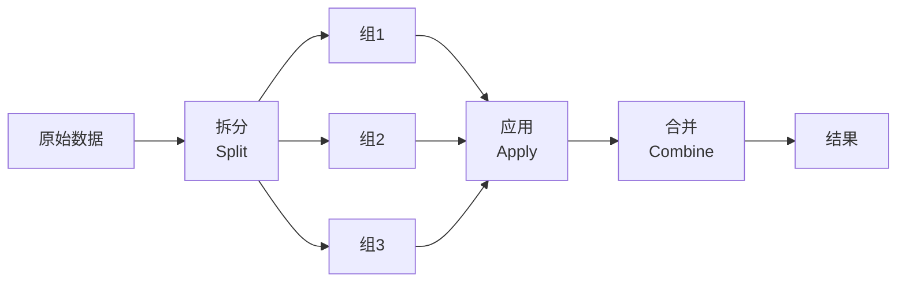

# 分组与聚合

## 学习目标

- 理解 groupby 的"拆分—应用—合并"机制
- 掌握常用聚合函数和 `agg` 方法
- 学会分组转换（transform）和分组过滤（filter）
- 掌握数据透视表（pivot_table）

---

## 为什么 groupby 这么重要？

回想第 1 章——用纯 Python 做"按性别统计生存率"，需要手写字典和循环。用 Pandas 的 groupby **一行搞定**：

```python
# 纯 Python：15 行代码
# Pandas：1 行
df.groupby("Sex")["Survived"].mean()
```

`groupby` 就像 SQL 的 `GROUP BY`——按某个字段分组，然后对每组分别计算。

---

## groupby 基础

### 分组机制



```python
import pandas as pd
import numpy as np

df = pd.DataFrame({
    "部门": ["技术", "市场", "技术", "管理", "市场", "技术", "管理"],
    "姓名": ["张三", "李四", "王五", "赵六", "钱七", "孙八", "周九"],
    "薪资": [15000, 18000, 22000, 35000, 20000, 19000, 30000],
    "年龄": [22, 28, 25, 35, 30, 24, 40]
})

# 按部门分组，计算平均薪资
result = df.groupby("部门")["薪资"].mean()
print(result)
# 部门
# 市场    19000.0
# 技术    18666.7
# 管理    32500.0
```

### 基本聚合

```python
grouped = df.groupby("部门")

# 常用聚合函数
print(grouped["薪资"].sum())       # 总薪资
print(grouped["薪资"].mean())      # 平均薪资
print(grouped["薪资"].median())    # 中位数
print(grouped["薪资"].min())       # 最低薪资
print(grouped["薪资"].max())       # 最高薪资
print(grouped["薪资"].std())       # 标准差
print(grouped["薪资"].count())     # 人数
```

### 多列聚合

```python
# 对多列聚合
print(df.groupby("部门")[["薪资", "年龄"]].mean())
#        薪资       年龄
# 部门
# 市场  19000.0  29.000000
# 技术  18666.7  23.666667
# 管理  32500.0  37.500000
```

### 多级分组

```python
df2 = pd.DataFrame({
    "部门": ["技术", "技术", "市场", "市场", "技术", "市场"],
    "级别": ["初级", "高级", "初级", "高级", "初级", "初级"],
    "薪资": [15000, 25000, 12000, 22000, 18000, 14000]
})

# 按部门和级别分组
result = df2.groupby(["部门", "级别"])["薪资"].mean()
print(result)
# 部门  级别
# 市场  初级    13000.0
#       高级    22000.0
# 技术  初级    16500.0
#       高级    25000.0
```

---

## agg：多种聚合一起做

`agg` 让你对同一列或不同列应用不同的聚合函数：

```python
# 对薪资列同时计算多个统计量
result = df.groupby("部门")["薪资"].agg(["mean", "min", "max", "count"])
print(result)
#            mean    min    max  count
# 部门
# 市场  19000.0  18000  20000      2
# 技术  18666.7  15000  22000      3
# 管理  32500.0  30000  35000      2
```

```python
# 对不同列用不同的聚合函数
result = df.groupby("部门").agg({
    "薪资": ["mean", "max"],
    "年龄": ["mean", "min"],
    "姓名": "count"           # 人数
})
print(result)

# 自定义聚合函数
result = df.groupby("部门")["薪资"].agg(
    平均薪资="mean",
    最高薪资="max",
    薪资差距=lambda x: x.max() - x.min()
)
print(result)
```

---

## transform：分组转换

`transform` 对每组应用函数，但**返回和原数据同样长度的结果**——非常适合生成新列。

```python
# 场景：给每个人标注"与部门平均薪资的差距"
df["部门平均薪资"] = df.groupby("部门")["薪资"].transform("mean")
df["薪资差距"] = df["薪资"] - df["部门平均薪资"]
print(df[["姓名", "部门", "薪资", "部门平均薪资", "薪资差距"]])

# 场景：组内标准化（每组减去均值除以标准差）
df["薪资_标准化"] = df.groupby("部门")["薪资"].transform(
    lambda x: (x - x.mean()) / x.std() if x.std() > 0 else 0
)
```

:::tip transform vs agg 的区别
- `agg`：每组返回**一个值**（汇总），结果行数 = 组数
- `transform`：每组返回**和原来一样多的值**，结果行数 = 原始行数

```python
# agg: 3 个部门 → 3 行
df.groupby("部门")["薪资"].agg("mean")

# transform: 7 个人 → 7 行（每人对应其部门的均值）
df.groupby("部门")["薪资"].transform("mean")
```
:::

---

## filter：分组过滤

`filter` 根据条件保留或排除整个组：

```python
# 只保留平均薪资 > 20000 的部门
result = df.groupby("部门").filter(lambda x: x["薪资"].mean() > 20000)
print(result)
# 只有"管理"部门的平均薪资 > 20000，所以只保留管理部门的人

# 只保留人数 >= 3 的部门
result = df.groupby("部门").filter(lambda x: len(x) >= 3)
print(result)
```

---

## 数据透视表（pivot_table）

透视表是 Excel 用户最熟悉的功能——Pandas 也完美支持。

```python
# 准备销售数据
sales = pd.DataFrame({
    "日期": ["1月", "1月", "2月", "2月", "1月", "2月"],
    "商品": ["苹果", "牛奶", "苹果", "牛奶", "面包", "面包"],
    "销量": [50, 30, 60, 25, 40, 45],
    "金额": [250, 240, 300, 200, 120, 135]
})

# 透视表：每月每种商品的总销量
pivot = pd.pivot_table(
    sales,
    values="销量",        # 聚合的值
    index="商品",         # 行
    columns="日期",       # 列
    aggfunc="sum"         # 聚合方式
)
print(pivot)
# 日期   1月   2月
# 商品
# 牛奶   30   25
# 苹果   50   60
# 面包   40   45

# 多个聚合
pivot2 = pd.pivot_table(
    sales,
    values="金额",
    index="商品",
    columns="日期",
    aggfunc=["sum", "mean"],
    margins=True              # 添加合计行和列
)
print(pivot2)
```

### 交叉表（crosstab）

```python
# 统计部门和级别的人数分布
ct = pd.crosstab(df2["部门"], df2["级别"])
print(ct)
# 级别  初级  高级
# 部门
# 市场    2    1
# 技术    2    1

# 加上合计和占比
ct2 = pd.crosstab(df2["部门"], df2["级别"], margins=True, normalize="index")
print(ct2)  # 每行占比（各部门中初级/高级的比例）
```

---

## 实战：销售数据分组分析

```python
import pandas as pd
import numpy as np

np.random.seed(42)
n = 200

orders = pd.DataFrame({
    "月份": np.random.choice(["1月", "2月", "3月", "4月"], n),
    "区域": np.random.choice(["华东", "华南", "华北", "西南"], n),
    "商品": np.random.choice(["手机", "电脑", "耳机", "平板"], n),
    "销量": np.random.randint(1, 50, n),
    "单价": np.random.choice([99, 299, 999, 2999, 5999], n)
})
orders["金额"] = orders["销量"] * orders["单价"]

# 1. 每个区域的总销售额
print(orders.groupby("区域")["金额"].sum().sort_values(ascending=False))

# 2. 每种商品的平均销量和总金额
print(orders.groupby("商品").agg(
    平均销量=("销量", "mean"),
    总金额=("金额", "sum"),
    订单数=("金额", "count")
))

# 3. 透视表：区域 × 商品的总金额
print(pd.pivot_table(orders, values="金额", index="区域", columns="商品", aggfunc="sum"))

# 4. 每个月销售额最高的区域
monthly_top = orders.groupby(["月份", "区域"])["金额"].sum().reset_index()
idx = monthly_top.groupby("月份")["金额"].idxmax()
print(monthly_top.loc[idx])
```

---

## 小结

| 操作 | 方法 | 返回行数 | 用途 |
|------|------|---------|------|
| 基本聚合 | `groupby().mean()` 等 | 组数 | 汇总统计 |
| 多重聚合 | `groupby().agg()` | 组数 | 多种统计量 |
| 分组转换 | `groupby().transform()` | 原始行数 | 生成新列 |
| 分组过滤 | `groupby().filter()` | ≤ 原始行数 | 按条件保留组 |
| 透视表 | `pivot_table()` | 行值种数 | 交叉统计 |
| 交叉表 | `crosstab()` | 行值种数 | 频次统计 |

---

## 动手练习

### 练习 1：基本分组

```python
# 用上面的 orders 数据
# 1. 按月份统计平均客单价（金额/销量）
# 2. 哪个月份哪种商品的销量最高？
# 3. 每个区域卖得最好的商品是什么？
```

### 练习 2：transform 应用

```python
# 1. 给每个订单添加"区域平均金额"列
# 2. 标记每个订单的金额是否高于其所在区域的平均水平
# 3. 计算每个订单金额占其区域总金额的百分比
```

### 练习 3：透视表

```python
# 1. 创建一个透视表：行=区域，列=月份，值=总金额，带合计
# 2. 哪个区域在哪个月份的销售额最高？
```
