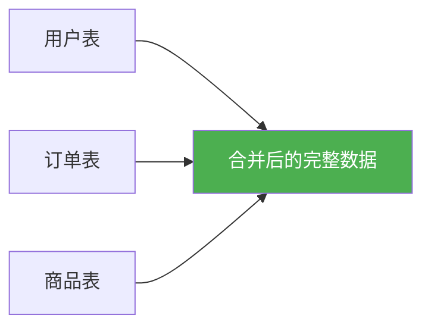
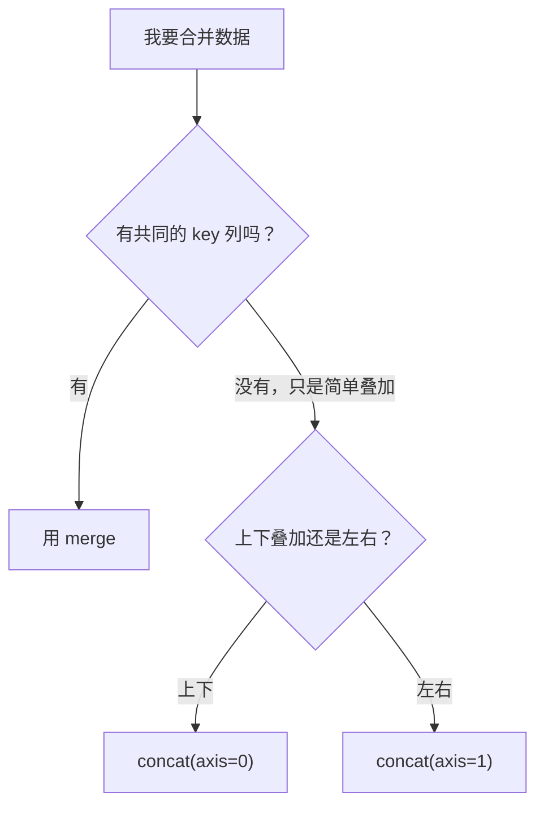

# 数据合并

## 学习目标

- 掌握 `merge`（SQL 风格连接）
- 了解 `join`（基于索引的连接）
- 掌握 `concat`（拼接操作）
- 理解不同合并策略的选择

---

## 为什么需要合并数据？

真实的数据往往分散在多张表中。比如一个电商系统可能有：
- **用户表**：用户ID、姓名、注册时间
- **订单表**：订单ID、用户ID、商品、金额
- **商品表**：商品ID、名称、类别、价格

要分析"每个用户买了什么商品"，就需要把这些表**合并**起来。



---

## merge：SQL 风格连接

`merge` 是最强大的合并方式，类似 SQL 的 JOIN。

### 准备示例数据

```python
import pandas as pd

# 用户表
users = pd.DataFrame({
    "用户ID": [1, 2, 3, 4],
    "姓名": ["张三", "李四", "王五", "赵六"],
    "城市": ["北京", "上海", "广州", "深圳"]
})

# 订单表
orders = pd.DataFrame({
    "订单ID": [101, 102, 103, 104, 105],
    "用户ID": [1, 2, 1, 3, 5],       # 注意：用户5不在用户表中
    "商品": ["手机", "电脑", "耳机", "平板", "键盘"],
    "金额": [5999, 8999, 299, 3999, 199]
})
```

### 内连接（inner join）

只保留两边都有的：

```python
result = pd.merge(users, orders, on="用户ID", how="inner")
print(result)
#    用户ID  姓名  城市  订单ID  商品    金额
# 0      1  张三  北京    101  手机   5999
# 1      1  张三  北京    103  耳机    299
# 2      2  李四  上海    102  电脑   8999
# 3      3  王五  广州    104  平板   3999
# 用户4（赵六）没有订单 → 不出现
# 用户5 不在用户表 → 不出现
```

### 左连接（left join）

保留左表所有行：

```python
result = pd.merge(users, orders, on="用户ID", how="left")
print(result)
#    用户ID  姓名  城市  订单ID   商品     金额
# 0      1  张三  北京  101.0  手机   5999.0
# 1      1  张三  北京  103.0  耳机    299.0
# 2      2  李四  上海  102.0  电脑   8999.0
# 3      3  王五  广州  104.0  平板   3999.0
# 4      4  赵六  深圳    NaN   NaN      NaN   ← 赵六没有订单，用 NaN 填充
```

### 右连接（right join）

保留右表所有行：

```python
result = pd.merge(users, orders, on="用户ID", how="right")
print(result)
# 用户5 出现了（姓名和城市为 NaN）
```

### 外连接（outer join）

保留两边所有行：

```python
result = pd.merge(users, orders, on="用户ID", how="outer")
print(result)
# 所有用户和所有订单都出现，缺失的用 NaN 填充
```

### 四种连接方式对比

```
用户表: {1,2,3,4}    订单表: {1,2,3,5}

inner:  {1,2,3}       两边都有的
left:   {1,2,3,4}     左表全部 + 右表匹配的
right:  {1,2,3,5}     右表全部 + 左表匹配的
outer:  {1,2,3,4,5}   全部保留
```

### 不同列名的合并

```python
# 如果两表的连接列名不同
df1 = pd.DataFrame({"user_id": [1, 2], "name": ["A", "B"]})
df2 = pd.DataFrame({"uid": [1, 2], "score": [90, 85]})

result = pd.merge(df1, df2, left_on="user_id", right_on="uid")
print(result)
```

### 多列连接

```python
# 按多个列匹配
result = pd.merge(df1, df2, on=["col1", "col2"])
```

---

## concat：拼接操作

`concat` 用于将多个 DataFrame 纵向或横向拼接（不需要共同的 key）：

### 纵向拼接（上下叠加）

```python
# 1 月和 2 月的销售数据
jan = pd.DataFrame({
    "商品": ["苹果", "牛奶"],
    "销量": [100, 80],
    "月份": ["1月", "1月"]
})

feb = pd.DataFrame({
    "商品": ["苹果", "面包"],
    "销量": [120, 90],
    "月份": ["2月", "2月"]
})

# 上下拼接
all_sales = pd.concat([jan, feb], ignore_index=True)
print(all_sales)
#    商品  销量  月份
# 0  苹果  100  1月
# 1  牛奶   80  1月
# 2  苹果  120  2月
# 3  面包   90  2月
```

:::tip ignore_index=True
`ignore_index=True` 会重新生成 0, 1, 2... 的索引。如果不加，可能会有重复索引。
:::

### 横向拼接

```python
info = pd.DataFrame({"姓名": ["张三", "李四"], "年龄": [22, 25]})
scores = pd.DataFrame({"数学": [90, 85], "英语": [88, 92]})

# 左右拼接
combined = pd.concat([info, scores], axis=1)
print(combined)
#    姓名  年龄  数学  英语
# 0  张三   22   90   88
# 1  李四   25   85   92
```

---

## merge vs concat vs join

| 方法 | 适用场景 | 类比 |
|------|---------|------|
| `merge` | 按共同列连接两表 | SQL JOIN |
| `concat` | 简单的上下/左右拼接 | 胶水粘合 |
| `join` | 按索引连接 | 特殊的 merge |



---

## 实战：多表合并分析

```python
import pandas as pd
import numpy as np

# 创建三张表
np.random.seed(42)

# 学生表
students = pd.DataFrame({
    "学号": [1, 2, 3, 4, 5],
    "姓名": ["张三", "李四", "王五", "赵六", "钱七"],
    "班级": ["A班", "B班", "A班", "B班", "A班"]
})

# 成绩表（某些学生可能有多科成绩）
scores = pd.DataFrame({
    "学号": [1, 1, 2, 2, 3, 3, 4, 4, 5, 5],
    "科目": ["数学", "英语", "数学", "英语", "数学", "英语", "数学", "英语", "数学", "英语"],
    "分数": [90, 85, 78, 92, 88, 75, 95, 88, 72, 80]
})

# 班级信息表
classes = pd.DataFrame({
    "班级": ["A班", "B班"],
    "班主任": ["王老师", "李老师"],
    "教室": ["101", "102"]
})

# 合并 1：学生 + 成绩
student_scores = pd.merge(students, scores, on="学号")
print(student_scores.head())

# 合并 2：再加上班级信息
full = pd.merge(student_scores, classes, on="班级")
print(full.head())

# 分析：每个班级的平均分
print(full.groupby(["班级", "班主任"])["分数"].mean())

# 分析：每个学生的总分排名
total_scores = full.groupby(["学号", "姓名"])["分数"].sum().reset_index()
total_scores["排名"] = total_scores["分数"].rank(ascending=False, method="dense")
print(total_scores.sort_values("排名"))
```

---

## 小结

| 操作 | 函数 | 关键参数 |
|------|------|---------|
| SQL 风格连接 | `pd.merge()` | `on`, `how` (inner/left/right/outer) |
| 纵向拼接 | `pd.concat(axis=0)` | `ignore_index=True` |
| 横向拼接 | `pd.concat(axis=1)` | |
| 索引连接 | `df.join()` | `how` |

---

## 动手练习

### 练习 1：基本 merge

```python
# 有两张表：员工表和部门表
# 1. 用 inner join 合并
# 2. 用 left join 找出没有分配部门的员工
# 3. 用 outer join 找出没有员工的部门
```

### 练习 2：多表合并分析

```python
# 创建：商品表、订单表、客户表
# 1. 三表合并成一张完整的表
# 2. 分析每个客户购买了哪些类别的商品
# 3. 找出购买金额最高的 Top 3 客户
```

### 练习 3：concat 拼接

```python
# 有 4 个季度的销售数据（4 个独立的 DataFrame）
# 1. 纵向拼接成全年数据
# 2. 添加"季度"列标识数据来源
# 3. 统计全年各季度的销售趋势
```
