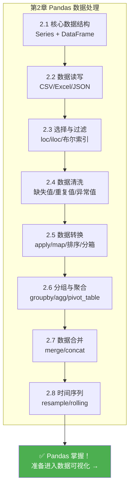

# 时间序列

## 学习目标

- 掌握日期时间类型的创建和转换
- 学会时间序列的索引与切片
- 掌握重采样（resample）和频率转换
- 学会滚动窗口计算（rolling）

---

## 为什么需要时间序列？

很多数据都和时间相关——股票价格、销售数据、网站访问量、天气记录……处理时间数据是数据分析的必备技能。

---

## 日期时间类型

### 创建时间戳

```python
import pandas as pd
import numpy as np

# 创建单个时间戳
ts = pd.Timestamp("2024-01-15")
print(ts)        # 2024-01-15 00:00:00
print(ts.year)   # 2024
print(ts.month)  # 1
print(ts.day)    # 15
print(ts.day_name())  # Monday

# 更多格式
ts2 = pd.Timestamp("2024-01-15 14:30:00")
ts3 = pd.Timestamp(year=2024, month=3, day=20)
```

### 字符串转日期

```python
# 单列转换
dates = pd.Series(["2024-01-15", "2024-02-20", "2024-03-10"])
dt_series = pd.to_datetime(dates)
print(dt_series)
print(dt_series.dtype)  # datetime64[ns]

# 处理不同格式
pd.to_datetime("15/01/2024", format="%d/%m/%Y")
pd.to_datetime("2024年3月15日", format="%Y年%m月%d日")

# 处理无法解析的值
dirty = pd.Series(["2024-01-15", "not a date", "2024-03-10"])
clean = pd.to_datetime(dirty, errors="coerce")  # 无法解析的变成 NaT
print(clean)
# 0   2024-01-15
# 1          NaT   ← Not a Time
# 2   2024-03-10
```

### 日期范围

```python
# 创建日期范围
dates = pd.date_range("2024-01-01", periods=10, freq="D")  # 每天
print(dates)

# 不同频率
pd.date_range("2024-01-01", periods=12, freq="ME")   # 每月末
pd.date_range("2024-01-01", periods=4, freq="QE")    # 每季度末
pd.date_range("2024-01-01", "2024-12-31", freq="W")  # 每周

# 常用频率代码
# D=天, W=周, ME=月末, MS=月初, QE=季末, YE=年末
# h=小时, min=分钟, s=秒
# B=工作日
```

---

## 时间序列数据

### 创建时间序列 DataFrame

```python
# 模拟 2024 年每天的销售数据
np.random.seed(42)
dates = pd.date_range("2024-01-01", periods=365, freq="D")
sales = pd.DataFrame({
    "日期": dates,
    "销售额": np.random.randint(5000, 20000, 365) + \
              np.sin(np.arange(365) * 2 * np.pi / 365) * 3000  # 加入季节性
})
sales = sales.set_index("日期")
print(sales.head())
print(sales.shape)  # (365, 1)
```

### 提取日期组件

```python
df = pd.DataFrame({
    "日期": pd.date_range("2024-01-01", periods=100, freq="D"),
    "销量": np.random.randint(10, 100, 100)
})

# 用 dt 访问器提取日期组件
df["年"] = df["日期"].dt.year
df["月"] = df["日期"].dt.month
df["日"] = df["日期"].dt.day
df["星期几"] = df["日期"].dt.day_name()
df["是否周末"] = df["日期"].dt.dayofweek >= 5  # 5=周六, 6=周日
df["第几周"] = df["日期"].dt.isocalendar().week

print(df.head())
```

### 时间索引切片

当日期是索引时，可以用字符串方便地切片：

```python
# sales 的索引是日期
# 选取 2024 年 3 月的数据
print(sales.loc["2024-03"])

# 选取 2024 年第一季度
print(sales.loc["2024-01":"2024-03"])

# 选取某一天
print(sales.loc["2024-06-15"])
```

---

## 重采样（resample）

重采样是时间序列最核心的操作——改变数据的**时间频率**。

### 降采样（高频 → 低频）

```python
# 每日数据 → 每月数据
monthly = sales.resample("ME").sum()  # 月末汇总
print(monthly.head())

# 每日 → 每周
weekly = sales.resample("W").mean()  # 周平均

# 每日 → 每季度
quarterly = sales.resample("QE").agg({
    "销售额": ["sum", "mean", "max"]
})
print(quarterly)
```

### 升采样（低频 → 高频）

```python
# 月度数据 → 每日数据（需要填充）
daily = monthly.resample("D").ffill()     # 前向填充
# 或
daily = monthly.resample("D").interpolate()  # 插值
```

---

## 滚动窗口（rolling）

滚动窗口对连续的 N 个数据点计算统计量——常用于平滑数据和计算移动平均。

### 移动平均

```python
# 7 日移动平均（平滑日常波动）
sales["MA7"] = sales["销售额"].rolling(window=7).mean()

# 30 日移动平均（看长期趋势）
sales["MA30"] = sales["销售额"].rolling(window=30).mean()

print(sales.head(10))
# 前 6 天的 MA7 是 NaN（不够 7 天计算）
```

### 其他滚动统计

```python
# 滚动标准差（波动性）
sales["STD7"] = sales["销售额"].rolling(7).std()

# 滚动最大值
sales["MAX7"] = sales["销售额"].rolling(7).max()

# 滚动求和
sales["SUM7"] = sales["销售额"].rolling(7).sum()
```

### expanding：累积计算

```python
# 累积均值（从头到当前的均值）
sales["累积均值"] = sales["销售额"].expanding().mean()

# 累积最大值
sales["历史最高"] = sales["销售额"].expanding().max()
```

---

## 时间差计算

```python
df = pd.DataFrame({
    "注册时间": pd.to_datetime(["2023-01-15", "2023-06-20", "2024-01-10"]),
    "最后登录": pd.to_datetime(["2024-06-01", "2024-05-15", "2024-06-10"])
})

# 计算时间差
df["使用天数"] = (df["最后登录"] - df["注册时间"]).dt.days
print(df)

# 距今天数
df["注册至今天数"] = (pd.Timestamp.now() - df["注册时间"]).dt.days
```

---

## 实战：销售趋势分析

```python
import pandas as pd
import numpy as np

np.random.seed(42)

# 创建 2 年的日销售数据
dates = pd.date_range("2023-01-01", "2024-12-31", freq="D")
n = len(dates)

sales = pd.DataFrame({
    "日期": dates,
    "销售额": (
        10000 +                                    # 基础值
        np.sin(np.arange(n) * 2 * np.pi / 365) * 3000 +  # 季节性
        np.arange(n) * 5 +                         # 增长趋势
        np.random.normal(0, 1000, n)               # 随机波动
    ).astype(int)
}).set_index("日期")

# 1. 月度汇总
monthly = sales.resample("ME").agg(
    月销售额=("销售额", "sum"),
    日均销售额=("销售额", "mean"),
    最高日销售额=("销售额", "max")
)
print("=== 月度汇总 ===")
print(monthly.head())

# 2. 移动平均看趋势
sales["MA30"] = sales["销售额"].rolling(30).mean()
print("\n=== 30日移动平均（最后5天）===")
print(sales[["销售额", "MA30"]].tail())

# 3. 同比增长（和去年同月比）
monthly_pivot = sales.resample("ME")["销售额"].sum()
monthly_pivot.index = monthly_pivot.index.to_period("M")
# 简单计算 2024 年各月 vs 2023 年同月
m2024 = monthly_pivot["2024"]
m2023 = monthly_pivot["2023"]

print("\n=== 2024 vs 2023 月度对比 ===")
for m24, m23 in zip(m2024.items(), m2023.items()):
    month = m24[0].month
    growth = (m24[1] - m23[1]) / m23[1] * 100
    print(f"  {month}月: 2023={m23[1]:,.0f}, 2024={m24[1]:,.0f}, 增长率={growth:+.1f}%")

# 4. 每周几的销售差异
sales_with_dow = sales.copy()
sales_with_dow["星期几"] = sales_with_dow.index.day_name()
dow_avg = sales_with_dow.groupby("星期几")["销售额"].mean()
print("\n=== 各星期几的平均销售额 ===")
print(dow_avg.sort_values(ascending=False))
```

---

## 小结

| 操作 | 方法 | 用途 |
|------|------|------|
| 字符串转日期 | `pd.to_datetime()` | 类型转换 |
| 日期范围 | `pd.date_range()` | 生成连续日期 |
| 提取组件 | `.dt.year/month/day` | 拆解日期 |
| 重采样 | `.resample()` | 改变时间频率 |
| 滚动窗口 | `.rolling()` | 移动平均、平滑 |
| 累积计算 | `.expanding()` | 累积统计 |
| 时间差 | 相减 `.dt.days` | 计算间隔 |

---

## 章节总结：Pandas 知识全景

恭喜你完成了 Pandas 的全部内容！来回顾一下：



> **✅ 自检：** 给你一份销售数据 CSV，你能用 Pandas 清洗缺失值、按月份和产品分组统计销售额、并找出每月销售最高的产品吗？回想一下第 1 章的预热练习——现在是不是简洁多了？

---

## 动手练习

### 练习 1：日期处理

```python
# 创建一个包含"2024-01-01"到"2024-12-31"的日期 DataFrame
# 1. 提取月份、星期几
# 2. 标记是否为工作日
# 3. 计算每月的工作日天数
```

### 练习 2：时间序列分析

```python
# 用上面的 sales 数据
# 1. 计算 7 日和 30 日移动平均
# 2. 找出销售额最高和最低的月份
# 3. 计算每月的环比增长率（本月vs上月）
# 4. 分析周末vs工作日的销售差异
```

### 练习 3：综合实战

```python
# 模拟一个 App 的用户活跃数据（365天）
# 包含：日期、DAU（日活跃用户）、新增用户、收入
# 1. 计算周活跃用户数（WAU）和月活跃用户数（MAU）
# 2. 计算 7 日留存率趋势
# 3. 用 rolling 计算 ARPU（每用户平均收入）的 30 日平均
# 4. 找出用户增长最快的月份
```
