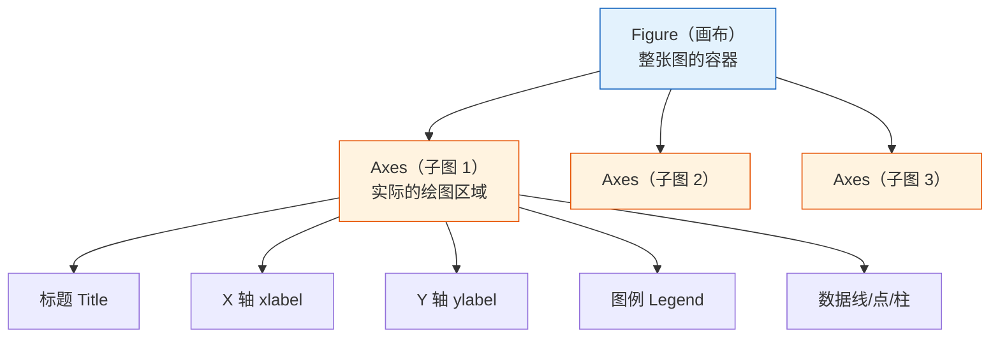
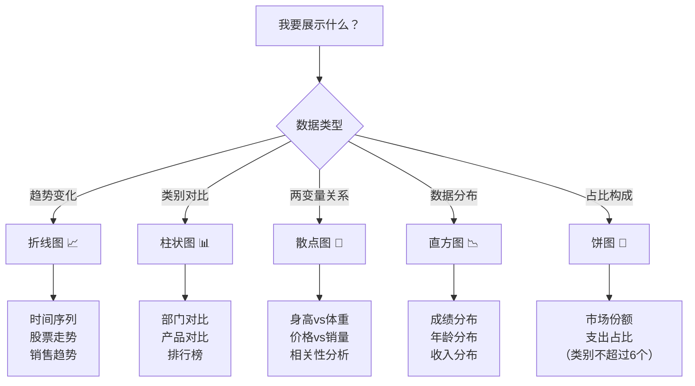

# Matplotlib 基础

## 学习目标

- 理解 Figure 和 Axes 的对象模型
- 掌握 5 种基本图表的绑制
- 学会定制图表元素（标题、图例、网格等）
- 掌握子图布局

---

## 为什么要学可视化？

> "一图胜千言。"

同样的数据——

- 用表格展示：`平均薪资: 技术部 18667, 市场部 19000, 管理部 32500`
- 用图表展示：一眼就能看出管理部薪资远高于其他部门

数据可视化的目的是**让数据说话**，让人在几秒内理解背后的规律和故事。

---

## 安装与导入

```python
# 安装（通常已预装）
# pip install matplotlib

import matplotlib.pyplot as plt
import numpy as np

# 在 Jupyter Notebook 中显示图表
# %matplotlib inline
```

:::tip 导入约定
`import matplotlib.pyplot as plt` 是固定写法，整个数据科学社区都这么用。
:::

---

## 第一张图：5 行代码

```python
import matplotlib.pyplot as plt

x = [1, 2, 3, 4, 5]
y = [2, 4, 6, 8, 10]

plt.plot(x, y)        # 绘制折线图
plt.title("我的第一张图")  # 标题
plt.show()             # 显示图表
```

就这么简单！你会看到一条从左下到右上的直线。

---

## 核心概念：Figure 和 Axes

Matplotlib 的图表由两个核心对象组成：



- **Figure**：整张画布，可以包含多个子图
- **Axes**：一个具体的图表区域（注意不是"轴"，而是"子图"）

### 两种绑图风格

```python
# 风格 1：plt 快速绘图（简单场景用这个）
plt.plot([1, 2, 3], [4, 5, 6])
plt.title("快速绘图")
plt.show()

# 风格 2：面向对象（推荐，更灵活）
fig, ax = plt.subplots()         # 创建画布和子图
ax.plot([1, 2, 3], [4, 5, 6])   # 在子图上绑制
ax.set_title("面向对象绘图")      # 设置标题
plt.show()
```

:::tip 推荐使用面向对象风格
虽然 `plt.plot()` 更简单，但面向对象风格（`fig, ax = plt.subplots()`）在需要多个子图或精细控制时更方便。建议从一开始就养成这个习惯。
:::

---

## 5 种基本图表

### 1. 折线图（Line Plot）

**适合场景：** 展示数据随时间或连续变量的变化趋势

```python
import matplotlib.pyplot as plt
import numpy as np

# 模拟 12 个月的销售数据
months = np.arange(1, 13)
sales_2023 = [120, 135, 150, 180, 200, 210, 195, 188, 220, 250, 280, 310]
sales_2024 = [140, 155, 170, 195, 230, 245, 225, 210, 260, 290, 320, 350]

fig, ax = plt.subplots(figsize=(10, 6))  # 设置画布大小

ax.plot(months, sales_2023, marker="o", label="2023年", color="#2196F3", linewidth=2)
ax.plot(months, sales_2024, marker="s", label="2024年", color="#FF5722", linewidth=2)

ax.set_title("月度销售额趋势", fontsize=16, fontweight="bold")
ax.set_xlabel("月份", fontsize=12)
ax.set_ylabel("销售额（万元）", fontsize=12)
ax.set_xticks(months)
ax.set_xticklabels([f"{m}月" for m in months])
ax.legend(fontsize=12)     # 显示图例
ax.grid(True, alpha=0.3)   # 显示网格线

plt.tight_layout()  # 自动调整边距
plt.show()
```

**关键参数：**

| 参数 | 作用 | 示例 |
|------|------|------|
| `marker` | 数据点标记 | `"o"` 圆点, `"s"` 方块, `"^"` 三角 |
| `linestyle` | 线型 | `"-"` 实线, `"--"` 虚线, `":"` 点线 |
| `linewidth` | 线宽 | `2` |
| `color` | 颜色 | `"red"`, `"#FF5722"`, `"C0"` |
| `label` | 图例标签 | `"2023年"` |
| `alpha` | 透明度 | `0.7`（0 全透明, 1 不透明） |

### 2. 柱状图（Bar Chart）

**适合场景：** 比较不同类别的数据大小

```python
# 各部门薪资对比
departments = ["技术部", "市场部", "管理部", "财务部", "人事部"]
avg_salary = [18500, 16200, 28000, 15800, 14500]

fig, ax = plt.subplots(figsize=(8, 5))

bars = ax.bar(departments, avg_salary, color=["#4CAF50", "#2196F3", "#FF9800", "#9C27B0", "#607D8B"])

# 在柱子上方显示数值
for bar, val in zip(bars, avg_salary):
    ax.text(bar.get_x() + bar.get_width()/2, bar.get_height() + 300,
            f"¥{val:,}", ha="center", fontsize=10)

ax.set_title("各部门平均薪资", fontsize=14)
ax.set_ylabel("薪资（元）")
ax.set_ylim(0, max(avg_salary) * 1.15)  # Y 轴留出数值标签的空间

plt.tight_layout()
plt.show()
```

**水平柱状图**（数据标签较长时更好看）：

```python
fig, ax = plt.subplots(figsize=(8, 5))
ax.barh(departments, avg_salary, color="#4CAF50")
ax.set_xlabel("薪资（元）")
ax.set_title("各部门平均薪资")
plt.tight_layout()
plt.show()
```

**分组柱状图：**

```python
# 两年对比
x = np.arange(len(departments))
width = 0.35

fig, ax = plt.subplots(figsize=(10, 5))
ax.bar(x - width/2, [17000, 15000, 26000, 14500, 13000], width, label="2023", color="#64B5F6")
ax.bar(x + width/2, avg_salary, width, label="2024", color="#1565C0")

ax.set_xticks(x)
ax.set_xticklabels(departments)
ax.legend()
ax.set_title("各部门薪资对比（2023 vs 2024）")
plt.tight_layout()
plt.show()
```

### 3. 散点图（Scatter Plot）

**适合场景：** 观察两个变量之间的关系

```python
np.random.seed(42)

# 模拟身高和体重数据
height = np.random.normal(170, 8, 100)
weight = height * 0.65 - 40 + np.random.normal(0, 5, 100)

fig, ax = plt.subplots(figsize=(8, 6))

scatter = ax.scatter(height, weight, c=weight, cmap="RdYlGn_r",
                     s=50, alpha=0.7, edgecolors="white", linewidth=0.5)

ax.set_title("身高与体重的关系", fontsize=14)
ax.set_xlabel("身高（cm）")
ax.set_ylabel("体重（kg）")

plt.colorbar(scatter, label="体重")  # 颜色条
plt.tight_layout()
plt.show()
```

**关键参数：**

| 参数 | 作用 | 示例 |
|------|------|------|
| `s` | 点的大小 | `50`, 或传入数组让大小不同 |
| `c` | 点的颜色 | `"red"`, 或传入数组做颜色映射 |
| `cmap` | 颜色映射 | `"viridis"`, `"RdYlGn"`, `"Blues"` |
| `alpha` | 透明度 | `0.7` |

### 4. 直方图（Histogram）

**适合场景：** 查看数据的分布情况

```python
np.random.seed(42)
scores = np.random.normal(75, 12, 500)  # 500 个学生的成绩

fig, ax = plt.subplots(figsize=(8, 5))

# 绘制直方图
n, bins, patches = ax.hist(scores, bins=20, color="#42A5F5", edgecolor="white",
                            alpha=0.8)

# 添加均值线
mean_val = scores.mean()
ax.axvline(mean_val, color="red", linestyle="--", linewidth=2, label=f"均值: {mean_val:.1f}")

ax.set_title("学生成绩分布", fontsize=14)
ax.set_xlabel("分数")
ax.set_ylabel("人数")
ax.legend()

plt.tight_layout()
plt.show()
```

### 5. 饼图（Pie Chart）

**适合场景：** 展示各部分占整体的比例（类别不超过 5-6 个）

```python
labels = ["Python", "JavaScript", "Java", "C++", "其他"]
sizes = [35, 25, 20, 10, 10]
colors = ["#4CAF50", "#FFC107", "#2196F3", "#FF5722", "#9E9E9E"]
explode = (0.05, 0, 0, 0, 0)  # 突出 Python

fig, ax = plt.subplots(figsize=(7, 7))

ax.pie(sizes, explode=explode, labels=labels, colors=colors,
       autopct="%1.1f%%", startangle=90, shadow=False,
       textprops={"fontsize": 12})

ax.set_title("AI 领域编程语言使用占比", fontsize=14)

plt.tight_layout()
plt.show()
```

:::caution 饼图慎用
饼图在类别多（大于 6 个）或比例接近时**很难看清差异**。大多数情况下，柱状图比饼图更好。只有在强调"部分占总体"的关系时才用饼图。
:::

---

## 图表选择指南



---

## 图表定制

### 中文显示

Matplotlib 默认不支持中文，需要配置：

```python
import matplotlib.pyplot as plt

# 方法 1：全局设置（推荐）
plt.rcParams["font.sans-serif"] = ["SimHei", "Arial Unicode MS", "DejaVu Sans"]
plt.rcParams["axes.unicode_minus"] = False  # 解决负号显示问题

# macOS 用户可以用
# plt.rcParams["font.sans-serif"] = ["Arial Unicode MS"]

# Linux 用户可以用
# plt.rcParams["font.sans-serif"] = ["WenQuanYi Micro Hei"]
```

:::tip 一劳永逸的方法
把这两行加到你所有绑图代码的开头，就不用每次都设置了。在 Jupyter 中，放在第一个 Cell 即可。
:::

### 标题和标签

```python
fig, ax = plt.subplots()
ax.plot([1, 2, 3], [4, 5, 6])

ax.set_title("主标题", fontsize=16, fontweight="bold", color="#333")
ax.set_xlabel("X 轴标签", fontsize=12)
ax.set_ylabel("Y 轴标签", fontsize=12)
```

### 图例

```python
ax.plot(x, y1, label="数据 A")
ax.plot(x, y2, label="数据 B")
ax.legend(loc="upper left", fontsize=10, frameon=True, shadow=True)

# loc 常用值：
# "best" (自动), "upper left", "upper right", "lower left", "lower right", "center"
```

### 网格和样式

```python
ax.grid(True, alpha=0.3, linestyle="--")  # 半透明虚线网格

# 使用预设样式（全局设置）
plt.style.use("seaborn-v0_8-whitegrid")  # 清爽白色网格
# 其他好看的样式：
# "ggplot", "seaborn-v0_8", "fivethirtyeight", "bmh"
```

查看所有可用样式：

```python
print(plt.style.available)
```

### 注释和标注

```python
fig, ax = plt.subplots(figsize=(8, 5))
x = np.arange(1, 13)
y = [120, 135, 150, 180, 200, 210, 195, 188, 220, 250, 280, 310]
ax.plot(x, y, marker="o")

# 标注最大值
max_idx = np.argmax(y)
ax.annotate(f"最高点: {y[max_idx]}",
            xy=(x[max_idx], y[max_idx]),       # 箭头指向
            xytext=(x[max_idx]-2, y[max_idx]+20),  # 文字位置
            arrowprops=dict(arrowstyle="->", color="red"),
            fontsize=12, color="red")

plt.show()
```

---

## 子图布局

### subplots：创建多个子图

```python
# 2 行 2 列 = 4 个子图
fig, axes = plt.subplots(2, 2, figsize=(12, 8))

# axes 是一个 2×2 的数组
axes[0, 0].plot([1, 2, 3], [1, 4, 9])
axes[0, 0].set_title("折线图")

axes[0, 1].bar(["A", "B", "C"], [3, 7, 5])
axes[0, 1].set_title("柱状图")

axes[1, 0].scatter(np.random.rand(50), np.random.rand(50))
axes[1, 0].set_title("散点图")

axes[1, 1].hist(np.random.randn(200), bins=15)
axes[1, 1].set_title("直方图")

fig.suptitle("四种基本图表", fontsize=16, fontweight="bold")
plt.tight_layout()
plt.show()
```

### 不等分子图

```python
fig = plt.figure(figsize=(12, 5))

# 左边占 2/3 宽度
ax1 = fig.add_axes([0.05, 0.1, 0.6, 0.8])   # [left, bottom, width, height]
ax1.plot([1, 2, 3, 4], [10, 20, 25, 30])
ax1.set_title("主图")

# 右边占 1/3 宽度
ax2 = fig.add_axes([0.72, 0.1, 0.25, 0.8])
ax2.bar(["A", "B"], [15, 25])
ax2.set_title("辅图")

plt.show()
```

---

## 保存图表

```python
fig, ax = plt.subplots()
ax.plot([1, 2, 3], [4, 5, 6])
ax.set_title("保存示例")

# 保存为 PNG（最常用）
fig.savefig("my_chart.png", dpi=150, bbox_inches="tight")

# 保存为 SVG（矢量图，放大不模糊）
fig.savefig("my_chart.svg", bbox_inches="tight")

# 保存为 PDF
fig.savefig("my_chart.pdf", bbox_inches="tight")
```

| 参数 | 作用 | 推荐值 |
|------|------|--------|
| `dpi` | 分辨率 | 150（普通）, 300（印刷） |
| `bbox_inches` | 裁剪边距 | `"tight"` 自动裁剪 |
| `transparent` | 透明背景 | `True`（PPT 用） |

---

## 小结

| 图表 | 函数 | 适用场景 |
|------|------|---------|
| 折线图 | `ax.plot()` | 趋势、时间序列 |
| 柱状图 | `ax.bar()` / `ax.barh()` | 类别对比 |
| 散点图 | `ax.scatter()` | 两变量关系 |
| 直方图 | `ax.hist()` | 数据分布 |
| 饼图 | `ax.pie()` | 占比（慎用） |

核心工作流：

```python
fig, ax = plt.subplots(figsize=(8, 5))   # 1. 创建画布
ax.plot(x, y)                             # 2. 绑制数据
ax.set_title("标题")                       # 3. 设置标题/标签
ax.legend()                               # 4. 添加图例
plt.tight_layout()                        # 5. 调整布局
plt.show()                                # 6. 显示
```

---

## 动手练习

### 练习 1：折线图

```python
# 绘制 sin(x) 和 cos(x) 的曲线图
# x 从 0 到 2π，取 100 个点
# 要求：不同颜色和线型、有图例、有网格、有标题
```

### 练习 2：柱状图

```python
# 有 6 个城市的房价数据和人均收入数据
# 绘制分组柱状图进行对比
# 要求：在柱子上方标注数值
```

### 练习 3：综合子图

```python
# 生成 1000 个正态分布随机数
# 在 2×2 的子图中分别展示：
# 1. 折线图（前 100 个数据的走势）
# 2. 直方图（分布）
# 3. 散点图（相邻两个数据点的关系）
# 4. 柱状图（按区间统计频次）
```
