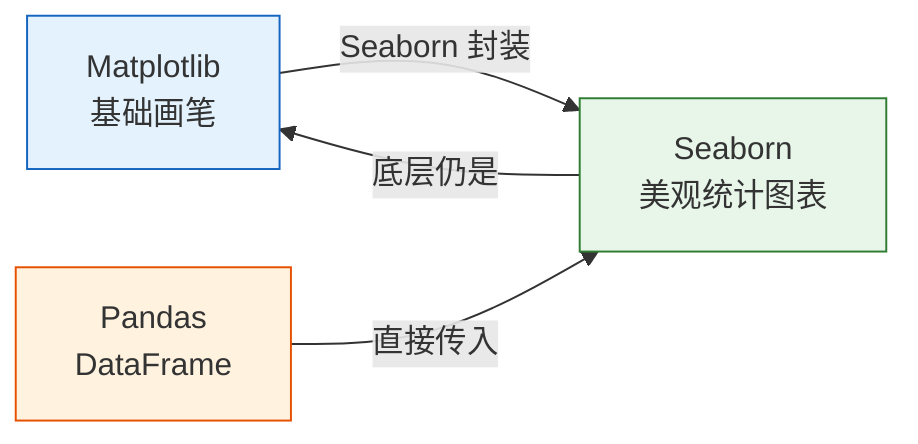
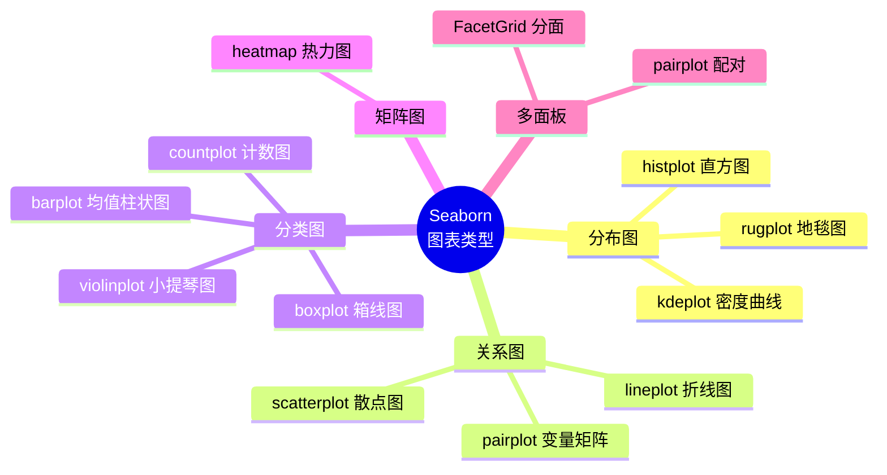

# Seaborn 统计可视化

## 学习目标

- 理解 Seaborn 与 Matplotlib 的关系
- 掌握分布图、关系图、分类图
- 学会绘制热力图与相关性矩阵
- 使用 FacetGrid 进行分面绑图

---

## Seaborn 是什么？

如果把 Matplotlib 比作**画笔和颜料**，那 Seaborn 就是**画笔套装 + 调色板 + 模板**。



| 对比 | Matplotlib | Seaborn |
|------|-----------|---------|
| 定位 | 底层绑图库 | 高级统计绘图库 |
| 代码量 | 多，需要手动设置 | 少，开箱即用 |
| 默认美观度 | 一般 | 非常美观 |
| 数据格式 | 数组、列表 | 直接用 DataFrame |
| 统计功能 | 需要手动计算 | 自动计算均值、置信区间等 |
| 定制能力 | 极强 | 中等（可借助 Matplotlib 补充） |

**一句话总结：** Seaborn 让你用 1 行代码画出 Matplotlib 需要 10 行才能完成的美观统计图。

---

## 安装与导入

```python
# 安装
# pip install seaborn

import seaborn as sns
import matplotlib.pyplot as plt
import pandas as pd
import numpy as np

# Seaborn 自带的示例数据集
tips = sns.load_dataset("tips")      # 餐厅小费数据
iris = sns.load_dataset("iris")      # 鸢尾花数据
titanic = sns.load_dataset("titanic")  # 泰坦尼克号数据

# 设置全局风格
sns.set_theme(style="whitegrid")     # 白底网格，清爽好看
```

### 常用风格一览

| 风格 | 说明 | 适合场景 |
|------|------|----------|
| `"whitegrid"` | 白底 + 网格 | 数值对比（推荐默认） |
| `"darkgrid"` | 灰底 + 网格 | 强调数据点 |
| `"white"` | 纯白底 | 论文、报告 |
| `"dark"` | 灰底 | 艺术风格 |
| `"ticks"` | 白底 + 刻度线 | 简洁专业 |

---

## 分布图：数据长什么样？

分布图帮你回答：**这组数据的值集中在哪里？分散程度如何？是否有偏斜？**

### histplot：直方图

```python
fig, axes = plt.subplots(1, 3, figsize=(15, 4))

# 基本直方图
sns.histplot(data=tips, x="total_bill", ax=axes[0])
axes[0].set_title("基本直方图")

# 添加密度曲线
sns.histplot(data=tips, x="total_bill", kde=True, ax=axes[1])
axes[1].set_title("直方图 + 密度曲线")

# 按类别分颜色
sns.histplot(data=tips, x="total_bill", hue="time", kde=True, ax=axes[2])
axes[2].set_title("按用餐时间分组")

plt.tight_layout()
plt.show()
```

### kdeplot：核密度估计

```python
fig, axes = plt.subplots(1, 2, figsize=(12, 4))

# 一维密度
sns.kdeplot(data=tips, x="total_bill", hue="sex", fill=True, ax=axes[0])
axes[0].set_title("消费金额密度分布")

# 二维密度（等高线）
sns.kdeplot(data=tips, x="total_bill", y="tip", fill=True, cmap="Blues", ax=axes[1])
axes[1].set_title("消费 vs 小费 联合密度")

plt.tight_layout()
plt.show()
```

:::tip 什么是 KDE？
KDE（核密度估计）可以理解为"平滑版的直方图"。它用一条连续的曲线来估计数据的概率密度，比直方图更平滑、更容易对比。
:::

### rugplot：地毯图

```python
fig, ax = plt.subplots(figsize=(8, 4))
sns.kdeplot(data=tips, x="total_bill", fill=True, ax=ax)
sns.rugplot(data=tips, x="total_bill", ax=ax, alpha=0.5)
ax.set_title("密度曲线 + 地毯图（每条线代表一个数据点）")
plt.show()
```

---

## 关系图：变量之间有什么关系？

### scatterplot：散点图

```python
fig, axes = plt.subplots(1, 2, figsize=(14, 5))

# 基本散点图，用颜色区分类别
sns.scatterplot(data=tips, x="total_bill", y="tip", hue="time", ax=axes[0])
axes[0].set_title("消费 vs 小费")

# 用大小和颜色同时表示信息
sns.scatterplot(data=tips, x="total_bill", y="tip",
                hue="day", size="size", sizes=(20, 200), ax=axes[1])
axes[1].set_title("多维度散点图")

plt.tight_layout()
plt.show()
```

### lineplot：折线图（带置信区间）

```python
# 模拟实验数据：每个 x 有多个 y 值
np.random.seed(42)
data = pd.DataFrame({
    "step": np.tile(np.arange(1, 51), 10),
    "accuracy": np.tile(np.linspace(0.5, 0.95, 50), 10) + np.random.normal(0, 0.03, 500),
    "model": np.repeat(["模型 A", "模型 B"], 250)
})

fig, ax = plt.subplots(figsize=(10, 5))
sns.lineplot(data=data, x="step", y="accuracy", hue="model", ax=ax)
ax.set_title("模型训练准确率变化（阴影 = 95% 置信区间）")
plt.show()
```

:::info Seaborn 的自动统计
当同一个 x 值对应多个 y 值时，`lineplot` 会自动计算均值和 95% 置信区间。这在展示实验结果时非常有用！
:::

### pairplot：变量两两关系一览

```python
# 鸢尾花数据集的所有变量关系
sns.pairplot(iris, hue="species", diag_kind="kde", corner=True)
plt.suptitle("鸢尾花数据集特征关系", y=1.02)
plt.show()
```

`pairplot` 一行代码就能展示所有变量之间的关系，是**数据探索阶段的利器**。

---

## 分类图：不同组有何差异？

分类图是 Seaborn 的强项，帮你比较不同类别之间的数据分布和统计量。

### boxplot：箱线图

```python
fig, axes = plt.subplots(1, 2, figsize=(14, 5))

# 基本箱线图
sns.boxplot(data=tips, x="day", y="total_bill", ax=axes[0])
axes[0].set_title("各日消费分布")

# 用颜色区分子类
sns.boxplot(data=tips, x="day", y="total_bill", hue="sex", ax=axes[1])
axes[1].set_title("各日消费分布（按性别）")

plt.tight_layout()
plt.show()
```

:::tip 如何看箱线图

```
          最大值（上须）
            │
    ┌───────┤
    │  上四分位(Q3) ─── 75% 的数据在此以下
    │       │
    │  中位数(Q2) ──── 50% 分位
    │       │
    │  下四分位(Q1) ─── 25% 的数据在此以下
    └───────┤
            │
          最小值（下须）

    ●       异常值（超出须线的点）
```

箱体越高，数据越分散；中线越靠上，数据整体越大。
:::

### violinplot：小提琴图

```python
fig, ax = plt.subplots(figsize=(10, 5))

sns.violinplot(data=tips, x="day", y="total_bill", hue="sex",
               split=True, inner="quart", ax=ax)
ax.set_title("各日消费分布（小提琴图，左女右男）")

plt.show()
```

小提琴图 = 箱线图 + 密度分布，比箱线图能看到更多分布形状。

### barplot：均值柱状图（带误差线）

```python
fig, ax = plt.subplots(figsize=(8, 5))

sns.barplot(data=tips, x="day", y="total_bill", hue="sex",
            ci=95, ax=ax)  # ci=95 表示 95% 置信区间
ax.set_title("各日平均消费（误差线 = 95% 置信区间）")

plt.show()
```

:::caution barplot 的误差线
Seaborn 的 `barplot` 默认会在每个柱子上加误差线（bootstrap 置信区间）。这不是标准差！如果想用标准差，设置 `ci="sd"`。
:::

### countplot：计数图

```python
fig, axes = plt.subplots(1, 2, figsize=(12, 4))

# 简单计数
sns.countplot(data=tips, x="day", order=["Thur", "Fri", "Sat", "Sun"], ax=axes[0])
axes[0].set_title("各天就餐人次")

# 分组计数
sns.countplot(data=titanic, x="class", hue="survived", ax=axes[1])
axes[1].set_title("各舱位生存情况")

plt.tight_layout()
plt.show()
```

---

## 热力图（Heatmap）

热力图用颜色深浅表示数值大小，最常用于**相关性矩阵**。

### 绘制相关性矩阵

```python
# 计算数值列的相关系数
# 选取 tips 中的数值列
numeric_cols = tips.select_dtypes(include="number")
corr = numeric_cols.corr()

fig, ax = plt.subplots(figsize=(8, 6))
sns.heatmap(corr, annot=True, fmt=".2f", cmap="RdBu_r",
            center=0, vmin=-1, vmax=1,
            square=True, linewidths=0.5, ax=ax)
ax.set_title("小费数据集相关性矩阵")
plt.tight_layout()
plt.show()
```

**关键参数：**

| 参数 | 作用 | 常用值 |
|------|------|--------|
| `annot` | 显示数值 | `True` |
| `fmt` | 数值格式 | `".2f"` 两位小数 |
| `cmap` | 颜色映射 | `"RdBu_r"` 红蓝反转 |
| `center` | 颜色中心值 | `0`（相关系数） |
| `square` | 正方形格子 | `True` |

### 自定义热力图

```python
# 交叉表热力图（比如各天各时段的平均消费）
pivot = tips.pivot_table(values="total_bill", index="day", columns="time", aggfunc="mean")

fig, ax = plt.subplots(figsize=(6, 4))
sns.heatmap(pivot, annot=True, fmt=".1f", cmap="YlOrRd",
            linewidths=1, ax=ax)
ax.set_title("各天各时段平均消费")
plt.show()
```

---

## FacetGrid：分面绑图

当你想**按某个变量把图表拆成多个子图**时，用 FacetGrid。

```python
# 按用餐时间分面，展示消费与小费的关系
g = sns.FacetGrid(tips, col="time", row="sex", hue="smoker",
                  height=4, aspect=1.2)
g.map_dataframe(sns.scatterplot, x="total_bill", y="tip")
g.add_legend()
g.fig.suptitle("按时间和性别分面的消费-小费关系", y=1.02)
plt.show()
```

### 更多分面示例

```python
# 按星期分面的直方图
g = sns.FacetGrid(tips, col="day", col_wrap=2, height=3)
g.map_dataframe(sns.histplot, x="total_bill", kde=True)
g.set_titles("星期: {col_name}")
g.fig.suptitle("各日消费分布", y=1.02)
plt.show()
```

| 参数 | 作用 |
|------|------|
| `col` | 按此变量分列 |
| `row` | 按此变量分行 |
| `hue` | 按此变量分颜色 |
| `col_wrap` | 每行最多几列（自动换行） |
| `height` | 每个子图高度 |
| `aspect` | 宽高比 |

---

## Seaborn 常用图表速查



---

## 小结

| 需求 | 函数 | 说明 |
|------|------|------|
| 查看分布 | `histplot` / `kdeplot` | 直方图 / 密度曲线 |
| 两变量关系 | `scatterplot` / `lineplot` | 散点图 / 折线图 |
| 所有变量关系 | `pairplot` | 一键矩阵图 |
| 类别间对比 | `boxplot` / `violinplot` / `barplot` | 分布 / 均值 |
| 类别计数 | `countplot` | 柱状图 |
| 数值矩阵 | `heatmap` | 热力图 |
| 分面展示 | `FacetGrid` | 多子图 |

**核心优势：** 一行代码就能画出美观且含统计信息的图表，直接传入 DataFrame 即可。

---

## 动手练习

### 练习 1：探索数据分布

```python
# 加载 tips 数据集
# 1. 用 histplot 画出 tip（小费）的分布，按 time 分颜色
# 2. 用 kdeplot 画出 total_bill 的密度曲线，按 sex 分组
```

### 练习 2：分类比较

```python
# 加载 titanic 数据集
# 1. 用 boxplot 比较各舱位 (class) 的年龄 (age) 分布
# 2. 用 countplot 展示各舱位的生存人数
```

### 练习 3：相关性分析

```python
# 加载 iris 数据集
# 1. 计算数值列的相关系数矩阵
# 2. 用 heatmap 可视化，添加数值标注
# 3. 用 pairplot 查看所有变量关系
```

### 练习 4：分面绑图

```python
# 使用 tips 数据集
# 用 FacetGrid 按 day 分面，画出 total_bill 和 tip 的散点图
# 用颜色区分 sex
```
