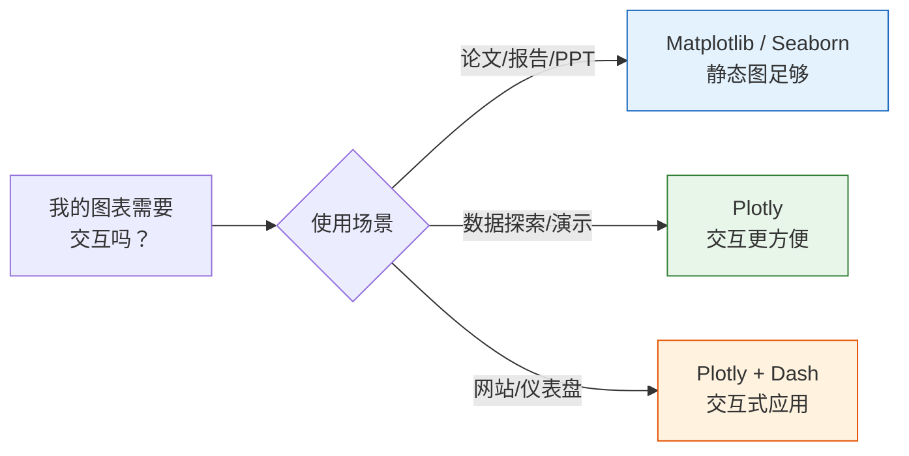

# 交互式可视化

:::info 选修内容
本节为选修内容。如果你时间有限，可以先跳过，需要时再回来学。但建议至少浏览一遍，了解交互式图表的能力。
:::

## 学习目标

- 理解静态图 vs 交互图的区别
- 掌握 Plotly Express 快速绑图
- 了解交互式仪表盘的概念

---

## 为什么需要交互式图表？

| 对比 | 静态图（Matplotlib/Seaborn） | 交互图（Plotly） |
|------|--------------------------|-----------------|
| 鼠标悬停 | 不支持 | 显示详细数据 |
| 缩放拖动 | 不支持 | 自由缩放和平移 |
| 数据筛选 | 不支持 | 可点击图例隐藏/显示 |
| 导出 | 保存为图片 | 图片 + HTML 网页 |
| 使用场景 | 论文、报告 | 数据探索、网页展示 |



---

## 安装与导入

```python
# 安装
# pip install plotly

# Plotly Express：快速绑图（推荐）
import plotly.express as px

# Plotly Graph Objects：更底层的控制
import plotly.graph_objects as go

import pandas as pd
import numpy as np
```

---

## Plotly Express 快速入门

Plotly Express 是 Plotly 的高级接口，**一行代码**就能创建漂亮的交互式图表。

### 散点图

```python
# 使用内置数据集
df = px.data.iris()

fig = px.scatter(df, x="sepal_width", y="sepal_length",
                 color="species",        # 按物种分颜色
                 size="petal_length",     # 用花瓣长度控制点大小
                 hover_data=["petal_width"],  # 悬停显示花瓣宽度
                 title="鸢尾花数据集 - 交互式散点图")
fig.show()
```

运行后，你会看到一个可以悬停、缩放、拖动的图表！

### 折线图

```python
df = px.data.gapminder()
# 筛选中国、美国、日本的数据
countries = df[df["country"].isin(["China", "United States", "Japan"])]

fig = px.line(countries, x="year", y="gdpPercap",
              color="country",
              title="中美日人均 GDP 变化",
              labels={"gdpPercap": "人均 GDP（美元）", "year": "年份", "country": "国家"})
fig.show()
```

### 柱状图

```python
df = px.data.tips()

fig = px.bar(df, x="day", y="total_bill", color="sex",
             barmode="group",          # "group" 分组, "stack" 堆叠
             title="各日消费（按性别分组）",
             labels={"total_bill": "消费金额", "day": "星期", "sex": "性别"})
fig.show()
```

### 直方图

```python
df = px.data.tips()

fig = px.histogram(df, x="total_bill", color="time",
                   nbins=20,
                   marginal="box",    # 边际图："box", "violin", "rug"
                   title="消费金额分布（带边际箱线图）")
fig.show()
```

### 箱线图

```python
df = px.data.tips()

fig = px.box(df, x="day", y="total_bill", color="smoker",
             notched=True,             # 带缺口的箱线图
             title="各日消费分布（按是否吸烟）")
fig.show()
```

### 饼图 / 甜甜圈图

```python
# 饼图
fig = px.pie(df, names="day", values="total_bill",
             title="各日消费占比",
             hole=0.3)  # hole > 0 变成甜甜圈图
fig.show()
```

---

## 进阶图表

### 热力图

```python
# 计算相关系数
df = px.data.iris()
numeric_cols = df.select_dtypes(include="number")
corr = numeric_cols.corr()

fig = px.imshow(corr, text_auto=".2f",
                color_continuous_scale="RdBu_r",
                title="鸢尾花特征相关性热力图")
fig.show()
```

### 3D 散点图

```python
df = px.data.iris()

fig = px.scatter_3d(df, x="sepal_length", y="sepal_width", z="petal_length",
                    color="species",
                    title="鸢尾花 3D 散点图（可旋转！）")
fig.show()
```

你可以用鼠标拖动旋转这个 3D 图，从不同角度观察数据。

### 动画图表

```python
df = px.data.gapminder()

fig = px.scatter(df, x="gdpPercap", y="lifeExp",
                 size="pop", color="continent",
                 hover_name="country",
                 animation_frame="year",      # 按年份播放动画
                 animation_group="country",
                 log_x=True,
                 range_x=[100, 100000],
                 range_y=[25, 90],
                 title="各国发展轨迹（1952-2007）")
fig.show()
```

点击播放按钮，可以看到各国在不同年份的变化。这就是著名的 **Hans Rosling 气泡图**。

---

## 图表定制

### 更新布局

```python
fig = px.scatter(px.data.iris(), x="sepal_width", y="sepal_length",
                 color="species")

fig.update_layout(
    title=dict(text="自定义标题", font=dict(size=20)),
    xaxis_title="萼片宽度 (cm)",
    yaxis_title="萼片长度 (cm)",
    template="plotly_white",      # 模板主题
    width=800,
    height=500,
    legend_title="品种"
)

fig.show()
```

### 常用模板

| 模板名 | 风格 |
|--------|------|
| `"plotly"` | 默认蓝色背景 |
| `"plotly_white"` | 白底（推荐） |
| `"plotly_dark"` | 深色背景 |
| `"ggplot2"` | R ggplot 风格 |
| `"simple_white"` | 极简白底 |

### 保存图表

```python
# 保存为交互式 HTML
fig.write_html("my_chart.html")

# 保存为静态图片（需安装 kaleido）
# pip install kaleido
fig.write_image("my_chart.png", scale=2)
fig.write_image("my_chart.svg")
```

---

## Plotly vs Matplotlib vs Seaborn

| 特性 | Matplotlib | Seaborn | Plotly |
|------|-----------|---------|--------|
| 交互性 | 无 | 无 | 强 |
| 美观度 | 一般 | 好 | 好 |
| 学习难度 | 中 | 低 | 低 |
| 定制能力 | 极强 | 中 | 强 |
| 输出格式 | 图片/PDF | 图片/PDF | HTML/图片 |
| 适合场景 | 论文/精细控制 | 快速统计图 | 数据探索/展示 |

---

## 交互式仪表盘简介

在实际工作中，你可能需要将多个交互式图表组合成一个**仪表盘**（Dashboard）。

常用工具：

| 工具 | 特点 |
|------|------|
| **Plotly Dash** | Python 代码构建，功能强大 |
| **Streamlit** | 最简单，几行代码就能做应用 |
| **Gradio** | AI 模型演示专用 |
| **Panel** | Jupyter 生态集成好 |

一个简单的 Dash 示例（了解即可）：

```python
# pip install dash
from dash import Dash, html, dcc
import plotly.express as px

app = Dash(__name__)

df = px.data.gapminder().query("year == 2007")
fig = px.scatter(df, x="gdpPercap", y="lifeExp", size="pop",
                 color="continent", hover_name="country", log_x=True)

app.layout = html.Div([
    html.H1("世界发展指标仪表盘"),
    dcc.Graph(figure=fig)
])

# 运行：python app.py，然后打开 http://127.0.0.1:8050
# app.run(debug=True)
```

:::tip 后续课程
仪表盘的详细开发不在本阶段范围。后续项目阶段会有实战练习。
:::

---

## 小结

| Plotly Express 函数 | 图表类型 |
|---------------------|---------|
| `px.scatter()` | 散点图 |
| `px.line()` | 折线图 |
| `px.bar()` | 柱状图 |
| `px.histogram()` | 直方图 |
| `px.box()` | 箱线图 |
| `px.pie()` | 饼图 |
| `px.imshow()` | 热力图 |
| `px.scatter_3d()` | 3D 散点图 |

Plotly 的核心优势就是**交互**——鼠标悬停查看数据、缩放细看局部、动画展示变化。在数据探索和结果展示时非常好用。

---

## 动手练习

### 练习 1：交互式探索

```python
# 加载 gapminder 数据集
# 1. 用 px.scatter 画出 2007 年各国 gdpPercap vs lifeExp 的关系
#    - 用 pop 控制点大小，continent 控制颜色
#    - 悬停显示 country
# 2. 用 px.line 画出中国 1952-2007 年的 lifeExp 变化
```

### 练习 2：数据分布

```python
# 加载 tips 数据集
# 1. 用 px.histogram 画消费金额分布，用 marginal="violin" 添加边际图
# 2. 用 px.box 按星期比较消费金额
```

### 练习 3：动画图

```python
# 用 gapminder 数据集制作动画散点图
# 展示 1952-2007 年各国 gdpPercap vs lifeExp 的变化
# 用 animation_frame="year"
```
