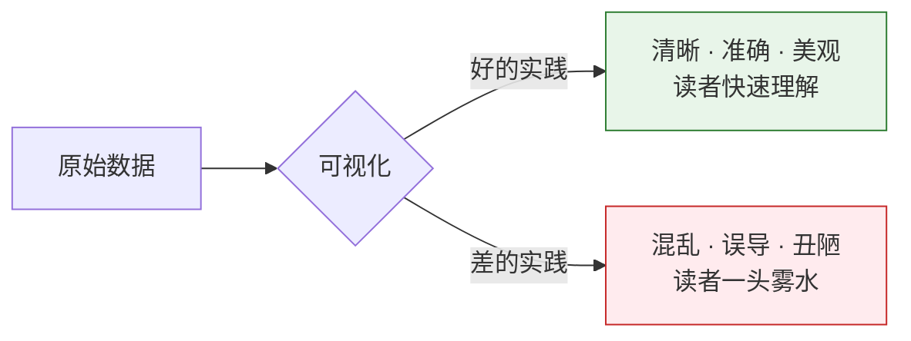
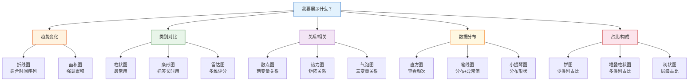
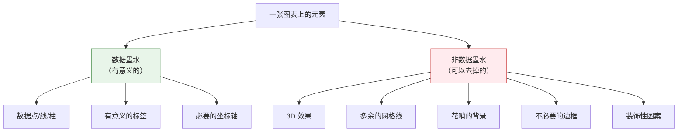
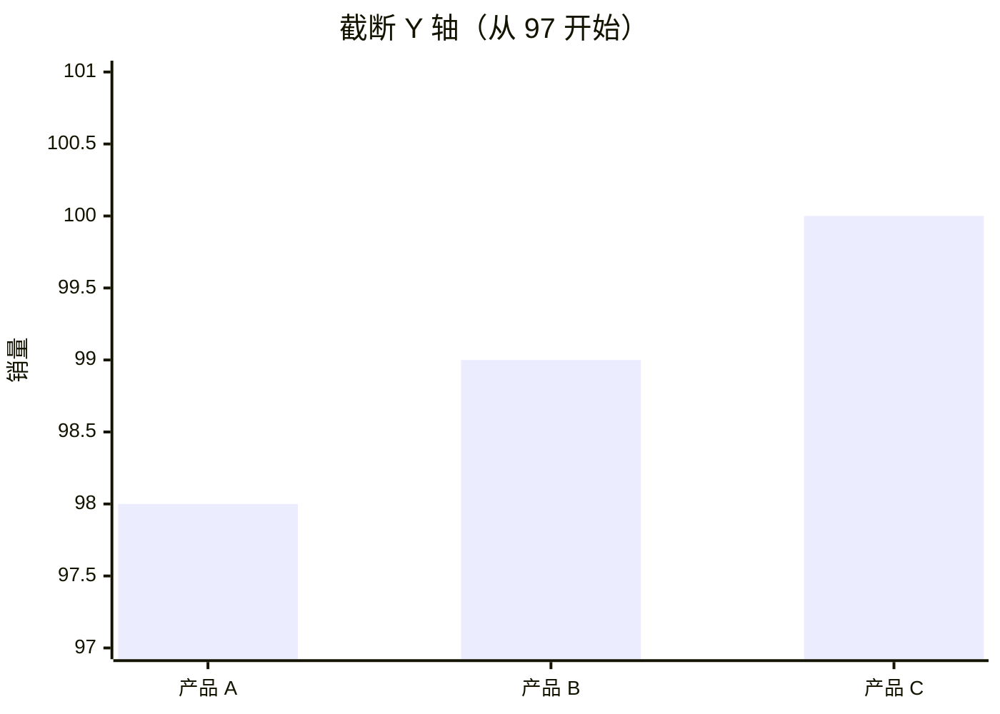
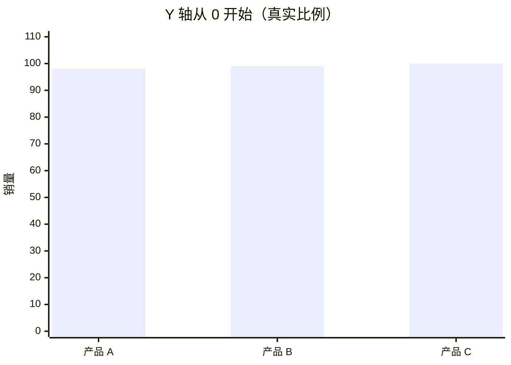
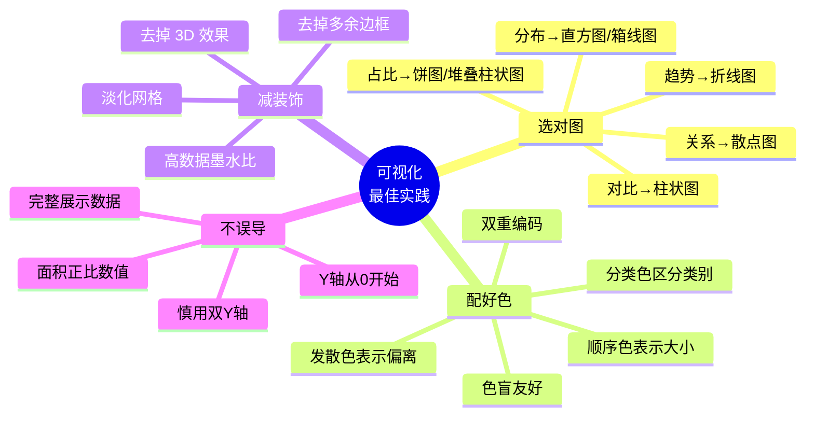

# 可视化最佳实践

## 学习目标

- 掌握图表类型的选择策略
- 了解配色原则和色盲友好设计
- 理解"数据墨水比"概念
- 识别并避免常见的可视化误导

---

## 为什么要学最佳实践？

> 同样的数据，好的可视化让人一秒看懂，差的可视化让人越看越迷糊，甚至被误导。



---

## 一、图表类型选择指南

### 核心原则：先问自己"我要展示什么？"



### 详细选择对照表

| 我的目标 | 推荐图表 | 不推荐 | 说明 |
|---------|---------|--------|------|
| 展示时间趋势 | 折线图 | 饼图 | 折线图天然适合连续变化 |
| 比较几个类别 | 柱状图 | 饼图（大于 6 类） | 柱子高度一眼对比 |
| 看两变量关系 | 散点图 | 折线图 | 散点直观显示分布和趋势 |
| 查看数据分布 | 直方图/箱线图 | 折线图 | 直方图显示频次分布 |
| 展示占比 | 饼图（少类别）/ 堆叠柱状图 | 3D 饼图 | 3D 饼图会扭曲面积 |
| 比较分布差异 | 箱线图/小提琴图 | 只用均值柱状图 | 均值柱状图丢失分布信息 |
| 展示相关性矩阵 | 热力图 | 表格 | 颜色编码比数字直观 |

---

## 二、配色原则

### 1. 颜色的三种用法

| 用法 | 场景 | 示例 |
|------|------|------|
| **分类**（定性色） | 区分不同类别 | 男/女用不同颜色 |
| **顺序**（连续色） | 表示数值大小 | 温度从蓝到红 |
| **发散**（两端色） | 有中心值的数据 | 相关系数 -1 到 1 |

### 2. 推荐配色方案

```python
import matplotlib.pyplot as plt
import seaborn as sns

# === 分类色（区分类别）===
# Matplotlib 默认色板（Tab10）
# 颜色: 蓝、橙、绿、红、紫、棕、粉、灰、黄绿、青
# 适合：最多 10 个类别

# Seaborn 色板
sns.color_palette("Set2")       # 柔和色调
sns.color_palette("colorblind") # 色盲友好！

# === 顺序色（表示大小）===
# 从浅到深
# "Blues", "Greens", "Reds", "YlOrRd"（黄-橙-红）

# === 发散色（有中心值）===
# "RdBu_r"（红-白-蓝）——相关系数常用
# "RdYlGn"（红-黄-绿）——表现好/差
```

### 3. 色盲友好设计

全球约 8% 的男性有色觉障碍（最常见的是红绿色盲）。

**避免的组合：**

| 避免 | 原因 | 替代方案 |
|------|------|---------|
| 红 + 绿 | 红绿色盲无法区分 | 蓝 + 橙 |
| 仅靠颜色区分 | 色盲看不出差异 | 颜色 + 形状/线型 |

**推荐做法：**

```python
# 使用色盲友好的色板
sns.set_palette("colorblind")

# 或者用不同的标记形状 + 颜色
markers = ["o", "s", "^", "D"]  # 圆、方、三角、菱形
linestyles = ["-", "--", ":", "-."]  # 实线、虚线、点线、点划线

# 示例：用颜色 + 线型 双重编码
fig, ax = plt.subplots()
for i, (style, marker) in enumerate(zip(linestyles, markers)):
    ax.plot(range(10), [x + i*2 for x in range(10)],
            linestyle=style, marker=marker, label=f"系列 {i+1}")
ax.legend()
plt.show()
```

:::tip 双重编码
不要只靠颜色传递信息，同时使用**形状、线型、标签、图案**来辅助区分，这样即使打印成黑白也能看懂。
:::

---

## 三、数据墨水比

### 什么是数据墨水比？

这个概念来自可视化大师 **Edward Tufte**：

> **数据墨水比 = 用于展示数据的墨水 / 图表上所有的墨水**

简单说：**去掉一切不必要的装饰，让每一滴墨水都为数据服务。**

### 减少"图表垃圾"



### 实际对比

**不好的做法（低数据墨水比）：**

```python
# ❌ 过度装饰
fig, ax = plt.subplots(figsize=(8, 5))
values = [25, 40, 30, 55, 45]
categories = ["A", "B", "C", "D", "E"]

ax.bar(categories, values, color="skyblue", edgecolor="navy", linewidth=2, hatch="//")
ax.set_facecolor("#f0f0f0")          # 背景色
ax.grid(True, linewidth=2, alpha=1)  # 粗重的网格
ax.set_title("销售数据", fontsize=20, fontweight="bold",
             fontstyle="italic", color="red")
# 过多的装饰让数据不突出
plt.show()
```

**好的做法（高数据墨水比）：**

```python
# ✅ 简洁清晰
fig, ax = plt.subplots(figsize=(8, 5))

bars = ax.bar(categories, values, color="#4CAF50", width=0.6)

# 直接在柱子上标数值（减少对坐标轴的依赖）
for bar, val in zip(bars, values):
    ax.text(bar.get_x() + bar.get_width()/2, bar.get_height() + 1,
            str(val), ha="center", fontsize=12)

ax.set_title("销售数据", fontsize=14)
ax.spines["top"].set_visible(False)     # 去掉上边框
ax.spines["right"].set_visible(False)   # 去掉右边框
ax.set_ylabel("销售额")

plt.tight_layout()
plt.show()
```

### 简化清单

| 元素 | 是否保留 | 原因 |
|------|---------|------|
| 上/右边框 | 去掉 | 无信息量 |
| 密集网格 | 去掉或淡化 | 用 `alpha=0.2` |
| 3D 效果 | 去掉 | 扭曲比例 |
| 数据标签 | 按需 | 有时比坐标轴更直观 |
| 图例 | 按需 | 只有一个系列时不需要 |
| 背景色 | 白底 | 最不干扰 |

---

## 四、常见可视化误导

### 误导 1：截断 Y 轴

三个产品的销量分别是 98、99、100，数据几乎一样。但如果 Y 轴不从 0 开始：

**截断 Y 轴（从 97 开始）—— 看起来差异巨大：**



C 的柱子看起来是 A 的 **3 倍高**！但实际只多了 2%。

**Y 轴从 0 开始 —— 真实比例：**



从 0 开始后，三个柱子几乎一样高——这才是数据的真实面貌。

:::tip 关键结论
**Y 轴不从 0 开始**会让微小差异看起来天差地别。新闻媒体中这种误导手法非常常见，大家要学会识别！
:::

**代码实现对比：**

```python
import matplotlib.pyplot as plt

fig, axes = plt.subplots(1, 2, figsize=(12, 4))

data = [98, 99, 100]
labels = ["产品 A", "产品 B", "产品 C"]

# ❌ 误导：截断 Y 轴
axes[0].bar(labels, data, color="#F44336")
axes[0].set_ylim(97, 101)  # Y 轴从 97 开始！
axes[0].set_title("❌ 截断 Y 轴（从 97 开始）")
axes[0].set_ylabel("销量")

# ✅ 正确：从 0 开始
axes[1].bar(labels, data, color="#4CAF50")
axes[1].set_ylim(0, 110)
axes[1].set_title("✅ Y 轴从 0 开始")
axes[1].set_ylabel("销量")

plt.tight_layout()
plt.show()
```

:::caution 什么时候可以不从 0 开始？
折线图关注**变化趋势**时可以截断 Y 轴（因为读者看的是线的走势），但柱状图（柱子面积代表数量）**必须从 0 开始**。
:::

### 误导 2：3D 饼图

3D 饼图会让靠近观众的部分看起来更大：

```python
# ❌ 3D 饼图
# matplotlib 虽然没有真正的 3D 饼图，但展示概念：
# 前方的扇区因为透视被放大，后方的被缩小
# 导致读者对比例产生错误判断

# ✅ 正确做法：用 2D 饼图或柱状图代替
fig, axes = plt.subplots(1, 2, figsize=(12, 5))

labels = ["Python", "Java", "JS", "C++"]
sizes = [35, 25, 25, 15]

axes[0].pie(sizes, labels=labels, autopct="%1.0f%%")
axes[0].set_title("2D 饼图（清晰）")

axes[1].barh(labels, sizes, color=["#4CAF50", "#2196F3", "#FFC107", "#FF5722"])
axes[1].set_xlabel("占比 (%)")
axes[1].set_title("柱状图（更精确的对比）")

plt.tight_layout()
plt.show()
```

### 误导 3：双 Y 轴陷阱

```python
# ❌ 双 Y 轴可能暗示不存在的相关性
fig, ax1 = plt.subplots(figsize=(8, 5))

months = range(1, 13)
temp = [5, 7, 12, 18, 23, 28, 30, 29, 24, 17, 10, 6]
ice_cream = [20, 25, 35, 50, 70, 90, 95, 88, 60, 40, 22, 18]

ax1.plot(months, temp, "r-", label="气温")
ax1.set_ylabel("气温 (°C)", color="r")

ax2 = ax1.twinx()
ax2.plot(months, ice_cream, "b-", label="冰淇淋销量")
ax2.set_ylabel("冰淇淋销量", color="b")

ax1.set_title("气温 vs 冰淇淋销量")
plt.show()

# 这里确实有相关性，但双 Y 轴的尺度可以随意调整
# 让两条线看起来完美重合或完全无关
# 用散点图展示相关性更诚实
```

### 误导 4：不当的面积/大小映射

```python
# ❌ 用直径而非面积表示数量
# 如果 A = 100, B = 200
# 直径翻倍 → 面积变为 4 倍 → 读者觉得 B 是 A 的 4 倍

# ✅ 正确做法：用面积映射数值
import numpy as np

values = [100, 200, 300]
# 面积正比于数值，所以半径应该正比于 sqrt(数值)
sizes = [v * 2 for v in values]  # 面积正比
```

### 常见误导总结

| 误导方式 | 为什么误导 | 正确做法 |
|---------|-----------|---------|
| 截断 Y 轴 | 夸大差异 | 柱状图从 0 开始 |
| 3D 饼图 | 扭曲面积比例 | 用 2D 饼图或柱状图 |
| 双 Y 轴 | 可操纵视觉相关 | 用散点图或分开画 |
| 面积误用 | 大小感知偏差 | 面积正比于数值 |
| 选择性展示 | 隐藏不利数据 | 展示完整数据 |
| 颜色误导 | 鲜艳色强调小数据 | 中性色为主 |

---

## 五、完整检查清单

每次做完图表后，用这个清单检查一遍：

```
☐ 图表类型是否合适？（折线 vs 柱状 vs 散点…）
☐ 标题是否清晰表达了图表要说的事？
☐ 坐标轴是否有标签和单位？
☐ Y 轴起始值是否合理？（柱状图从 0 开始）
☐ 图例是否必要且清晰？
☐ 颜色是否色盲友好？
☐ 是否去掉了不必要的装饰？（3D 效果、花哨背景）
☐ 数据标签是否有助于理解？
☐ 字号是否足够大？（别人能看清吗？）
☐ 数据展示是否诚实？（没有误导？）
```

---

## 六、从"能用"到"好用"的模板

### 极简专业模板

```python
import matplotlib.pyplot as plt
import numpy as np

def professional_style(ax):
    """一键设置专业风格"""
    ax.spines["top"].set_visible(False)
    ax.spines["right"].set_visible(False)
    ax.grid(True, axis="y", alpha=0.2, linestyle="--")
    ax.tick_params(labelsize=10)

# 使用模板
fig, ax = plt.subplots(figsize=(8, 5))

categories = ["产品 A", "产品 B", "产品 C", "产品 D", "产品 E"]
values = [42, 38, 55, 29, 47]

bars = ax.bar(categories, values, color="#1976D2", width=0.6)

# 数据标签
for bar, val in zip(bars, values):
    ax.text(bar.get_x() + bar.get_width()/2, bar.get_height() + 1,
            f"{val}万", ha="center", fontsize=11)

ax.set_title("2024 年各产品销售额", fontsize=14, pad=15)
ax.set_ylabel("销售额（万元）")
ax.set_ylim(0, max(values) * 1.15)

professional_style(ax)
plt.tight_layout()
plt.show()
```

### Seaborn 极简模板

```python
import seaborn as sns
import matplotlib.pyplot as plt

# 全局设置
sns.set_theme(
    style="ticks",                         # 极简刻度风格
    palette="colorblind",                   # 色盲友好
    rc={
        "figure.figsize": (8, 5),
        "axes.spines.top": False,           # 去掉上边框
        "axes.spines.right": False,         # 去掉右边框
        "font.size": 11,
    }
)

# 之后所有 sns/plt 图表都会使用这个风格
```

---

## 小结



**核心三句话：**

1. **选对图表** —— 让数据决定图表类型，不是反过来
2. **少即是多** —— 去掉一切不为数据服务的元素
3. **诚实展示** —— 不夸大、不隐瞒、不误导

---

## 动手练习

### 练习 1：改造一张"丑图"

```python
# 下面这张图有很多问题，请改造成专业版本：
import matplotlib.pyplot as plt

fig, ax = plt.subplots()
data = [45, 52, 38, 67, 41]
labels = ["北京", "上海", "广州", "深圳", "杭州"]

ax.bar(labels, data, color=["red", "green", "blue", "yellow", "purple"],
       edgecolor="black", linewidth=3, hatch="xxx")
ax.set_ylim(30, 70)  # Y 轴截断！
ax.set_facecolor("#cccccc")
ax.grid(True, linewidth=3)
ax.set_title("SALES DATA!!!", fontsize=24, color="red")
plt.show()

# 问题清单：
# 1. Y 轴不从 0 开始（误导）
# 2. 配色花哨不统一
# 3. 背景色干扰
# 4. 网格太粗
# 5. 标题不清晰
# 6. 边框多余
# 请逐一修正！
```

### 练习 2：选图练习

```
请为以下场景选择合适的图表类型并说明理由：

1. 展示某公司 2018-2024 年的年收入变化
2. 比较 5 个城市的平均房价
3. 分析广告投入与销售额的关系
4. 查看 1000 名员工的年龄分布
5. 展示公司各部门的人员占比（4 个部门）
6. 比较三组实验数据的分布差异
```

### 练习 3：色盲友好改造

```python
# 将下面的图表改造为色盲友好版本
# 要求：使用色盲安全色板 + 不同线型/标记 双重编码

fig, ax = plt.subplots()
x = range(10)
ax.plot(x, [i**1.5 for i in x], color="red", label="模型 A")
ax.plot(x, [i**1.3 for i in x], color="green", label="模型 B")
ax.plot(x, [i**1.1 for i in x], color="red", alpha=0.5, label="模型 C")  # 和 A 太像！
ax.legend()
plt.show()
```
