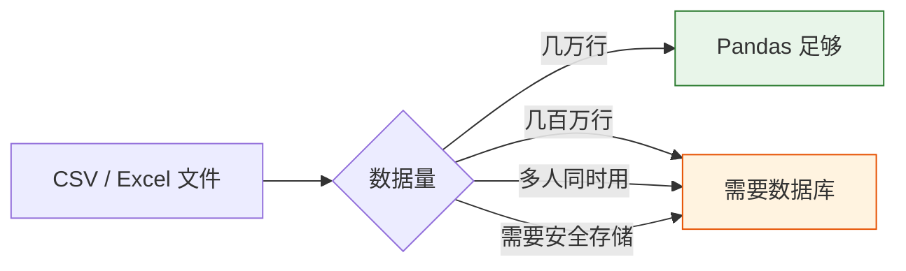
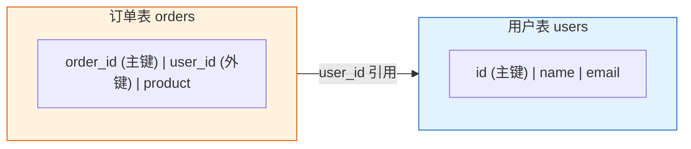
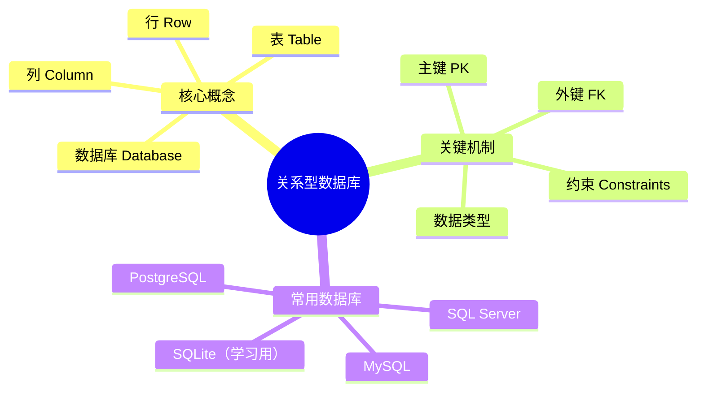

# 关系型数据库基础

:::info 选修章节
本章为选修内容。如果你只想做数据分析和建模，可以暂时跳过。但如果你未来要做 AI 应用开发（如 RAG 系统、AI Agent），数据库知识是必备的。
:::

## 学习目标

- 理解什么是数据库以及为什么需要它
- 掌握关系型数据库的核心概念
- 理解表、行、列、主键、外键的含义
- 了解常见的数据库管理系统

---

## 为什么 AI 工程师需要学数据库？

你可能会想："我已经会用 Pandas 读 CSV 了，为什么还要学数据库？"



| 场景 | CSV 文件 | 数据库 |
|------|---------|--------|
| 数据量 | 几万行还行，百万行卡死 | 轻松处理上亿行 |
| 多人协作 | 谁改了不知道，容易冲突 | 支持并发读写，有权限控制 |
| 数据安全 | 文件删了就没了 | 有备份、事务、崩溃恢复 |
| 查询速度 | 每次都要全量扫描 | 有索引，毫秒级查询 |
| 数据关联 | 手动 merge 多个文件 | 用 SQL JOIN 一句搞定 |

**真实场景举例：**

- 做 RAG 系统 → 用户问答记录要存数据库
- 做 AI Agent → 记忆系统需要持久化存储
- 做推荐系统 → 用户行为数据在数据库里
- 做数据分析 → 企业数据 99% 存在数据库中

---

## 什么是关系型数据库？

### 用 Excel 来类比

如果你用过 Excel，你已经理解了关系型数据库 80% 的概念：

| Excel 概念 | 数据库概念 | 说明 |
|-----------|-----------|------|
| 一个 Excel 文件 | 一个**数据库**（Database） | 存放所有数据的容器 |
| 一个 Sheet 工作表 | 一张**表**（Table） | 存放某一类数据 |
| 一行 | 一条**记录**（Row / Record） | 一个具体的数据实体 |
| 一列 | 一个**字段**（Column / Field） | 数据的一个属性 |
| 列标题 | **字段名**（Column Name） | 属性名称 |
| 单元格的数据类型 | **数据类型**（Data Type） | 整数、文本、日期等 |

### 用一个例子理解

假设你开了一家网店，需要管理**用户**和**订单**：

**用户表（users）：**

| id | name | email | age | city |
|----|------|-------|-----|------|
| 1 | 张三 | zhang@mail.com | 28 | 北京 |
| 2 | 李四 | li@mail.com | 35 | 上海 |
| 3 | 王五 | wang@mail.com | 22 | 广州 |

**订单表（orders）：**

| order_id | user_id | product | amount | order_date |
|----------|---------|---------|--------|------------|
| 101 | 1 | iPhone 16 | 7999 | 2024-11-01 |
| 102 | 1 | AirPods | 999 | 2024-11-05 |
| 103 | 2 | MacBook | 14999 | 2024-11-10 |

这两张表通过 `user_id` 关联——这就是**关系型**数据库名字的由来：表与表之间存在**关系**。

---

## 核心概念

### 1. 主键（Primary Key）

主键是每条记录的**唯一标识**，就像身份证号一样，不能重复、不能为空。

```
用户表中：id 是主键 → 每个用户有唯一的 id
订单表中：order_id 是主键 → 每个订单有唯一的 order_id
```

:::tip 为什么需要主键？
想象没有主键的情况：有两个都叫"张三"的用户，你怎么区分他们？主键就是解决这个问题的——即使名字相同，id 一定不同。
:::

### 2. 外键（Foreign Key）

外键是指**引用另一张表主键的字段**，用于建立表之间的关系。



订单表中的 `user_id` 就是外键——它指向用户表的 `id`，表示"这个订单属于哪个用户"。

### 3. 常见数据类型

| 类型 | 说明 | 示例 |
|------|------|------|
| `INTEGER` | 整数 | 1, 42, -100 |
| `REAL` / `FLOAT` | 浮点数 | 3.14, 99.9 |
| `TEXT` / `VARCHAR` | 文本字符串 | "张三", "hello" |
| `DATE` | 日期 | 2024-11-01 |
| `DATETIME` | 日期时间 | 2024-11-01 14:30:00 |
| `BOOLEAN` | 布尔值 | TRUE / FALSE |
| `BLOB` | 二进制数据 | 图片、文件（不常用） |

### 4. 约束（Constraints）

约束是对数据的**规则限制**，保证数据质量：

| 约束 | 作用 | 示例 |
|------|------|------|
| `PRIMARY KEY` | 主键，唯一且不为空 | `id` |
| `NOT NULL` | 不能为空 | `name NOT NULL` |
| `UNIQUE` | 值不能重复 | `email UNIQUE` |
| `DEFAULT` | 默认值 | `city DEFAULT '未知'` |
| `FOREIGN KEY` | 外键，引用其他表 | `user_id REFERENCES users(id)` |

---

## 常见数据库管理系统

| 数据库 | 特点 | 适用场景 |
|--------|------|---------|
| **SQLite** | 零配置，存在单个文件中 | 学习、小应用、移动端 |
| **MySQL** | 最流行的开源数据库 | Web 应用、中小型项目 |
| **PostgreSQL** | 功能最强大的开源数据库 | 大型项目、AI 应用（支持向量搜索） |
| **SQL Server** | 微软出品 | 企业级 Windows 环境 |

:::tip 本章使用 SQLite
SQLite 不需要安装任何服务器，Python 自带 `sqlite3` 模块，最适合学习。所有 SQL 语法在其他数据库中也通用。
:::

---

## 动手体验：创建第一个数据库

```python
import sqlite3

# 1. 连接数据库（不存在则自动创建）
conn = sqlite3.connect("my_shop.db")
cursor = conn.cursor()

# 2. 创建用户表
cursor.execute("""
    CREATE TABLE IF NOT EXISTS users (
        id INTEGER PRIMARY KEY AUTOINCREMENT,
        name TEXT NOT NULL,
        email TEXT UNIQUE,
        age INTEGER,
        city TEXT DEFAULT '未知'
    )
""")

# 3. 插入数据
cursor.execute("INSERT INTO users (name, email, age, city) VALUES ('张三', 'zhang@mail.com', 28, '北京')")
cursor.execute("INSERT INTO users (name, email, age, city) VALUES ('李四', 'li@mail.com', 35, '上海')")
cursor.execute("INSERT INTO users (name, email, age, city) VALUES ('王五', 'wang@mail.com', 22, '广州')")

# 4. 提交更改
conn.commit()

# 5. 查询数据
cursor.execute("SELECT * FROM users")
rows = cursor.fetchall()
for row in rows:
    print(row)
# (1, '张三', 'zhang@mail.com', 28, '北京')
# (2, '李四', 'li@mail.com', 35, '上海')
# (3, '王五', 'wang@mail.com', 22, '广州')

# 6. 关闭连接
conn.close()
```

恭喜！你刚刚创建了一个数据库、一张表，并存入了 3 条数据。

---

## 小结



| 概念 | 一句话理解 |
|------|----------|
| 数据库 | 存放所有表的"文件夹" |
| 表 | 一类数据的"Excel 工作表" |
| 主键 | 每条记录的"身份证号" |
| 外键 | 连接两张表的"纽带" |
| 约束 | 保证数据质量的"规则" |

---

## 动手练习

### 练习 1：设计表结构

```
为一个图书管理系统设计两张表：
- books 表：书名、作者、出版年份、价格、分类
- borrows 表：借阅记录（谁借了哪本书、借阅日期、归还日期）

思考：
1. 每张表的主键是什么？
2. borrows 表需要哪些外键？
3. 哪些字段应该加 NOT NULL 约束？
```

### 练习 2：用 SQLite 实践

```python
# 使用 sqlite3 创建上面设计的 books 表和 borrows 表
# 插入 5 本书和 3 条借阅记录
# 查询所有数据并打印
```
