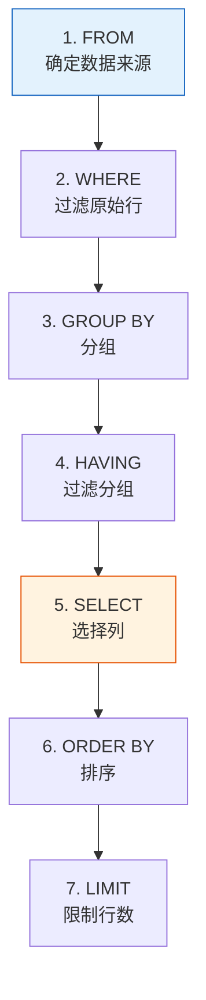
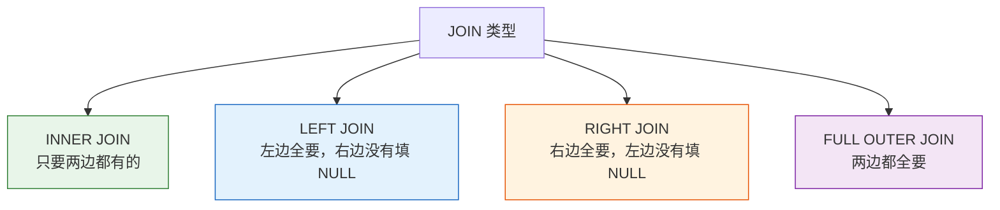

# SQL 基础

## 学习目标

- 掌握 SQL 的四大操作：增、删、改、查
- 熟练使用 SELECT 查询语句
- 学会 WHERE 条件过滤
- 掌握 JOIN 多表连接
- 理解 GROUP BY 分组聚合

---

## SQL 是什么？

**SQL**（Structured Query Language，结构化查询语言）是和数据库"对话"的语言。无论你用的是 SQLite、MySQL 还是 PostgreSQL，SQL 语法基本一致。


:::tip SQL 和 Pandas 的关系
SQL 能做的事，Pandas 大多也能做。实际上 Pandas 的很多方法名（如 `merge`、`groupby`）就是从 SQL 借鉴来的。两者对照着学，效果更好。
:::

---

## 准备工作：创建练习数据库

本节所有示例都基于这个练习数据库，请先运行：

```python
import sqlite3

conn = sqlite3.connect(":memory:")  # 内存数据库，关闭即消失
cursor = conn.cursor()

# 创建用户表
cursor.execute("""
    CREATE TABLE users (
        id INTEGER PRIMARY KEY,
        name TEXT NOT NULL,
        age INTEGER,
        city TEXT,
        salary REAL
    )
""")

# 创建订单表
cursor.execute("""
    CREATE TABLE orders (
        order_id INTEGER PRIMARY KEY,
        user_id INTEGER,
        product TEXT,
        amount REAL,
        order_date TEXT,
        FOREIGN KEY (user_id) REFERENCES users(id)
    )
""")

# 插入用户数据
users_data = [
    (1, "张三", 28, "北京", 15000),
    (2, "李四", 35, "上海", 22000),
    (3, "王五", 22, "广州", 8000),
    (4, "赵六", 42, "北京", 35000),
    (5, "钱七", 30, "上海", 18000),
    (6, "孙八", 26, "深圳", 12000),
]
cursor.executemany("INSERT INTO users VALUES (?, ?, ?, ?, ?)", users_data)

# 插入订单数据
orders_data = [
    (101, 1, "iPhone", 7999, "2024-11-01"),
    (102, 1, "AirPods", 999, "2024-11-05"),
    (103, 2, "MacBook", 14999, "2024-11-10"),
    (104, 3, "iPad", 3999, "2024-11-15"),
    (105, 2, "键盘", 599, "2024-11-20"),
    (106, 4, "显示器", 2999, "2024-12-01"),
    (107, 5, "鼠标", 299, "2024-12-05"),
]
cursor.executemany("INSERT INTO orders VALUES (?, ?, ?, ?, ?)", orders_data)

conn.commit()

# 定义一个方便查询的辅助函数
def query(sql):
    cursor.execute(sql)
    cols = [desc[0] for desc in cursor.description]
    rows = cursor.fetchall()
    # 打印表头
    print(" | ".join(cols))
    print("-" * (len(" | ".join(cols))))
    for row in rows:
        print(" | ".join(str(v) for v in row))
    print()
```

---

## 一、查询数据（SELECT）

SELECT 是 SQL 中最常用的语句，用来从表中取数据。

### 基本查询

```sql
-- 查询所有列
SELECT * FROM users;

-- 查询指定列
SELECT name, age, city FROM users;

-- 给列起别名
SELECT name AS 姓名, age AS 年龄 FROM users;
```

```python
query("SELECT * FROM users")
# id | name | age | city | salary
# 1 | 张三 | 28 | 北京 | 15000
# 2 | 李四 | 35 | 上海 | 22000
# ...
```

### DISTINCT：去重

```sql
-- 查询所有不重复的城市
SELECT DISTINCT city FROM users;
```

### LIMIT：限制行数

```sql
-- 只取前 3 条
SELECT * FROM users LIMIT 3;
```

---

## 二、条件过滤（WHERE）

WHERE 就像 Pandas 的布尔索引，用来筛选满足条件的行。

### 基本比较

```sql
-- 年龄大于 30
SELECT * FROM users WHERE age > 30;

-- 城市是北京
SELECT * FROM users WHERE city = '北京';

-- 薪资在 10000 到 20000 之间
SELECT * FROM users WHERE salary BETWEEN 10000 AND 20000;
```

### 组合条件

```sql
-- AND：同时满足
SELECT * FROM users WHERE city = '北京' AND age > 25;

-- OR：满足其一
SELECT * FROM users WHERE city = '北京' OR city = '上海';

-- IN：在列表中
SELECT * FROM users WHERE city IN ('北京', '上海', '深圳');

-- NOT：取反
SELECT * FROM users WHERE city NOT IN ('北京');
```

### 模糊匹配（LIKE）

```sql
-- % 匹配任意字符（类似 Pandas 的 str.contains）
SELECT * FROM users WHERE name LIKE '张%';    -- 以"张"开头
SELECT * FROM users WHERE name LIKE '%三';    -- 以"三"结尾
SELECT * FROM users WHERE email LIKE '%@mail%'; -- 包含"@mail"
```

### NULL 处理

```sql
-- 判断是否为空（不能用 = NULL）
SELECT * FROM users WHERE city IS NULL;
SELECT * FROM users WHERE city IS NOT NULL;
```

### SQL vs Pandas 对照

| 需求 | SQL | Pandas |
|------|-----|--------|
| 年龄大于 30 | `WHERE age > 30` | `df[df["age"] > 30]` |
| 城市是北京 | `WHERE city = '北京'` | `df[df["city"] == "北京"]` |
| 多条件与 | `WHERE age > 30 AND city = '北京'` | `df[(df["age"] > 30) & (df["city"] == "北京")]` |
| 多条件或 | `WHERE city IN ('北京', '上海')` | `df[df["city"].isin(["北京", "上海"])]` |
| 模糊匹配 | `WHERE name LIKE '张%'` | `df[df["name"].str.startswith("张")]` |
| 为空 | `WHERE city IS NULL` | `df[df["city"].isna()]` |

---

## 三、排序（ORDER BY）

```sql
-- 按薪资升序（默认）
SELECT * FROM users ORDER BY salary;

-- 按薪资降序
SELECT * FROM users ORDER BY salary DESC;

-- 先按城市排序，同城市再按薪资降序
SELECT * FROM users ORDER BY city, salary DESC;
```

---

## 四、聚合函数与分组（GROUP BY）

### 常用聚合函数

| 函数 | 作用 | 示例 |
|------|------|------|
| `COUNT(*)` | 计数 | 总共多少条记录 |
| `SUM(col)` | 求和 | 总薪资 |
| `AVG(col)` | 平均值 | 平均年龄 |
| `MAX(col)` | 最大值 | 最高薪资 |
| `MIN(col)` | 最小值 | 最低年龄 |

```sql
-- 基本聚合
SELECT COUNT(*) AS 总人数, AVG(salary) AS 平均薪资, MAX(salary) AS 最高薪资
FROM users;
```

### GROUP BY：分组统计

```sql
-- 按城市统计人数和平均薪资
SELECT city, COUNT(*) AS 人数, AVG(salary) AS 平均薪资
FROM users
GROUP BY city;
```

```
city | 人数 | 平均薪资
北京 | 2 | 25000.0
上海 | 2 | 20000.0
广州 | 1 | 8000.0
深圳 | 1 | 12000.0
```

### HAVING：对分组结果过滤

```sql
-- 找出平均薪资超过 15000 的城市
SELECT city, AVG(salary) AS avg_salary
FROM users
GROUP BY city
HAVING avg_salary > 15000;
```

:::tip WHERE vs HAVING
- `WHERE` 在分组**之前**过滤（过滤原始行）
- `HAVING` 在分组**之后**过滤（过滤聚合结果）
:::

### SQL 执行顺序

SQL 的书写顺序和执行顺序不同：



---

## 五、多表连接（JOIN）

JOIN 是 SQL 最强大的功能之一，让你把多张表的数据合并在一起。

### INNER JOIN：内连接

只返回**两张表都有**匹配的行。

```sql
-- 查询每个用户的订单信息
SELECT users.name, orders.product, orders.amount
FROM users
INNER JOIN orders ON users.id = orders.user_id;
```

```
name | product | amount
张三 | iPhone | 7999.0
张三 | AirPods | 999.0
李四 | MacBook | 14999.0
王五 | iPad | 3999.0
李四 | 键盘 | 599.0
赵六 | 显示器 | 2999.0
钱七 | 鼠标 | 299.0
```

注意：孙八没有订单，所以不出现在结果中。

### LEFT JOIN：左连接

返回左表所有行，右表没匹配的显示 NULL。

```sql
-- 查询所有用户及其订单（没有订单的也显示）
SELECT users.name, orders.product, orders.amount
FROM users
LEFT JOIN orders ON users.id = orders.user_id;
```

```
name | product | amount
张三 | iPhone | 7999.0
张三 | AirPods | 999.0
李四 | MacBook | 14999.0
...
孙八 | None | None       ← 没有订单，但也显示了
```

### JOIN 类型对比



:::tip SQL JOIN vs Pandas merge
| SQL | Pandas |
|-----|--------|
| `INNER JOIN` | `pd.merge(how="inner")` |
| `LEFT JOIN` | `pd.merge(how="left")` |
| `RIGHT JOIN` | `pd.merge(how="right")` |
| `ON users.id = orders.user_id` | `on="user_id"` 或 `left_on=, right_on=` |
:::

### 实用组合：JOIN + GROUP BY

```sql
-- 查询每个用户的订单总额
SELECT users.name, COUNT(orders.order_id) AS 订单数, SUM(orders.amount) AS 总消费
FROM users
LEFT JOIN orders ON users.id = orders.user_id
GROUP BY users.id, users.name
ORDER BY 总消费 DESC;
```

---

## 六、增删改（INSERT / UPDATE / DELETE）

### 插入数据

```sql
-- 插入一条
INSERT INTO users (name, age, city, salary) VALUES ('周九', 29, '杭州', 16000);

-- 插入多条
INSERT INTO users (name, age, city, salary) VALUES
    ('吴十', 33, '成都', 13000),
    ('郑十一', 27, '南京', 11000);
```

### 更新数据

```sql
-- 给张三加薪
UPDATE users SET salary = 18000 WHERE name = '张三';

-- 所有北京员工加薪 10%
UPDATE users SET salary = salary * 1.1 WHERE city = '北京';
```

:::caution UPDATE 一定要加 WHERE！
`UPDATE users SET salary = 0;` 会把**所有用户**的薪资清零！忘加 WHERE 是数据库操作中最常见的灾难之一。
:::

### 删除数据

```sql
-- 删除指定记录
DELETE FROM users WHERE name = '周九';

-- 删除所有年龄小于 20 的
DELETE FROM users WHERE age < 20;
```

:::danger DELETE 也要加 WHERE！
`DELETE FROM users;` 会删除表中**所有数据**！操作前请三思。
:::

---

## SQL 语句速查表

| 操作 | SQL 语法 | 说明 |
|------|---------|------|
| 查询所有 | `SELECT * FROM 表名` | 取全部数据 |
| 查询指定列 | `SELECT 列1, 列2 FROM 表名` | 取部分列 |
| 条件过滤 | `SELECT ... WHERE 条件` | 筛选行 |
| 排序 | `ORDER BY 列 DESC` | 降序排列 |
| 限制行数 | `LIMIT 10` | 取前 N 条 |
| 去重 | `SELECT DISTINCT 列` | 唯一值 |
| 聚合 | `COUNT / SUM / AVG / MAX / MIN` | 统计计算 |
| 分组 | `GROUP BY 列` | 分组统计 |
| 分组过滤 | `HAVING 条件` | 过滤分组 |
| 内连接 | `INNER JOIN 表 ON 条件` | 两表交集 |
| 左连接 | `LEFT JOIN 表 ON 条件` | 左表全部 |
| 插入 | `INSERT INTO 表 VALUES (...)` | 添加数据 |
| 更新 | `UPDATE 表 SET 列=值 WHERE 条件` | 修改数据 |
| 删除 | `DELETE FROM 表 WHERE 条件` | 删除数据 |

---

## 小结

SQL 就是和数据库"说话"的语言，核心就 4 类操作：

| 类别 | 关键字 | 作用 |
|------|--------|------|
| **查** | `SELECT` | 数据查询（最常用） |
| **增** | `INSERT` | 插入新数据 |
| **改** | `UPDATE` | 修改已有数据 |
| **删** | `DELETE` | 删除数据 |

其中 `SELECT` 搭配 `WHERE`、`JOIN`、`GROUP BY` 能完成绝大部分数据分析需求。

---

## 动手练习

### 练习 1：基础查询

```sql
-- 使用上面的练习数据库，完成以下查询：
-- 1. 查询所有上海的用户
-- 2. 查询薪资最高的 3 个人
-- 3. 查询每个城市的平均薪资，按平均薪资降序排列
```

### 练习 2：JOIN 查询

```sql
-- 1. 查询所有用户的姓名和他们买过的产品
-- 2. 查询没有下过单的用户
--    提示：LEFT JOIN + WHERE orders.order_id IS NULL
-- 3. 查询每个用户的订单总额，包括没有订单的用户（显示为 0）
```

### 练习 3：综合分析

```sql
-- 用一条 SQL 完成：
-- 查询消费总额超过 5000 的用户姓名、订单数量和总消费
-- 按总消费降序排列
```
