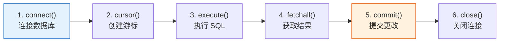

# Python 数据库操作

## 学习目标

- 掌握 Python sqlite3 模块的完整用法
- 学会参数化查询防止 SQL 注入
- 掌握 Pandas 直接读写数据库的方法
- 了解 SQLAlchemy 的基本概念

---

## sqlite3 标准库

Python 自带 `sqlite3` 模块，无需安装，开箱即用。

### 基本工作流程



### 完整示例

```python
import sqlite3

# ========== 连接 ==========
# 连接到文件数据库（不存在会自动创建）
conn = sqlite3.connect("example.db")

# 或使用内存数据库（关闭后数据消失，适合测试）
# conn = sqlite3.connect(":memory:")

# 创建游标对象
cursor = conn.cursor()

# ========== 创建表 ==========
cursor.execute("""
    CREATE TABLE IF NOT EXISTS students (
        id INTEGER PRIMARY KEY AUTOINCREMENT,
        name TEXT NOT NULL,
        grade INTEGER,
        score REAL
    )
""")

# ========== 插入数据 ==========
# 方式 1：直接插入
cursor.execute("INSERT INTO students (name, grade, score) VALUES ('张三', 3, 89.5)")

# 方式 2：参数化插入（推荐！）
cursor.execute(
    "INSERT INTO students (name, grade, score) VALUES (?, ?, ?)",
    ("李四", 2, 92.0)
)

# 方式 3：批量插入
students = [
    ("王五", 3, 76.5),
    ("赵六", 1, 95.0),
    ("钱七", 2, 88.0),
    ("孙八", 1, 70.5),
]
cursor.executemany(
    "INSERT INTO students (name, grade, score) VALUES (?, ?, ?)",
    students
)

# 别忘了提交！
conn.commit()

# ========== 查询数据 ==========
# fetchall()：获取所有结果
cursor.execute("SELECT * FROM students")
all_rows = cursor.fetchall()
print("所有学生：", all_rows)

# fetchone()：获取一条
cursor.execute("SELECT * FROM students WHERE name = '张三'")
one_row = cursor.fetchone()
print("张三：", one_row)

# fetchmany(n)：获取 n 条
cursor.execute("SELECT * FROM students ORDER BY score DESC")
top3 = cursor.fetchmany(3)
print("前三名：", top3)

# ========== 获取列名 ==========
cursor.execute("SELECT * FROM students")
col_names = [desc[0] for desc in cursor.description]
print("列名：", col_names)  # ['id', 'name', 'grade', 'score']

# ========== 关闭 ==========
conn.close()
```

---

## 参数化查询：防止 SQL 注入

:::danger 什么是 SQL 注入？
SQL 注入是最常见的安全漏洞之一。攻击者通过构造恶意输入来篡改 SQL 语句。
:::

### 错误写法（危险！）

```python
# ❌ 千万不要这样拼接字符串！
user_input = "张三"
sql = f"SELECT * FROM students WHERE name = '{user_input}'"
cursor.execute(sql)

# 如果用户输入的是：  ' OR '1'='1
# SQL 变成：SELECT * FROM students WHERE name = '' OR '1'='1'
# 这会返回所有数据！
```

### 正确写法（安全！）

```python
# ✅ 使用 ? 占位符
user_input = "张三"
cursor.execute("SELECT * FROM students WHERE name = ?", (user_input,))

# ✅ 多个参数
cursor.execute(
    "SELECT * FROM students WHERE grade = ? AND score > ?",
    (3, 80.0)
)
```

:::tip 一句话记住
**永远用 `?` 占位符，永远不要用 f-string 或字符串拼接来构建 SQL。**
:::

---

## 使用 with 语句管理连接

```python
import sqlite3

# 推荐写法：with 自动管理提交和关闭
with sqlite3.connect("example.db") as conn:
    cursor = conn.cursor()

    cursor.execute("SELECT * FROM students WHERE score > ?", (85,))
    results = cursor.fetchall()

    for row in results:
        print(row)
    # with 块结束后自动 commit（如果没有异常）
    # 如果有异常则自动 rollback
```

---

## Row 工厂：用字典访问结果

默认情况下，查询结果是元组，需要用索引 `row[0]` 访问。用 `Row` 工厂可以按列名访问：

```python
import sqlite3

conn = sqlite3.connect("example.db")
conn.row_factory = sqlite3.Row  # 关键设置

cursor = conn.cursor()
cursor.execute("SELECT * FROM students WHERE name = '张三'")
row = cursor.fetchone()

# 现在可以按列名访问了！
print(row["name"])   # 张三
print(row["score"])  # 89.5
print(dict(row))     # {'id': 1, 'name': '张三', 'grade': 3, 'score': 89.5}

conn.close()
```

---

## Pandas + 数据库：最强搭配

Pandas 可以直接读写数据库，这是实际工作中最常用的方式。

### 从数据库读取到 DataFrame

```python
import pandas as pd
import sqlite3

conn = sqlite3.connect("example.db")

# 方式 1：read_sql_query（推荐）
df = pd.read_sql_query("SELECT * FROM students", conn)
print(df)
#    id name  grade  score
# 0   1   张三      3   89.5
# 1   2   李四      2   92.0
# 2   3   王五      3   76.5
# ...

# 方式 2：带条件查询
df_top = pd.read_sql_query(
    "SELECT name, score FROM students WHERE score > 85 ORDER BY score DESC",
    conn
)
print(df_top)

# 方式 3：read_sql_table（读整张表）
df_all = pd.read_sql_table("students", conn)  # 需要 SQLAlchemy

conn.close()
```

### DataFrame 写入数据库

```python
import pandas as pd
import sqlite3

# 创建一个 DataFrame
df_new = pd.DataFrame({
    "name": ["周九", "吴十", "郑十一"],
    "grade": [2, 3, 1],
    "score": [85.5, 91.0, 78.0]
})

conn = sqlite3.connect("example.db")

# 写入数据库
df_new.to_sql(
    "new_students",     # 表名
    conn,
    if_exists="replace",  # 如果表存在：replace 替换 / append 追加 / fail 报错
    index=False           # 不把 DataFrame 的索引写入
)

# 验证
df_check = pd.read_sql_query("SELECT * FROM new_students", conn)
print(df_check)

conn.close()
```

### 实际工作流：数据库 → Pandas → 分析

```python
import pandas as pd
import sqlite3

conn = sqlite3.connect("example.db")

# 1. 用 SQL 做初步筛选和连接（利用数据库的索引加速）
df = pd.read_sql_query("""
    SELECT s.name, s.grade, s.score
    FROM students s
    WHERE s.score > 60
    ORDER BY s.score DESC
""", conn)

# 2. 用 Pandas 做复杂分析
print("各年级平均分：")
print(df.groupby("grade")["score"].mean())

print("\n成绩分布：")
print(df["score"].describe())

conn.close()
```

:::tip 最佳实践
- **大数据量过滤**：用 SQL 的 WHERE 先筛选，减少传给 Pandas 的数据量
- **复杂分析**：SQL 筛选后，用 Pandas 做聚合、可视化等复杂操作
- **写回结果**：分析完用 `to_sql()` 把结果存回数据库
:::

---

## SQLAlchemy 简介

SQLAlchemy 是 Python 最流行的数据库工具库，支持多种数据库，提供 ORM（对象关系映射）。

```python
# 安装
# pip install sqlalchemy

from sqlalchemy import create_engine
import pandas as pd

# 创建引擎（连接不同数据库只需换 URL）
engine = create_engine("sqlite:///example.db")

# SQLite:  sqlite:///文件路径
# MySQL:   mysql+pymysql://用户:密码@主机:端口/数据库
# PostgreSQL: postgresql://用户:密码@主机:端口/数据库

# Pandas 搭配 SQLAlchemy 使用
df = pd.read_sql("SELECT * FROM students", engine)
print(df)

# 写入
df.to_sql("students_backup", engine, if_exists="replace", index=False)
```

:::info 什么时候用 SQLAlchemy？
- 如果只用 SQLite → `sqlite3` 就够了
- 如果需要连接 MySQL/PostgreSQL → 用 SQLAlchemy
- 如果做 Web 开发 → 用 SQLAlchemy 的 ORM 功能
:::

---

## 完整实战：学生成绩管理

```python
import sqlite3
import pandas as pd

class StudentDB:
    """简单的学生成绩管理系统"""

    def __init__(self, db_path="students.db"):
        self.conn = sqlite3.connect(db_path)
        self.conn.row_factory = sqlite3.Row
        self._create_table()

    def _create_table(self):
        self.conn.execute("""
            CREATE TABLE IF NOT EXISTS students (
                id INTEGER PRIMARY KEY AUTOINCREMENT,
                name TEXT NOT NULL,
                subject TEXT NOT NULL,
                score REAL CHECK(score >= 0 AND score <= 100)
            )
        """)
        self.conn.commit()

    def add_student(self, name, subject, score):
        """添加成绩"""
        self.conn.execute(
            "INSERT INTO students (name, subject, score) VALUES (?, ?, ?)",
            (name, subject, score)
        )
        self.conn.commit()
        print(f"✅ 已添加: {name} - {subject}: {score}")

    def query_by_name(self, name):
        """按姓名查询"""
        cursor = self.conn.execute(
            "SELECT * FROM students WHERE name = ?", (name,)
        )
        return [dict(row) for row in cursor.fetchall()]

    def get_ranking(self, subject):
        """获取某科目排名"""
        df = pd.read_sql_query(
            "SELECT name, score FROM students WHERE subject = ? ORDER BY score DESC",
            self.conn,
            params=(subject,)
        )
        df["排名"] = range(1, len(df) + 1)
        return df

    def get_stats(self):
        """获取统计信息"""
        return pd.read_sql_query("""
            SELECT subject AS 科目,
                   COUNT(*) AS 人数,
                   ROUND(AVG(score), 1) AS 平均分,
                   MAX(score) AS 最高分,
                   MIN(score) AS 最低分
            FROM students
            GROUP BY subject
        """, self.conn)

    def close(self):
        self.conn.close()


# 使用示例
db = StudentDB(":memory:")

# 添加数据
for name, subject, score in [
    ("张三", "数学", 89), ("张三", "英语", 75),
    ("李四", "数学", 92), ("李四", "英语", 88),
    ("王五", "数学", 76), ("王五", "英语", 95),
]:
    db.add_student(name, subject, score)

# 查询
print("\n张三的成绩:", db.query_by_name("张三"))
print("\n数学排名:")
print(db.get_ranking("数学"))
print("\n各科统计:")
print(db.get_stats())

db.close()
```

---

## 小结

| 方法 | 适用场景 | 特点 |
|------|---------|------|
| `sqlite3` | SQLite 数据库 | Python 自带，零依赖 |
| `pd.read_sql_query()` | SQL → DataFrame | 分析最方便 |
| `df.to_sql()` | DataFrame → 数据库 | 一行写入 |
| `SQLAlchemy` | 多种数据库 | 通用性强 |

**核心原则：**
- 用 `?` 占位符，不要拼接 SQL
- 用 `with` 管理连接
- 大数据量先用 SQL 过滤，再用 Pandas 分析

---

## 动手练习

### 练习 1：基本 CRUD

```python
# 创建一个 SQLite 数据库
# 建一张 books 表（书名、作者、价格、出版年份）
# 插入 5 本书
# 查询价格大于 50 的书
# 把某本书的价格改为 99
# 删除出版年份最早的书
```

### 练习 2：Pandas 协作

```python
# 1. 用 pd.read_sql_query 读取 books 表到 DataFrame
# 2. 用 Pandas 计算每个作者的平均书价
# 3. 把计算结果用 to_sql 写回数据库的新表
```

### 练习 3：封装一个类

```python
# 参考上面的 StudentDB 示例
# 封装一个 TodoDB 类，实现待办事项管理：
# - 添加任务
# - 标记完成
# - 按状态查询
# - 统计完成率
```
