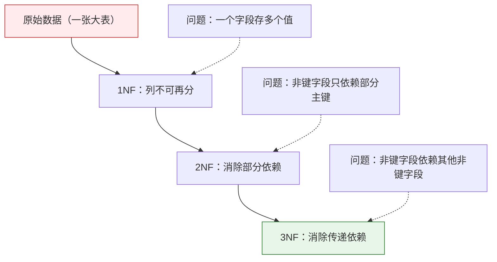
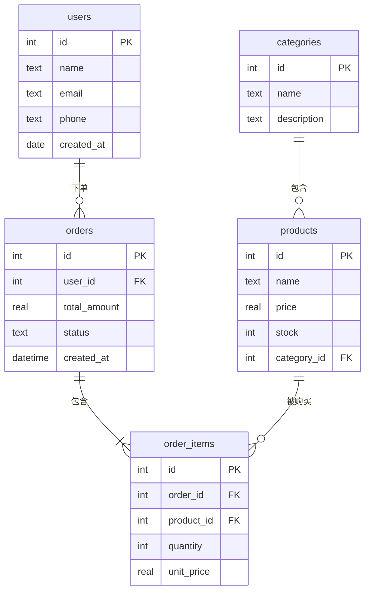

# 数据库设计

## 学习目标

- 理解为什么需要好的数据库设计
- 掌握数据库范式的核心思想
- 学会设计表结构和关系
- 理解索引的作用和使用时机

---

## 为什么设计很重要？

一个糟糕的数据库设计会导致：

| 问题 | 后果 |
|------|------|
| 数据冗余 | 同一信息存了 N 遍，浪费空间，改一处要改 N 处 |
| 更新异常 | 改了一处忘了另一处，数据自相矛盾 |
| 插入异常 | 想加一条信息，被迫编造不存在的关联数据 |
| 删除异常 | 删一条记录，意外丢了其他有用信息 |

---

## 数据库范式

范式（Normal Form）是数据库设计的规范，帮你避免上面的问题。你只需要记住前三个范式的核心思想。

### 第一范式（1NF）：列不可再分

**规则：** 每个字段只存一个值，不能是列表或逗号分隔的多值。

```
❌ 违反 1NF：
| name | phones                    |
|------|---------------------------|
| 张三 | 138xxxx, 139xxxx, 186xxxx |   ← 一个字段存了多个值

✅ 符合 1NF：
| name | phone    |
|------|----------|
| 张三 | 138xxxx  |
| 张三 | 139xxxx  |
| 张三 | 186xxxx  |
```

### 第二范式（2NF）：消除部分依赖

**规则：** 在满足 1NF 的基础上，非主键字段必须完全依赖于整个主键，不能只依赖主键的一部分。

```
❌ 违反 2NF（复合主键 = 学生ID + 课程ID）：
| student_id | course_id | student_name | course_name | score |
|------------|-----------|--------------|-------------|-------|
| 1          | C01       | 张三         | 数学        | 89    |

student_name 只依赖 student_id，不依赖 course_id → 部分依赖

✅ 符合 2NF（拆成三张表）：
students: student_id, student_name
courses:  course_id, course_name
scores:   student_id, course_id, score
```

### 第三范式（3NF）：消除传递依赖

**规则：** 在满足 2NF 的基础上，非主键字段不能依赖于另一个非主键字段。

```
❌ 违反 3NF：
| employee_id | name | dept_id | dept_name | dept_manager |
|-------------|------|---------|-----------|--------------|

dept_name 和 dept_manager 依赖于 dept_id，而不是直接依赖 employee_id
→ 传递依赖：employee_id → dept_id → dept_name

✅ 符合 3NF（拆表）：
employees:   employee_id, name, dept_id
departments: dept_id, dept_name, dept_manager
```

### 范式总结



:::tip 实际中不必死守范式
范式是理论指导，实际设计中有时会**故意违反**范式（反范式化），用适当的冗余换取查询性能。比如在用户表中同时存 `city_id` 和 `city_name`，避免每次查询都要 JOIN。
:::

---

## 实战：设计一个电商数据库

### 需求分析

一个简单的电商系统需要管理：
- 用户信息
- 商品信息
- 商品分类
- 订单和订单详情

### ER 图（实体关系图）



### 关键设计决策

**为什么订单要拆成 orders + order_items 两张表？**

```
❌ 一张表：
| order_id | user_id | product1 | qty1 | product2 | qty2 | ...
这样列数不固定，违反 1NF

❌ 重复订单信息：
| order_id | user_id | total | product  | quantity |
| 1        | 张三    | 8998  | iPhone   | 1        |
| 1        | 张三    | 8998  | AirPods  | 1        |
order_id 和 user_id、total 重复了，违反 2NF

✅ 拆成两张表：
orders:      order_id, user_id, total_amount, status
order_items: item_id, order_id, product_id, quantity, unit_price
```

### 用 SQLite 实现

```python
import sqlite3

conn = sqlite3.connect(":memory:")
cursor = conn.cursor()

# 创建表
cursor.executescript("""
    CREATE TABLE categories (
        id INTEGER PRIMARY KEY AUTOINCREMENT,
        name TEXT NOT NULL UNIQUE
    );

    CREATE TABLE products (
        id INTEGER PRIMARY KEY AUTOINCREMENT,
        name TEXT NOT NULL,
        price REAL NOT NULL CHECK(price > 0),
        stock INTEGER DEFAULT 0,
        category_id INTEGER,
        FOREIGN KEY (category_id) REFERENCES categories(id)
    );

    CREATE TABLE users (
        id INTEGER PRIMARY KEY AUTOINCREMENT,
        name TEXT NOT NULL,
        email TEXT UNIQUE,
        created_at TEXT DEFAULT CURRENT_TIMESTAMP
    );

    CREATE TABLE orders (
        id INTEGER PRIMARY KEY AUTOINCREMENT,
        user_id INTEGER NOT NULL,
        total_amount REAL DEFAULT 0,
        status TEXT DEFAULT 'pending',
        created_at TEXT DEFAULT CURRENT_TIMESTAMP,
        FOREIGN KEY (user_id) REFERENCES users(id)
    );

    CREATE TABLE order_items (
        id INTEGER PRIMARY KEY AUTOINCREMENT,
        order_id INTEGER NOT NULL,
        product_id INTEGER NOT NULL,
        quantity INTEGER NOT NULL CHECK(quantity > 0),
        unit_price REAL NOT NULL,
        FOREIGN KEY (order_id) REFERENCES orders(id),
        FOREIGN KEY (product_id) REFERENCES products(id)
    );
""")

# 插入示例数据
cursor.executescript("""
    INSERT INTO categories (name) VALUES ('手机'), ('配件'), ('电脑');

    INSERT INTO products (name, price, stock, category_id) VALUES
        ('iPhone 16', 7999, 100, 1),
        ('AirPods Pro', 1899, 200, 2),
        ('MacBook Pro', 14999, 50, 3),
        ('手机壳', 39, 500, 2);

    INSERT INTO users (name, email) VALUES
        ('张三', 'zhang@mail.com'),
        ('李四', 'li@mail.com');

    INSERT INTO orders (user_id, total_amount, status) VALUES
        (1, 9898, 'completed'),
        (2, 14999, 'shipped');

    INSERT INTO order_items (order_id, product_id, quantity, unit_price) VALUES
        (1, 1, 1, 7999),
        (1, 2, 1, 1899),
        (2, 3, 1, 14999);
""")

conn.commit()
```

### 实用查询示例

```python
import pandas as pd

# 查询每个用户的订单详情
df = pd.read_sql_query("""
    SELECT
        u.name AS 用户,
        o.id AS 订单号,
        p.name AS 商品,
        oi.quantity AS 数量,
        oi.unit_price AS 单价,
        oi.quantity * oi.unit_price AS 小计,
        o.status AS 状态
    FROM order_items oi
    JOIN orders o ON oi.order_id = o.id
    JOIN users u ON o.user_id = u.id
    JOIN products p ON oi.product_id = p.id
""", conn)
print(df)

# 查询每个分类的销售额
df_category = pd.read_sql_query("""
    SELECT
        c.name AS 分类,
        COUNT(oi.id) AS 销售次数,
        SUM(oi.quantity * oi.unit_price) AS 总销售额
    FROM categories c
    LEFT JOIN products p ON c.id = p.category_id
    LEFT JOIN order_items oi ON p.id = oi.product_id
    GROUP BY c.id, c.name
    ORDER BY 总销售额 DESC
""", conn)
print(df_category)
```

---

## 索引（Index）

### 什么是索引？

索引就像书的目录——没有目录，找一个词要翻遍整本书；有了目录，翻到对应页码就行。

| 场景 | 无索引 | 有索引 |
|------|--------|--------|
| 从 100 万行中查一条 | 扫描全部 100 万行 | 直接定位，几毫秒 |
| 查找原理 | 逐行比对（全表扫描） | B-Tree 查找（对数级） |

### 创建和使用索引

```sql
-- 在 email 列上创建索引（加速按 email 查询）
CREATE INDEX idx_users_email ON users(email);

-- 在 order_date 列上创建索引
CREATE INDEX idx_orders_date ON orders(created_at);

-- 复合索引（多列）
CREATE INDEX idx_items_order_product ON order_items(order_id, product_id);

-- 查看表的索引
-- SQLite: PRAGMA index_list('users');
-- MySQL:  SHOW INDEX FROM users;
```

### 什么时候加索引？

| 应该加索引 | 不需要加索引 |
|-----------|-------------|
| WHERE 条件中常用的列 | 很少用于查询的列 |
| JOIN 的关联列 | 数据量很小的表（几百行） |
| ORDER BY 排序的列 | 频繁更新的列（索引也要跟着更新） |
| 唯一性要求的列 | 值重复率很高的列（如性别） |

:::tip 索引的代价
索引不是免费的——每个索引都会占用额外存储空间，并且在插入/更新/删除数据时需要同步更新索引。所以不要对所有列都加索引，只对查询瓶颈列加。
:::

---

## 设计检查清单

每次设计数据库时，用这个清单检查：

```
☐ 每张表都有主键？
☐ 字段名清晰、统一命名风格？（推荐 snake_case）
☐ 数据类型选择合理？（整数用 INTEGER，金额用 REAL）
☐ 必填字段加了 NOT NULL？
☐ 唯一字段加了 UNIQUE？（如 email）
☐ 表之间的关系通过外键建立？
☐ 满足第三范式？（或有意识地反范式化）
☐ 常查询的列加了索引？
☐ 有合理的默认值？（如 status DEFAULT 'active'）
☐ 有 created_at 时间戳记录创建时间？
```

---

## 小结


| 原则 | 说明 |
|------|------|
| 先画 ER 图 | 想清楚实体和关系再建表 |
| 遵守范式 | 减少冗余和异常 |
| 适度反范式 | 用冗余换性能 |
| 善用索引 | 加速关键查询 |
| 先设计后编码 | 改数据库结构比改代码难得多 |

---

## 动手练习

### 练习 1：识别范式问题

```
以下表设计有什么问题？属于违反哪个范式？如何修正？

表：student_courses
| student_id | student_name | student_phone       | course_id | course_name | teacher   | score |
|------------|-------------|---------------------|-----------|-------------|-----------|-------|
| 1          | 张三        | 138xxxx, 139xxxx    | C01       | 数学        | 李老师    | 89    |
| 1          | 张三        | 138xxxx, 139xxxx    | C02       | 英语        | 王老师    | 75    |
| 2          | 李四        | 186xxxx             | C01       | 数学        | 李老师    | 92    |
```

### 练习 2：设计博客系统

```
设计一个简单博客系统的数据库，需要支持：
- 用户注册和登录
- 发表文章（有标题、内容、分类）
- 文章评论
- 文章标签（一篇文章可以有多个标签）

要求：
1. 画出 ER 图（可以用纸笔或 Mermaid）
2. 写出 CREATE TABLE 语句
3. 考虑需要加哪些索引
```

### 练习 3：实现并查询

```python
# 用 SQLite 实现练习 2 的设计
# 插入示例数据
# 完成以下查询：
# 1. 查询某个用户发表的所有文章
# 2. 查询某篇文章的所有评论（包含评论者姓名）
# 3. 查询每个分类下的文章数量
# 4. 查询有"Python"标签的所有文章
```
